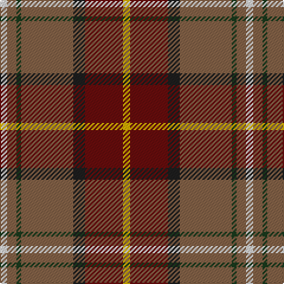

In pattern [WRGRBRY](/patterns/wrgrbry/).

This was sourced from register-of-tartans.  It is a [7 stripes tartan](/stripes/stripes7/).

Original link https://www.tartanregister.gov.uk/tartanDetails.aspx?ref=10668

## Attestations

This cloth appears in 2 source records; the oldest owns this page.

- 06/08/2012 — Pubcrawlers, The (register-of-tartans, [record](https://www.tartanregister.gov.uk/tartanDetails.aspx?ref=10668))
- undated — Pubcrawlers, The Corporate Tartan Tartan Number: 10668. Earliest known date: 06/08/2012 With over a decade of performing, the Pubcrawlers have firmly established themselves as a brand as well as a musical group, and the muted earthen tones of the Pubcrawler tartan reflect the colour palette that has come to be associated with both. Working together with members of the band, USA Kilts have crafted a tartan that represents not only the colours that have been the Pubcrawlers' trademark since 2002 (originally chosen as an amalgamation of the colours of several members' family tartans), but their physical location as well, having woven into the pattern the coordinates of Portland, Maine, the city that the band calls home. The Pubcrawlers take great pride in their tartan and will happily permit it to be worn by any members, friends, family and supporters of the band. See products available Copyright © Blair Urquhart, Comrie, 2015 (house-of-tartan, [record](http://www.house-of-tartan.scotland.net/house/TartanViewjs.asp?colr=Def&tnam=10668))

## Thread count
LN/6 LT8 DG4 LT44 K10 DR32 Y/6

## Palette
Each colour and its ΔE from the base-6 reference it is a variant of.

| Colour | Shade | Base | ΔE (OKLab) |
|---|---|---|---|
| DG | <code style="background-color:#1B3B1D;">#1B3B1D</code> `#1B3B1D` | G <code style="background-color:#006400;">#006400</code> | 0.14 |
| DR | <code style="background-color:#680D0D;">#680D0D</code> `#680D0D` | R <code style="background-color:#C80000;">#C80000</code> | 0.21 |
| K | <code style="background-color:#1E1E1E;">#1E1E1E</code> `#1E1E1E` | B <code style="background-color:#2C4084;">#2C4084</code> | 0.20 |
| LN | <code style="background-color:#DFDFDF;">#DFDFDF</code> `#DFDFDF` | W <code style="background-color:#F4F4F0;">#F4F4F0</code> | 0.06 |
| LT | <code style="background-color:#846247;">#846247</code> `#846247` | R <code style="background-color:#C80000;">#C80000</code> | 0.17 |
| Y | <code style="background-color:#DFAF00;">#DFAF00</code> `#DFAF00` | Y <code style="background-color:#E8C000;">#E8C000</code> | 0.05 |

# Sample pattern

## Nearest tartans

The nearest existing variants by ΔTartan distance.

1. [Battle of Bannockburn, The](/setts/s8/r4b4r36g24ba8bb12r8y4-b441800-ba5c8ca8-bb1474b4-g006818-rc80000-ybc8c00/) — ΔT 0.67
1. [Dundhuin](/setts/s6/y12r10k4g36ra56w4-g6a8a67-k1c1714-r905966-ra9d2123-wf9f5ef-y99a3ba/) — ΔT 1.00
1. [Dundhuin Ladies (Personal)](/setts/s6/b12ba10k4g36r56w4-b1474b4-ba780078-g006818-k101010-ra00048-we0e0e0/) — ΔT 1.01
1. [Moray of Abercairney](/setts/s9/b12ba4k4r48ra4g36r4ba4b12-b304080-ba5480b0-g008000-k000000-rc00000-rad03030/) — ΔT 1.07
1. [Moray of Abercairney Clan Tartan Tartan Number: 51. Earliest known date: 1735 The sett is derived from the portrait of James, 14th Laird, painted about 1735. Historians have made different interpretations of the tartan. The tartan is similar to other Perthshire setts but not to the Clan Murray tartan. See products available Copyright © Blair Urquhart, Comrie, 2015](/setts/s9/b12ba4k4r48ra4g36r4ba4b12-b2c2c80-ba2888c4-g006818-k101010-rc80000-rad05054/) — ΔT 1.07
1. [Gordon of Abergeldie (Portrait)](/setts/s6/r126w8k8b36y8g100-b780078-g005830-k101010-rc80000-wfcfcfc-yd8b000/) — ΔT 1.08
1. [Hewitt (Name)](/setts/s7/r60b24k6g24y4g6w4-b2c2c80-g006818-k101010-rc80000-we0e0e0-ye8c000/) — ΔT 1.11
1. [Barbour Dress](/setts/s7/r8b4r42ba22w4ra40rb6-b4c3428-ba141e46-rb07430-ra888888-rbc8002c-wf8f8f8/) — ΔT 1.12
1. [Red Rum](/setts/s7/k4r60g8w4g28ra26y4-g008000-k000000-r806050-ra802040-we0e0e0-yf0c000/) — ΔT 1.15
1. [Sawyer](/setts/s8/g8y4g40b4k16r32w4r8-b1c0070-g006818-k101010-ra00000-wa8ace8-yb8b8b8/) — ΔT 1.17

## Neighbour map

Every grey dot is one of 15726 variants placed by the first two principal components of the ΔTartan feature space (44% of its variance). Red is this tartan; blue dots are its nearest — click one to open its page.

<svg viewBox="0 0 640 380" role="img" style="max-width:100%;height:auto;border:1px solid #e0e0e0;border-radius:4px;display:block" xmlns="http://www.w3.org/2000/svg"><image href="/nn/cloud.v1.png" width="640" height="380"/><a href="/setts/s8/r4b4r36g24ba8bb12r8y4-b441800-ba5c8ca8-bb1474b4-g006818-rc80000-ybc8c00/"><circle cx="221.1" cy="164.3" r="4" fill="#3465a4"><title>Battle of Bannockburn, The</title></circle></a><a href="/setts/s6/y12r10k4g36ra56w4-g6a8a67-k1c1714-r905966-ra9d2123-wf9f5ef-y99a3ba/"><circle cx="255.8" cy="160.2" r="4" fill="#3465a4"><title>Dundhuin</title></circle></a><a href="/setts/s6/b12ba10k4g36r56w4-b1474b4-ba780078-g006818-k101010-ra00048-we0e0e0/"><circle cx="237.3" cy="155.7" r="4" fill="#3465a4"><title>Dundhuin Ladies (Personal)</title></circle></a><a href="/setts/s9/b12ba4k4r48ra4g36r4ba4b12-b304080-ba5480b0-g008000-k000000-rc00000-rad03030/"><circle cx="193.2" cy="129.5" r="4" fill="#3465a4"><title>Moray of Abercairney</title></circle></a><a href="/setts/s9/b12ba4k4r48ra4g36r4ba4b12-b2c2c80-ba2888c4-g006818-k101010-rc80000-rad05054/"><circle cx="198.0" cy="131.1" r="4" fill="#3465a4"><title>Moray of Abercairney Clan Tartan Tartan Number: 51. Earliest known date: 1735 The sett is derived from the portrait of James, 14th Laird, painted about 1735. Historians have made different interpretations of the tartan. The tartan is similar to other Perthshire setts but not to the Clan Murray tartan. See products available Copyright © Blair Urquhart, Comrie, 2015</title></circle></a><a href="/setts/s6/r126w8k8b36y8g100-b780078-g005830-k101010-rc80000-wfcfcfc-yd8b000/"><circle cx="240.4" cy="140.5" r="4" fill="#3465a4"><title>Gordon of Abergeldie (Portrait)</title></circle></a><a href="/setts/s7/r60b24k6g24y4g6w4-b2c2c80-g006818-k101010-rc80000-we0e0e0-ye8c000/"><circle cx="228.6" cy="129.5" r="4" fill="#3465a4"><title>Hewitt (Name)</title></circle></a><a href="/setts/s7/r8b4r42ba22w4ra40rb6-b4c3428-ba141e46-rb07430-ra888888-rbc8002c-wf8f8f8/"><circle cx="186.9" cy="165.1" r="4" fill="#3465a4"><title>Barbour Dress</title></circle></a><a href="/setts/s7/k4r60g8w4g28ra26y4-g008000-k000000-r806050-ra802040-we0e0e0-yf0c000/"><circle cx="240.9" cy="151.4" r="4" fill="#3465a4"><title>Red Rum</title></circle></a><a href="/setts/s8/g8y4g40b4k16r32w4r8-b1c0070-g006818-k101010-ra00000-wa8ace8-yb8b8b8/"><circle cx="187.8" cy="161.1" r="4" fill="#3465a4"><title>Sawyer</title></circle></a><circle cx="235.7" cy="162.3" r="5" fill="#c00000"/></svg>

ID: /setts/s7/w6r8g4r44b10ra32y6-b1e1e1e-g1b3b1d-r846247-ra680d0d-wdfdfdf-ydfaf00/
