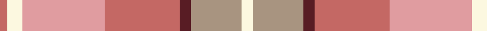

In pattern [RWYRBYW](/patterns/rwyrbyw/).

This was sourced from register-of-tartans.  It is a [7 stripes tartan](/stripes/stripes7/).

Original link https://www.tartanregister.gov.uk/tartanDetails.aspx?ref=4039

## Thread count
LT/4 LY8 LR44 LT40 DR6 N27 LY/6

## Palette
Each colour and its ΔE from the base-6 reference it is a variant of.

| Colour | Shade | Base | ΔE (OKLab) |
|---|---|---|---|
| DR | <code style="background-color:#581C24;">#581C24</code> `#581C24` | B <code style="background-color:#2C4084;">#2C4084</code> | 0.18 |
| LR | <code style="background-color:#E09CA0;">#E09CA0</code> `#E09CA0` | Y <code style="background-color:#E8C000;">#E8C000</code> | 0.18 |
| LT | <code style="background-color:#C46864;">#C46864</code> `#C46864` | R <code style="background-color:#C80000;">#C80000</code> | 0.14 |
| LY | <code style="background-color:#FCF8E0;">#FCF8E0</code> `#FCF8E0` | W <code style="background-color:#F4F4F0;">#F4F4F0</code> | 0.03 |
| N | <code style="background-color:#A89480;">#A89480</code> `#A89480` | Y <code style="background-color:#E8C000;">#E8C000</code> | 0.19 |
| R | <code style="background-color:#C80000;">#C80000</code> `#C80000` | R <code style="background-color:#C80000;">#C80000</code> | 0.00 |

# Sample pattern

ID: /setts/s7/w6y27b6r40ya44w8r4-b581c24-rc46864-wfcf8e0-ya89480-yae09ca0/
