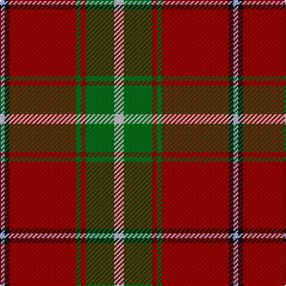

In pattern [WGRGRKW](/patterns/wgrgrkw/).

This was sourced from register-of-tartans.  It is a [7 stripes tartan](/stripes/stripes7/).

Original link https://www.tartanregister.gov.uk/tartanDetails.aspx?ref=5185

## Thread count
LP/4 K4 DR56 G4 DR4 G24 N/8

## Palette
Each colour and its ΔE from the base-6 reference it is a variant of.

| Colour | Shade | Base | ΔE (OKLab) |
|---|---|---|---|
| DR | <code style="background-color:#880000;">#880000</code> `#880000` | R <code style="background-color:#CC0000;">#CC0000</code> | 0.15 |
| G | <code style="background-color:#006818;">#006818</code> `#006818` | G <code style="background-color:#006100;">#006100</code> | 0.02 |
| K | <code style="background-color:#101010;">#101010</code> `#101010` | K <code style="background-color:#000000;">#000000</code> | 0.17 |
| LP | <code style="background-color:#A8ACE8;">#A8ACE8</code> `#A8ACE8` | W <code style="background-color:#F7F7F7;">#F7F7F7</code> | 0.23 |
| N | <code style="background-color:#C0C0C0;">#C0C0C0</code> `#C0C0C0` | W <code style="background-color:#F7F7F7;">#F7F7F7</code> | 0.17 |

# Sample pattern

## Nearest tartans

The nearest existing variants by ΔTartan distance.

1. [Unidentified 35](/setts/s7/b12ba6b6w6ba27r81ra12-b304080-ba401000-r906030-rac00000-we0e0e0/) — ΔT 0.95
1. [Tunes of Glory (Film)](/setts/s8/y6g80b24y6k4w8k4y6-b242470-g785000-k101010-w98c8e8-yd87c00/) — ΔT 1.07
1. [MacDuff](/setts/s7/r96b16g34ga48r18k6r9-b304080-g003000-ga008000-k000000-rc00000/) — ΔT 1.09
1. [Melieres, Michel (Personal)](/setts/s9/k4r2g16r6g6r28y2r2w4-g006818-k101010-rc80000-we0e0e0-ye8c000/) — ΔT 1.14
1. [Leach (1995)](/setts/s9/r96w4k12w4g56r32k12b12w8-b6c0070-g006818-k101010-r880000-wc0c0c0/) — ΔT 1.18
1. [Denny Hunting Clan Tartan Tartan Number: 518. Earliest known date: pre 2003 This tartan is remarkably similar to the Durham sett designed by Wilson's of Bannockburn around 1819. The variation in proportions may point to a deliberate modification suggested by the links between the names. See products available Copyright © Blair Urquhart, Comrie, 2015](/setts/s6/b2r32g12k2g12k2-b2c2c80-g006818-k101010-rc80000/) — ΔT 1.21
1. [Cruikshank (Name)](/setts/s9/r8g30b16g8r96g8b16g8y6-b2c2c80-g006818-rc80000-yfccc00/) — ΔT 1.23
1. [MacPhail](/setts/s6/r100b28r12g52ba4k8-b304080-ba5480b0-g008000-k000000-rc00000/) — ΔT 1.23
1. [Chisholm Clan Tartan Tartan Number: 1475. Earliest known date: 1842 Also recorded by Frank Adam in 'The Clans, Septs and Regiments of the Scottish Highlands'. Although the Vestiarium has been discredited as an authentic source, many of the tartans appear to be based on genuine older setts. In this case the 'Black Watch'. There is a specimen of both Chisholm and Chisholm Hunting in the collection of the Highland Society of London, sealed and marked "Presented by Lt. Col. Chisholm Batten, 1907." See products available Copyright © Blair Urquhart, Comrie, 2015](/setts/s10/r12w2r48b12g4k2g4k2g24r2-b2c2c80-g006818-k101010-rc80000-we0e0e0/) — ΔT 1.24
1. [Connacht #2](/setts/s8/r4ra4g24ra60ga8ra4ga24w4-g005020-ga2a2303-rdc0000-rabe7832-we0e0e0/) — ΔT 1.24

## Neighbour map

Every grey dot is one of 15726 variants placed by the first two principal components of the ΔTartan feature space (44% of its variance). Red is this tartan; blue dots are its nearest — click one to open its page.

<svg viewBox="0 0 640 380" role="img" style="max-width:100%;height:auto;border:1px solid #e0e0e0;border-radius:4px;display:block" xmlns="http://www.w3.org/2000/svg"><image href="/nn/cloud.v1.png" width="640" height="380"/><a href="/setts/s7/b12ba6b6w6ba27r81ra12-b304080-ba401000-r906030-rac00000-we0e0e0/"><circle cx="322.7" cy="158.0" r="4" fill="#3465a4"><title>Unidentified 35</title></circle></a><a href="/setts/s8/y6g80b24y6k4w8k4y6-b242470-g785000-k101010-w98c8e8-yd87c00/"><circle cx="354.0" cy="123.8" r="4" fill="#3465a4"><title>Tunes of Glory (Film)</title></circle></a><a href="/setts/s7/r96b16g34ga48r18k6r9-b304080-g003000-ga008000-k000000-rc00000/"><circle cx="292.7" cy="159.3" r="4" fill="#3465a4"><title>MacDuff</title></circle></a><a href="/setts/s9/k4r2g16r6g6r28y2r2w4-g006818-k101010-rc80000-we0e0e0-ye8c000/"><circle cx="299.2" cy="136.1" r="4" fill="#3465a4"><title>Melieres, Michel (Personal)</title></circle></a><a href="/setts/s9/r96w4k12w4g56r32k12b12w8-b6c0070-g006818-k101010-r880000-wc0c0c0/"><circle cx="328.3" cy="127.6" r="4" fill="#3465a4"><title>Leach (1995)</title></circle></a><a href="/setts/s6/b2r32g12k2g12k2-b2c2c80-g006818-k101010-rc80000/"><circle cx="342.8" cy="177.1" r="4" fill="#3465a4"><title>Denny Hunting Clan Tartan Tartan Number: 518. Earliest known date: pre 2003 This tartan is remarkably similar to the Durham sett designed by Wilson's of Bannockburn around 1819. The variation in proportions may point to a deliberate modification suggested by the links between the names. See products available Copyright © Blair Urquhart, Comrie, 2015</title></circle></a><a href="/setts/s9/r8g30b16g8r96g8b16g8y6-b2c2c80-g006818-rc80000-yfccc00/"><circle cx="332.9" cy="140.5" r="4" fill="#3465a4"><title>Cruikshank (Name)</title></circle></a><a href="/setts/s6/r100b28r12g52ba4k8-b304080-ba5480b0-g008000-k000000-rc00000/"><circle cx="327.4" cy="142.6" r="4" fill="#3465a4"><title>MacPhail</title></circle></a><a href="/setts/s10/r12w2r48b12g4k2g4k2g24r2-b2c2c80-g006818-k101010-rc80000-we0e0e0/"><circle cx="343.2" cy="107.2" r="4" fill="#3465a4"><title>Chisholm Clan Tartan Tartan Number: 1475. Earliest known date: 1842 Also recorded by Frank Adam in 'The Clans, Septs and Regiments of the Scottish Highlands'. Although the Vestiarium has been discredited as an authentic source, many of the tartans appear to be based on genuine older setts. In this case the 'Black Watch'. There is a specimen of both Chisholm and Chisholm Hunting in the collection of the Highland Society of London, sealed and marked &quot;Presented by Lt. Col. Chisholm Batten, 1907.&quot; See products available Copyright © Blair Urquhart, Comrie, 2015</title></circle></a><a href="/setts/s8/r4ra4g24ra60ga8ra4ga24w4-g005020-ga2a2303-rdc0000-rabe7832-we0e0e0/"><circle cx="282.4" cy="142.5" r="4" fill="#3465a4"><title>Connacht #2</title></circle></a><circle cx="342.3" cy="148.8" r="5" fill="#c00000"/></svg>

ID: /setts/s7/w8g24r4g4r56k4wa4-g006818-k101010-r880000-wc0c0c0-waa8ace8/
