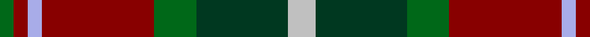

In pattern [GRWRGGW](/patterns/grwrggw/).

This was sourced from tartans-authority.  It is a [7 stripes tartan](/stripes/stripes7/).

Original link http://www.tartansauthority.com/tartan-ferret/display/2315/

## Thread count
G/4 DR4 LP4 DR32 G12 DG26 N/8

## Palette
Each colour and its ΔE from the base-6 reference it is a variant of.

| Colour | Shade | Base | ΔE (OKLab) |
|---|---|---|---|
| DG | <code style="background-color:#003820;">#003820</code> `#003820` | G <code style="background-color:#006100;">#006100</code> | 0.15 |
| DR | <code style="background-color:#880000;">#880000</code> `#880000` | R <code style="background-color:#CC0000;">#CC0000</code> | 0.15 |
| G | <code style="background-color:#006818;">#006818</code> `#006818` | G <code style="background-color:#006100;">#006100</code> | 0.02 |
| LP | <code style="background-color:#A8ACE8;">#A8ACE8</code> `#A8ACE8` | W <code style="background-color:#F7F7F7;">#F7F7F7</code> | 0.23 |
| N | <code style="background-color:#C0C0C0;">#C0C0C0</code> `#C0C0C0` | W <code style="background-color:#F7F7F7;">#F7F7F7</code> | 0.17 |

# Sample pattern

## Nearest tartans

The nearest existing variants by ΔTartan distance.

1. [Sikh (Corporate)](/setts/s8/r60k8r6k8r6g40b40y8-b14283c-g006818-k101010-rb84c00-ye8c000/) — ΔT 0.59
1. [Craik of Assington (Personal)](/setts/s8/b16r44b4g32r8g16k4y8-b1c0070-g006818-k101010-r880000-yd09800/) — ΔT 0.69
1. [Sikh](/setts/s8/r56k12r7k12r7g50b50y10-b2c2c80-g006818-k101010-rb84c00-ye8c000/) — ΔT 0.76
1. [Caledonian Brewery Corporate Tartan Tartan Number: 2315. Earliest known date: pre 1997 Designed by Kinloch Anderson Ltd to commemorate the opening of the new Caledonian Brewery Malting Building. See products available Copyright © Blair Urquhart, Comrie, 2015](/setts/s7/w8k26g12r32wa4r4g4-g006818-k101010-r880000-wc0c0c0-waa8ace8/) — ΔT 0.81
1. [Craik of Assington Personal Tartan Tartan Number: 494. Earliest known date: 1981 Restricted See products available Copyright © Blair Urquhart, Comrie, 2015](/setts/s8/b16r44b4g32r8g16k4y8-b2c2c80-g006818-k101010-rc80000-ye8c000/) — ΔT 0.91
1. [Graham of Montrose Red](/setts/s9/w4k4r40g40k20w20r40k4w4-g006818-k101010-r880000-wa8ace8/) — ΔT 1.03
1. [Sawyer](/setts/s8/g8y4g40b4k16r32w4r8-b1c0070-g006818-k101010-ra00000-wa8ace8-yb8b8b8/) — ΔT 1.06
1. [Eyre (Personal)](/setts/s6/r6b24r8g36r12k4-b202060-g006818-k101010-rc80000/) — ΔT 1.08
1. [Craik, of Assington](/setts/s8/b16r44b4g32r8g16k4y8-b304080-g008000-k000000-rc00000-yf0c000/) — ΔT 1.09
1. [Barbour Corporate Tartan Tartan Number: 2489. Earliest known date: 1998 For the linings of Barbour's famous wax jackets. Tartan designed by Kinloch Anderson of Edinburgh. See products available Copyright © Blair Urquhart, Comrie, 2015](/setts/s7/g8y4g42b22w4k40r6-b441800-g6c6044-k101010-rc80000-wfcfcfc-ye8c000/) — ΔT 1.11

## Neighbour map

Every grey dot is one of 15726 variants placed by the first two principal components of the ΔTartan feature space (44% of its variance). Red is this tartan; blue dots are its nearest — click one to open its page.

<svg viewBox="0 0 640 380" role="img" style="max-width:100%;height:auto;border:1px solid #e0e0e0;border-radius:4px;display:block" xmlns="http://www.w3.org/2000/svg"><image href="/nn/cloud.v1.png" width="640" height="380"/><a href="/setts/s8/r60k8r6k8r6g40b40y8-b14283c-g006818-k101010-rb84c00-ye8c000/"><circle cx="192.7" cy="173.5" r="4" fill="#3465a4"><title>Sikh (Corporate)</title></circle></a><a href="/setts/s8/b16r44b4g32r8g16k4y8-b1c0070-g006818-k101010-r880000-yd09800/"><circle cx="206.4" cy="184.3" r="4" fill="#3465a4"><title>Craik of Assington (Personal)</title></circle></a><a href="/setts/s8/r56k12r7k12r7g50b50y10-b2c2c80-g006818-k101010-rb84c00-ye8c000/"><circle cx="139.3" cy="186.9" r="4" fill="#3465a4"><title>Sikh</title></circle></a><a href="/setts/s7/w8k26g12r32wa4r4g4-g006818-k101010-r880000-wc0c0c0-waa8ace8/"><circle cx="169.8" cy="187.8" r="4" fill="#3465a4"><title>Caledonian Brewery Corporate Tartan Tartan Number: 2315. Earliest known date: pre 1997 Designed by Kinloch Anderson Ltd to commemorate the opening of the new Caledonian Brewery Malting Building. See products available Copyright © Blair Urquhart, Comrie, 2015</title></circle></a><a href="/setts/s8/b16r44b4g32r8g16k4y8-b2c2c80-g006818-k101010-rc80000-ye8c000/"><circle cx="193.6" cy="172.2" r="4" fill="#3465a4"><title>Craik of Assington Personal Tartan Tartan Number: 494. Earliest known date: 1981 Restricted See products available Copyright © Blair Urquhart, Comrie, 2015</title></circle></a><a href="/setts/s9/w4k4r40g40k20w20r40k4w4-g006818-k101010-r880000-wa8ace8/"><circle cx="196.6" cy="171.6" r="4" fill="#3465a4"><title>Graham of Montrose Red</title></circle></a><a href="/setts/s8/g8y4g40b4k16r32w4r8-b1c0070-g006818-k101010-ra00000-wa8ace8-yb8b8b8/"><circle cx="187.8" cy="161.1" r="4" fill="#3465a4"><title>Sawyer</title></circle></a><a href="/setts/s6/r6b24r8g36r12k4-b202060-g006818-k101010-rc80000/"><circle cx="213.7" cy="221.9" r="4" fill="#3465a4"><title>Eyre (Personal)</title></circle></a><a href="/setts/s8/b16r44b4g32r8g16k4y8-b304080-g008000-k000000-rc00000-yf0c000/"><circle cx="186.5" cy="169.9" r="4" fill="#3465a4"><title>Craik, of Assington</title></circle></a><a href="/setts/s7/g8y4g42b22w4k40r6-b441800-g6c6044-k101010-rc80000-wfcfcfc-ye8c000/"><circle cx="172.7" cy="166.7" r="4" fill="#3465a4"><title>Barbour Corporate Tartan Tartan Number: 2489. Earliest known date: 1998 For the linings of Barbour's famous wax jackets. Tartan designed by Kinloch Anderson of Edinburgh. See products available Copyright © Blair Urquhart, Comrie, 2015</title></circle></a><circle cx="182.9" cy="195.2" r="5" fill="#c00000"/></svg>

ID: /setts/s7/w8g26ga12r32wa4r4ga4-g003820-ga006818-r880000-wc0c0c0-waa8ace8/
