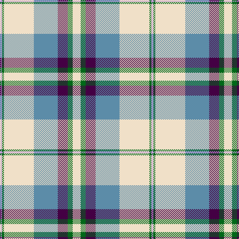

In pattern [WGBBWGW](/patterns/wgbbwgw/).

This was sourced from tartans-authority.  It is a [7 stripes tartan](/stripes/stripes7/).

Original link http://www.tartansauthority.com/tartan-ferret/display/7584/

## Attestations

This cloth appears in 3 source records; the oldest owns this page.

- March 2008 — Shiel, Purple V2 (Dance) (tartans-authority, [record](http://www.tartansauthority.com/tartan-ferret/display/7584/))
- undated — Shiel Purple V2 (register-of-tartans, [record](https://www.tartanregister.gov.uk/tartanDetails.aspx?ref=5608))
- undated — Shiel Lavender Fashion Tartan Tartan Number: 7584. Earliest known date: March 2008 One of a series of dancer's tartans for the House of Edgar's in-house collection designed by Kirsty Anderson. See products available Copyright © Blair Urquhart, Comrie, 2015 (house-of-tartan, [record](http://www.house-of-tartan.scotland.net/house/TartanViewjs.asp?colr=Def&tnam=7584))

## Thread count
LP/4 G4 W60 B48 DP20 G10 W/16

## Palette
Each colour and its ΔE from the base-6 reference it is a variant of.

| Colour | Shade | Base | ΔE (OKLab) |
|---|---|---|---|
| B | <code style="background-color:#5C8CA8;">#5C8CA8</code> `#5C8CA8` | B <code style="background-color:#2A418A;">#2A418A</code> | 0.23 |
| DP | <code style="background-color:#440044;">#440044</code> `#440044` | B <code style="background-color:#2A418A;">#2A418A</code> | 0.18 |
| G | <code style="background-color:#006818;">#006818</code> `#006818` | G <code style="background-color:#006100;">#006100</code> | 0.02 |
| LP | <code style="background-color:#C49CD8;">#C49CD8</code> `#C49CD8` | W <code style="background-color:#F7F7F7;">#F7F7F7</code> | 0.25 |
| W | <code style="background-color:#F0E0C8;">#F0E0C8</code> `#F0E0C8` | W <code style="background-color:#F7F7F7;">#F7F7F7</code> | 0.07 |

# Sample pattern

## Nearest tartans

The nearest existing variants by ΔTartan distance.

1. [Manx Laxey, dress green](/setts/s6/b2w14ba4y1g8b2x2~b304080-ba800080-g008000-we0e0e0-yf0c000/) — ΔT 0.61
1. [Shiel, Magenta (Dance)](/setts/s7/w8b5ba10bb24w30b2g2x2~b9080b8-ba7490a4-bb542850-g003820-wf0e0c8/) — ΔT 0.68
1. [Manx, dress](/setts/s6/g4w28b8y2ba17g4x2~b800080-ba304080-g008000-we0e0e0-yf0c000/) — ΔT 0.81
1. [MacTavish of Dunardry (Clan)](/setts/s7/b8w28y3g3b8k9b4x2~b5c8ca8-g408060-k101010-we0e0e0-ya08858/) — ΔT 0.85
1. [Manx Laxey Dress Green](/setts/s5/w14b4y1g8ba2x2~b780078-ba2c2c80-g006818-we0e0e0-ye8c000/) — ΔT 0.88
1. [Manitoba Dress (1958) (District)](/setts/s8/b4w1b2w18g3w1r9y4x4~b2c2c80-g00881c-r901c38-we0e0e0-ye8c000/) — ΔT 0.91
1. [Shiel, Purple (Dance)](/setts/s7/w8g5b10ba24w30g2wa2x2~b5c8ca8-ba440044-g006818-wf0e0c8-wac49cd8/) — ΔT 0.92
1. [MacTavish of Dunardry Dress](/setts/s7/b8w28r3g3b8k9b4x2~b5a6e90-g487731-k101010-r95765b-wffffff/) — ΔT 0.99
1. [MacNaughton Dress](/setts/s9/r2b2w26g25k14b13w26b2r2x2~b343494-g347800-k101010-rc80000-we0e0e0/) — ΔT 1.05
1. [Allanton Dress (Fashion)](/setts/s6/g4w28b14y2ba17g4x2~b2c2c80-ba5c8ca8-g006818-we0e0e0-ye8c000/) — ΔT 1.07

## Neighbour map

Every grey dot is one of 15726 variants placed by the first two principal components of the ΔTartan feature space (44% of its variance). Red is this tartan; blue dots are its nearest — click one to open its page.

<svg viewBox="0 0 640 380" role="img" style="max-width:100%;height:auto;border:1px solid #e0e0e0;border-radius:4px;display:block" xmlns="http://www.w3.org/2000/svg"><image href="/nn/cloud.v1.png" width="640" height="380"/><a href="/setts/s6/b2w14ba4y1g8b2x2~b304080-ba800080-g008000-we0e0e0-yf0c000/"><circle cx="185.1" cy="154.7" r="4" fill="#3465a4"><title>Manx Laxey, dress green</title></circle></a><a href="/setts/s7/w8b5ba10bb24w30b2g2x2~b9080b8-ba7490a4-bb542850-g003820-wf0e0c8/"><circle cx="206.7" cy="143.5" r="4" fill="#3465a4"><title>Shiel, Magenta (Dance)</title></circle></a><a href="/setts/s6/g4w28b8y2ba17g4x2~b800080-ba304080-g008000-we0e0e0-yf0c000/"><circle cx="182.2" cy="154.2" r="4" fill="#3465a4"><title>Manx, dress</title></circle></a><a href="/setts/s7/b8w28y3g3b8k9b4x2~b5c8ca8-g408060-k101010-we0e0e0-ya08858/"><circle cx="174.4" cy="163.1" r="4" fill="#3465a4"><title>MacTavish of Dunardry (Clan)</title></circle></a><a href="/setts/s5/w14b4y1g8ba2x2~b780078-ba2c2c80-g006818-we0e0e0-ye8c000/"><circle cx="202.1" cy="167.7" r="4" fill="#3465a4"><title>Manx Laxey Dress Green</title></circle></a><a href="/setts/s8/b4w1b2w18g3w1r9y4x4~b2c2c80-g00881c-r901c38-we0e0e0-ye8c000/"><circle cx="211.0" cy="117.9" r="4" fill="#3465a4"><title>Manitoba Dress (1958) (District)</title></circle></a><a href="/setts/s7/w8g5b10ba24w30g2wa2x2~b5c8ca8-ba440044-g006818-wf0e0c8-wac49cd8/"><circle cx="196.8" cy="141.5" r="4" fill="#3465a4"><title>Shiel, Purple (Dance)</title></circle></a><a href="/setts/s7/b8w28r3g3b8k9b4x2~b5a6e90-g487731-k101010-r95765b-wffffff/"><circle cx="161.2" cy="155.8" r="4" fill="#3465a4"><title>MacTavish of Dunardry Dress</title></circle></a><a href="/setts/s9/r2b2w26g25k14b13w26b2r2x2~b343494-g347800-k101010-rc80000-we0e0e0/"><circle cx="166.2" cy="143.1" r="4" fill="#3465a4"><title>MacNaughton Dress</title></circle></a><a href="/setts/s6/g4w28b14y2ba17g4x2~b2c2c80-ba5c8ca8-g006818-we0e0e0-ye8c000/"><circle cx="159.6" cy="164.6" r="4" fill="#3465a4"><title>Allanton Dress (Fashion)</title></circle></a><circle cx="206.6" cy="146.6" r="5" fill="#c00000"/></svg>

ID: /setts/s7/w8g5b10ba24w30g2wa2x2~b440044-ba5c8ca8-g006818-wf0e0c8-wac49cd8/
