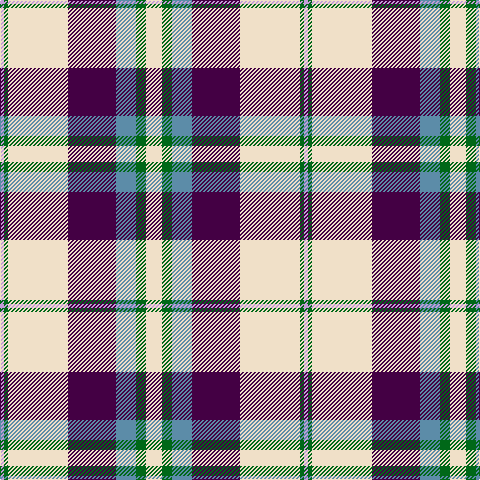

In pattern [WGBBWGW](/patterns/wgbbwgw/).

This was sourced from tartans-authority.  It is a [7 stripes tartan](/stripes/stripes7/).

Original link http://www.tartansauthority.com/tartan-ferret/display/7583/

## Attestations

This cloth appears in 2 source records; the oldest owns this page.

- March 2008 — Shiel, Purple (Dance) (tartans-authority, [record](http://www.tartansauthority.com/tartan-ferret/display/7583/))
- undated — Shiel Purple (register-of-tartans, [record](https://www.tartanregister.gov.uk/tartanDetails.aspx?ref=5607))

## Register references

External register numbers recorded for this tartan.

- Scottish Register of Tartans: [5607](https://www.tartanregister.gov.uk/tartanDetails.aspx?ref=5607)
- Scottish Tartans Authority (ITI): 7583

## Thread count
LP/4 G4 W60 DP48 B20 G10 W/16

## Palette
Each colour and its ΔE from the base-6 reference it is a variant of.

| Colour | Shade | Base | ΔE (OKLab) |
|---|---|---|---|
| B | <code style="background-color:#5C8CA8;">#5C8CA8</code> `#5C8CA8` | B <code style="background-color:#2A418A;">#2A418A</code> | 0.23 |
| DP | <code style="background-color:#440044;">#440044</code> `#440044` | B <code style="background-color:#2A418A;">#2A418A</code> | 0.18 |
| G | <code style="background-color:#006818;">#006818</code> `#006818` | G <code style="background-color:#006100;">#006100</code> | 0.02 |
| LP | <code style="background-color:#C49CD8;">#C49CD8</code> `#C49CD8` | W <code style="background-color:#F7F7F7;">#F7F7F7</code> | 0.25 |
| W | <code style="background-color:#F0E0C8;">#F0E0C8</code> `#F0E0C8` | W <code style="background-color:#F7F7F7;">#F7F7F7</code> | 0.07 |

# Sample pattern

## Nearest tartans

The nearest existing variants by ΔTartan distance.

1. [Shiel, Magenta (Dance)](/setts/s7/w8b5ba10bb24w30b2g2~b9080b8-ba7490a4-bb542850-g003820-wf0e0c8~x2/) — ΔT 0.46
1. [MacDuff Dress #5](/setts/s7/w39b9k10g11r7k3r7~b2c4084-g005020-k101010-rdc0000-we0e0e0~x2/) — ΔT 0.67
1. [MacDuff Dress Clan Tartan Tartan Number: 1601. Earliest known date: pre 2003 From Scott Adie pattern. See products available Copyright © Blair Urquhart, Comrie, 2015](/setts/s7/w39b9k10g11r7k3r7~b2c2c80-g006818-k101010-rc80000-we0e0e0~x2/) — ΔT 0.68
1. [Manx, dress](/setts/s6/g4w28b8y2ba17g4~b800080-ba304080-g008000-we0e0e0-yf0c000~x2/) — ΔT 0.78
1. [Manx Dress](/setts/s6/g4w28b8y2ba17g4~b780078-ba2c2c80-g006818-we0e0e0-ye8c000~x2/) — ΔT 0.82
1. [Manitoba Dress (1958) (District)](/setts/s8/b4w1b2w18g3w1r9y4~b2c2c80-g00881c-r901c38-we0e0e0-ye8c000~x4/) — ΔT 0.85
1. [MacDuff dress](/setts/s7/w39b9k10g11r7k3r7~b304080-g008000-k000000-rc00000-we0e0e0~x2/) — ΔT 0.86
1. [Shiel, Purple V2 (Dance)](/setts/s7/w8g5b10ba24w30g2wa2~b440044-ba5c8ca8-g006818-wf0e0c8-wac49cd8~x2/) — ΔT 0.92
1. [Culloden, dress Ancient](/setts/s8/r6b2ba21w3g19w26g3w5~b304080-ba800080-g003000-rc00000-we0e0e0~x2/) — ΔT 0.95
1. [Culloden Dress Old Tartan Tartan Number: 1322. Earliest known date: 1983 Worn by a member of Prince Charles' staff during the battle but it is not known with which family or district it was first connected. It was first illustrated in Old & Rare in 1893 by D W Stewart whose son D C Stewart was a founder member of the Scottish Tartans Society. Now firmly established as a district tartan. See products available Copyright © Blair Urquhart, Comrie, 2015](/setts/s8/r6b2ba21w3g19w26g3w5~b2c2c80-ba780078-g003820-rc80000-we0e0e0~x2/) — ΔT 0.95

## Neighbour map

Every grey dot is one of 15726 variants placed by the first two principal components of the ΔTartan feature space (44% of its variance). Red is this tartan; blue dots are its nearest — click one to open its page.

<svg viewBox="0 0 640 380" role="img" style="max-width:100%;height:auto;border:1px solid #e0e0e0;border-radius:4px;display:block" xmlns="http://www.w3.org/2000/svg"><image href="/nn/cloud.v1.png" width="640" height="380"/><a href="/setts/s7/w8b5ba10bb24w30b2g2~b9080b8-ba7490a4-bb542850-g003820-wf0e0c8~x2/"><circle cx="206.7" cy="143.5" r="4" fill="#3465a4"><title>Shiel, Magenta (Dance)</title></circle></a><a href="/setts/s7/w39b9k10g11r7k3r7~b2c4084-g005020-k101010-rdc0000-we0e0e0~x2/"><circle cx="169.2" cy="142.6" r="4" fill="#3465a4"><title>MacDuff Dress #5</title></circle></a><a href="/setts/s7/w39b9k10g11r7k3r7~b2c2c80-g006818-k101010-rc80000-we0e0e0~x2/"><circle cx="168.7" cy="143.0" r="4" fill="#3465a4"><title>MacDuff Dress Clan Tartan Tartan Number: 1601. Earliest known date: pre 2003 From Scott Adie pattern. See products available Copyright © Blair Urquhart, Comrie, 2015</title></circle></a><a href="/setts/s6/g4w28b8y2ba17g4~b800080-ba304080-g008000-we0e0e0-yf0c000~x2/"><circle cx="182.2" cy="154.2" r="4" fill="#3465a4"><title>Manx, dress</title></circle></a><a href="/setts/s6/g4w28b8y2ba17g4~b780078-ba2c2c80-g006818-we0e0e0-ye8c000~x2/"><circle cx="178.9" cy="153.5" r="4" fill="#3465a4"><title>Manx Dress</title></circle></a><a href="/setts/s8/b4w1b2w18g3w1r9y4~b2c2c80-g00881c-r901c38-we0e0e0-ye8c000~x4/"><circle cx="211.0" cy="117.9" r="4" fill="#3465a4"><title>Manitoba Dress (1958) (District)</title></circle></a><a href="/setts/s7/w39b9k10g11r7k3r7~b304080-g008000-k000000-rc00000-we0e0e0~x2/"><circle cx="162.9" cy="142.2" r="4" fill="#3465a4"><title>MacDuff dress</title></circle></a><a href="/setts/s7/w8g5b10ba24w30g2wa2~b440044-ba5c8ca8-g006818-wf0e0c8-wac49cd8~x2/"><circle cx="206.6" cy="146.6" r="4" fill="#3465a4"><title>Shiel, Purple V2 (Dance)</title></circle></a><a href="/setts/s8/r6b2ba21w3g19w26g3w5~b304080-ba800080-g003000-rc00000-we0e0e0~x2/"><circle cx="153.2" cy="143.3" r="4" fill="#3465a4"><title>Culloden, dress Ancient</title></circle></a><a href="/setts/s8/r6b2ba21w3g19w26g3w5~b2c2c80-ba780078-g003820-rc80000-we0e0e0~x2/"><circle cx="154.7" cy="143.8" r="4" fill="#3465a4"><title>Culloden Dress Old Tartan Tartan Number: 1322. Earliest known date: 1983 Worn by a member of Prince Charles' staff during the battle but it is not known with which family or district it was first connected. It was first illustrated in Old &amp; Rare in 1893 by D W Stewart whose son D C Stewart was a founder member of the Scottish Tartans Society. Now firmly established as a district tartan. See products available Copyright © Blair Urquhart, Comrie, 2015</title></circle></a><circle cx="196.8" cy="141.5" r="5" fill="#c00000"/></svg>

ID: /setts/s7/w8g5b10ba24w30g2wa2~b5c8ca8-ba440044-g006818-wf0e0c8-wac49cd8~x2/
