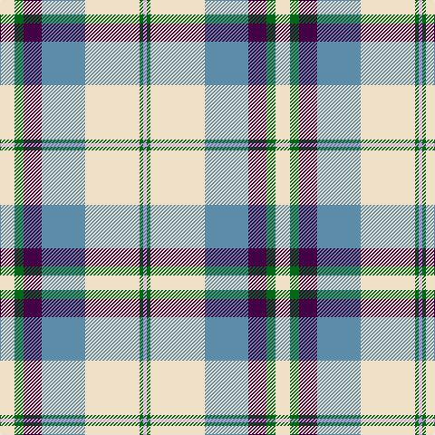

This page is one **sett** — a single exact thread-count. It belongs to the [tartan](/tartans/w8g5dp10b24w30g2lp2/)
(the same proportion at any scale), whose colour order is pattern [WGBBWGW](/stripes/wgbbwgw/).

Sourced from tartans-authority.  It is a [7 stripe tartan](/stripes/stripes7/).

Original link http://www.tartansauthority.com/tartan-ferret/display/7584/

## Also known as

This cloth is also recorded under:

- Shiel Purple V2
- Shiel, Purple V2

3 attestations — the source records this cloth was collapsed from (oldest owns this page)

<ul>
<li>March 2008 — Shiel, Purple V2 (Dance) (tartans-authority, <a href="http://www.tartansauthority.com/tartan-ferret/display/7584/">record</a>)</li>
<li>undated — Shiel Purple V2 (register-of-tartans, <a href="https://www.tartanregister.gov.uk/tartanDetails.aspx?ref=5608">record</a>)</li>
<li>undated — Shiel Lavender Fashion Tartan Tartan Number: 7584. Earliest known date: March 2008 One of a series of dancer's tartans for the House of Edgar's in-house collection designed by Kirsty Anderson. See products available Copyright © Blair Urquhart, Comrie, 2015 (house-of-tartan, <a href="http://www.house-of-tartan.scotland.net/house/TartanViewjs.asp?colr=Def&tnam=7584">record</a>)</li>
</ul>

## Register references

External register numbers recorded for this tartan.

- Scottish Register of Tartans: [5608](https://www.tartanregister.gov.uk/tartanDetails.aspx?ref=5608)
- Scottish Tartans Authority (ITI): 7584

## Thread count
W/16 G10 DP20 B48 W60 G4 LP/4

## Palette
Each colour and the base-6 reference it is a variant of.

| Colour | Shade | Base |
|---|---|---|
| B | <code style="background-color:#5C8CA8;">#5C8CA8</code> `oklch(61.7% 0.067 235.0)` <small>#5C8CA8</small> | B <code style="background-color:#2A418A;">#2A418A</code> |
| DP | <code style="background-color:#440044;">#440044</code> `oklch(27.1% 0.125 328.4)` <small>#440044</small> | B <code style="background-color:#2A418A;">#2A418A</code> |
| G | <code style="background-color:#006818;">#006818</code> `oklch(45.0% 0.142 145.0)` <small>#006818</small> | G <code style="background-color:#006100;">#006100</code> |
| LP | <code style="background-color:#C49CD8;">#C49CD8</code> `oklch(75.0% 0.095 314.2)` <small>#C49CD8</small> | W <code style="background-color:#F7F7F7;">#F7F7F7</code> |
| W | <code style="background-color:#F0E0C8;">#F0E0C8</code> `oklch(91.3% 0.036 78.1)` <small>#F0E0C8</small> | W <code style="background-color:#F7F7F7;">#F7F7F7</code> |

# Sample pattern

## Nearest tartans

The nearest existing variants by ΔTartan distance, with this tartan at the top so the swatches line up against it.

ΔTartan

Tartan

Sett

—

<a href="/ttd/edit/#slug=w8g5dp10t24w30g2lp2~x2">Shiel, Purple V2 (Dance)</a> <a class="nn-out" href="/setts/s7/w8g5dp10t24w30g2lp2~x2/" title="open its dictionary page">↗</a>

0.61

<a href="/ttd/edit/#slug=db2w14p4ly1g8db2~x2">Manx Laxey, dress green</a> <a class="nn-out" href="/setts/s6/db2w14p4ly1g8db2~x2/" title="open its dictionary page">↗</a>

0.68

<a href="/ttd/edit/#slug=w8b5t10dp24w30b2dg2~x2">Shiel, Magenta (Dance)</a> <a class="nn-out" href="/setts/s7/w8b5t10dp24w30b2dg2~x2/" title="open its dictionary page">↗</a>

0.81

<a href="/ttd/edit/#slug=g4w28p8ly2db17g4~x2">Manx, dress</a> <a class="nn-out" href="/setts/s6/g4w28p8ly2db17g4~x2/" title="open its dictionary page">↗</a>

0.85

<a href="/ttd/edit/#slug=t8w28lo3g3t8k9t4~x2">MacTavish of Dunardry (Clan)</a> <a class="nn-out" href="/setts/s7/t8w28lo3g3t8k9t4~x2/" title="open its dictionary page">↗</a>

0.88

<a href="/ttd/edit/#slug=w14dp4ly1g8db2~x2">Manx Laxey Dress Green</a> <a class="nn-out" href="/setts/s5/w14dp4ly1g8db2~x2/" title="open its dictionary page">↗</a>

0.91

<a href="/ttd/edit/#slug=db4w1db2w18g3w1r9ly4~x4">Manitoba Dress (1958) (District)</a> <a class="nn-out" href="/setts/s8/db4w1db2w18g3w1r9ly4~x4/" title="open its dictionary page">↗</a>

0.92

<a href="/ttd/edit/#slug=w8g5t10dp24w30g2lp2~x2">Shiel, Purple (Dance)</a> <a class="nn-out" href="/setts/s7/w8g5t10dp24w30g2lp2~x2/" title="open its dictionary page">↗</a>

0.98

<a href="/ttd/edit/#slug=n8w28o3g3n8k9n4~x2">MacTavish of Dunardry Dress</a> <a class="nn-out" href="/setts/s7/n8w28o3g3n8k9n4~x2/" title="open its dictionary page">↗</a>

1.05

<a href="/ttd/edit/#slug=r2db2w26g25k14db13w26db2r2~x2">MacNaughton Dress</a> <a class="nn-out" href="/setts/s9/r2db2w26g25k14db13w26db2r2~x2/" title="open its dictionary page">↗</a>

1.07

<a href="/ttd/edit/#slug=g4w28db14ly2t17g4~x2">Allanton Dress (Fashion)</a> <a class="nn-out" href="/setts/s6/g4w28db14ly2t17g4~x2/" title="open its dictionary page">↗</a>

## Neighbour map

Every grey dot is one of 14299 variants placed by the first two principal components of the ΔTartan feature space (44% of its variance). Red is this tartan; blue dots are its nearest — click one to open its page.

<svg viewBox="0 0 640 380" role="img" style="max-width:100%;height:auto;border:1px solid #e0e0e0;border-radius:4px;display:block" xmlns="http://www.w3.org/2000/svg"><image href="/nn/cloud.v1.png" width="640" height="380"/><a href="/setts/s6/db2w14p4ly1g8db2~x2/"><circle cx="187.5" cy="152.3" r="4" fill="#3465a4"><title>Manx Laxey, dress green</title></circle></a><a href="/setts/s7/w8b5t10dp24w30b2dg2~x2/"><circle cx="208.5" cy="140.3" r="4" fill="#3465a4"><title>Shiel, Magenta (Dance)</title></circle></a><a href="/setts/s6/g4w28p8ly2db17g4~x2/"><circle cx="184.6" cy="151.6" r="4" fill="#3465a4"><title>Manx, dress</title></circle></a><a href="/setts/s7/t8w28lo3g3t8k9t4~x2/"><circle cx="177.0" cy="161.3" r="4" fill="#3465a4"><title>MacTavish of Dunardry (Clan)</title></circle></a><a href="/setts/s5/w14dp4ly1g8db2~x2/"><circle cx="204.4" cy="164.1" r="4" fill="#3465a4"><title>Manx Laxey Dress Green</title></circle></a><a href="/setts/s8/db4w1db2w18g3w1r9ly4~x4/"><circle cx="212.7" cy="114.6" r="4" fill="#3465a4"><title>Manitoba Dress (1958) (District)</title></circle></a><a href="/setts/s7/w8g5t10dp24w30g2lp2~x2/"><circle cx="198.8" cy="137.3" r="4" fill="#3465a4"><title>Shiel, Purple (Dance)</title></circle></a><a href="/setts/s7/n8w28o3g3n8k9n4~x2/"><circle cx="163.8" cy="152.1" r="4" fill="#3465a4"><title>MacTavish of Dunardry Dress</title></circle></a><a href="/setts/s9/r2db2w26g25k14db13w26db2r2~x2/"><circle cx="168.8" cy="140.4" r="4" fill="#3465a4"><title>MacNaughton Dress</title></circle></a><a href="/setts/s6/g4w28db14ly2t17g4~x2/"><circle cx="162.5" cy="163.9" r="4" fill="#3465a4"><title>Allanton Dress (Fashion)</title></circle></a><circle cx="208.7" cy="144.4" r="5" fill="#c00000"/></svg>

ID: /setts/s7/w8g5dp10t24w30g2lp2~x2/
