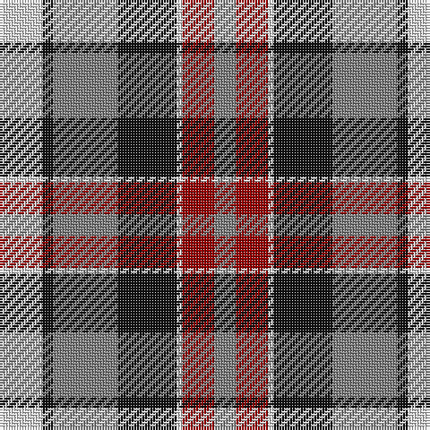

**Bands:** [GRWKGKW](/stripes/grwkgkw/) · **Stripes:** [Y R W K Y K W](/stripes/stripes7/) Y R W K Y K W

This was sourced from register-of-tartans.  It is a [7 band tartan](/bands/bands7/).

Original link https://www.tartanregister.gov.uk/tartanDetails.aspx?ref=5946

## Register references

External register numbers recorded for this tartan.

- Scottish Register of Tartans: [5946](https://www.tartanregister.gov.uk/tartanDetails.aspx?ref=5946)
- Scottish Tartans World Register: 3009

## Thread count
LN/16 K4 N24 K22 LN2 DR12 N/8

## Palette
Each colour and its ΔE from the base-6 reference it is a variant of.

| Colour | Shade | Base | ΔE (OKLab) |
|---|---|---|---|
| DR | <code style="background-color:#960000;">#960000</code> `#960000` | R <code style="background-color:#CC0000;">#CC0000</code> | 0.12 |
| K | <code style="background-color:#101010;">#101010</code> `#101010` | K <code style="background-color:#000000;">#000000</code> | 0.17 |
| LN | <code style="background-color:#E0E0E0;">#E0E0E0</code> `#E0E0E0` | W <code style="background-color:#F7F7F7;">#F7F7F7</code> | 0.07 |
| N | <code style="background-color:#808080;">#808080</code> `#808080` | G <code style="background-color:#006100;">#006100</code> | 0.23 |

# Sample pattern

## Nearest tartans

The nearest existing variants by ΔTartan distance.

1. [Bannockbane, Dark Tan](/setts/s8/dr4ly2dr13ly1w8t13ly2t4~x2/) — ΔT 0.78
1. [Borthwick Dress Artifact Tartan Tartan Number: 820. Earliest known date: pre 2003 No details available. See products available Copyright © Blair Urquhart, Comrie, 2015](/setts/s9/g7k1m7k1w7k10w7k2w4~x2/) — ΔT 0.84
1. [Thompson Grey Family Tartan Tartan Number: 1611. Earliest known date: pre 2003 Designed for Lord Thomson of Fleet in 1958 based on a sample in the Moy Hall collection dating from the mid 19th century. The tartan is also suitable for MacTavishs and Thompsons, who claim descent from the Clan MacIntosh. See products available Copyright © Blair Urquhart, Comrie, 2015](/setts/s6/r2o20k5w10k10r2~x2/) — ΔT 0.84
1. [Because You Care](/setts/s7/dg16dp4dg8dp13k3w26dp10~x2/) — ΔT 0.91
1. [Unidentified (ex Tony Murray)](/setts/s8/dt8w22dt5w4k24r6k2r6~x2/) — ΔT 0.92
1. [Bannockbane Grey #1](/setts/s8/k4ly2k13ly1w8o13ly2o4~x2/) — ΔT 0.95
1. [Bannock Bane M.407](/setts/s8/db4dy3db21dy2w14o22dy3o4~x2/) — ΔT 0.99
1. [Borthwick Dress (Clan)](/setts/s9/g7k1r8k2w7k10w7k2w4~x4/) — ΔT 1.01
1. [Thom(p)son, Grey](/setts/s6/r2y20k5w10k10r2~x2/) — ΔT 1.01
1. [Borthwick, dress](/setts/s9/g7k1r7k1w7k10w7k2w4~x2/) — ΔT 1.01

## Neighbour map

Every grey dot is one of 14313 variants placed by the first two principal components of the ΔTartan feature space (44% of its variance). Red is this tartan; blue dots are its nearest — click one to open its page.

<svg viewBox="0 0 640 380" role="img" style="max-width:100%;height:auto;border:1px solid #e0e0e0;border-radius:4px;display:block" xmlns="http://www.w3.org/2000/svg"><image href="/nn/cloud.v1.png" width="640" height="380"/><a href="/setts/s8/dr4ly2dr13ly1w8t13ly2t4~x2/"><circle cx="164.1" cy="170.8" r="4" fill="#3465a4"><title>Bannockbane, Dark Tan</title></circle></a><a href="/setts/s9/g7k1m7k1w7k10w7k2w4~x2/"><circle cx="127.5" cy="186.9" r="4" fill="#3465a4"><title>Borthwick Dress Artifact Tartan Tartan Number: 820. Earliest known date: pre 2003 No details available. See products available Copyright © Blair Urquhart, Comrie, 2015</title></circle></a><a href="/setts/s6/r2o20k5w10k10r2~x2/"><circle cx="174.7" cy="192.4" r="4" fill="#3465a4"><title>Thompson Grey Family Tartan Tartan Number: 1611. Earliest known date: pre 2003 Designed for Lord Thomson of Fleet in 1958 based on a sample in the Moy Hall collection dating from the mid 19th century. The tartan is also suitable for MacTavishs and Thompsons, who claim descent from the Clan MacIntosh. See products available Copyright © Blair Urquhart, Comrie, 2015</title></circle></a><a href="/setts/s7/dg16dp4dg8dp13k3w26dp10~x2/"><circle cx="120.0" cy="198.6" r="4" fill="#3465a4"><title>Because You Care</title></circle></a><a href="/setts/s8/dt8w22dt5w4k24r6k2r6~x2/"><circle cx="140.3" cy="164.5" r="4" fill="#3465a4"><title>Unidentified (ex Tony Murray)</title></circle></a><a href="/setts/s8/k4ly2k13ly1w8o13ly2o4~x2/"><circle cx="152.3" cy="167.0" r="4" fill="#3465a4"><title>Bannockbane Grey #1</title></circle></a><a href="/setts/s8/db4dy3db21dy2w14o22dy3o4~x2/"><circle cx="159.5" cy="166.9" r="4" fill="#3465a4"><title>Bannock Bane M.407</title></circle></a><a href="/setts/s9/g7k1r8k2w7k10w7k2w4~x4/"><circle cx="111.2" cy="187.6" r="4" fill="#3465a4"><title>Borthwick Dress (Clan)</title></circle></a><a href="/setts/s6/r2y20k5w10k10r2~x2/"><circle cx="164.9" cy="190.6" r="4" fill="#3465a4"><title>Thom(p)son, Grey</title></circle></a><a href="/setts/s9/g7k1r7k1w7k10w7k2w4~x2/"><circle cx="121.5" cy="187.1" r="4" fill="#3465a4"><title>Borthwick, dress</title></circle></a><circle cx="143.6" cy="193.3" r="5" fill="#c00000"/></svg>

ID: /setts/s7/w8k2y12k11w1r6y4~x2/
