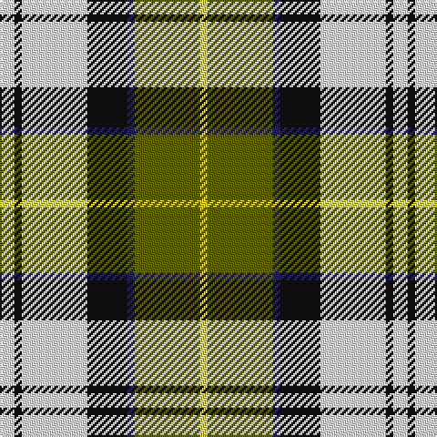

In pattern [WKWKBGY](/patterns/wkwkbgy/).

This was sourced from tartans-authority.  It is a [7 stripes tartan](/stripes/stripes7/).

Original link http://www.tartansauthority.com/tartan-ferret/display/8733/

## Thread count
W/8 K4 W36 K22 DB4 T36 Y/4

## Palette
Each colour and its ΔE from the base-6 reference it is a variant of.

| Colour | Shade | Base | ΔE (OKLab) |
|---|---|---|---|
| DB | <code style="background-color:#202060;">#202060</code> `#202060` | B <code style="background-color:#2C4084;">#2C4084</code> | 0.11 |
| K | <code style="background-color:#101010;">#101010</code> `#101010` | K <code style="background-color:#000000;">#000000</code> | 0.17 |
| T | <code style="background-color:#606000;">#606000</code> `#606000` | G <code style="background-color:#006400;">#006400</code> | 0.09 |
| W | <code style="background-color:#FCFCFC;">#FCFCFC</code> `#FCFCFC` | W <code style="background-color:#F4F4F0;">#F4F4F0</code> | 0.03 |
| Y | <code style="background-color:#FCCC00;">#FCCC00</code> `#FCCC00` | Y <code style="background-color:#E8C000;">#E8C000</code> | 0.04 |

# Sample pattern

## Nearest tartans

The nearest existing variants by ΔTartan distance.

1. [Hackett, William (Coatbridge) (Personal)](/setts/s8/k40w8r8w40g40w10g4ga4-g015c16-ga278f1c-k101010-rce1422-wffffff/) — ΔT 0.51
1. [Ailsa Craig](/setts/s8/r10w4ra40y4k32w36k4w10-k101010-rc80000-ra888888-wf8f8f8-ye8c000/) — ΔT 0.83
1. [Northern Ontario](/setts/s7/g68ga20b8w48b8y16ga28-b1c0070-g603800-ga408060-wf8f8f8-ye8c000/) — ΔT 0.85
1. [Ailsa Craig (District)](/setts/s8/r10w4b40y4k32w36k4w10-b7490a4-k101010-rc80000-wf8f8f8-ye8c000/) — ΔT 0.90
1. [Alexander Brothers - 2007? (Corp.)](/setts/s8/g10y4b40w4k40w40k4w10-b5c8ca8-g289c18-k101010-we0e0e0-ye8c000/) — ΔT 0.91
1. [Lalage (Personal)](/setts/s8/w8k26w34y4r4y48w4wa4-k101010-rc80000-wdcecf4-waf8f8f8-ya08858/) — ΔT 0.91
1. [Lalage (Personal)](/setts/s8/w8k26w34y4r4y48w4wa4-k101010-rdc0000-wdcecf4-waf8f8f8-ya08858/) — ΔT 0.92
1. [MacDuff dress](/setts/s7/w78b18k20g22r14k6r14-b304080-g008000-k000000-rc00000-we0e0e0/) — ΔT 0.99
1. [Tombow 140th Anniversary, The](/setts/s7/g8y14r18y18b40w4b4-b2c2c80-g006818-rb84c00-wfcfcfc-ye8c000/) — ΔT 1.01
1. [Thomson Dress (Grey) (Fashion)](/setts/s6/r8ra50k12w24k22y6-k101010-rc80000-ra888888-we0e0e0-ye8c000/) — ΔT 1.05

## Neighbour map

Every grey dot is one of 15726 variants placed by the first two principal components of the ΔTartan feature space (44% of its variance). Red is this tartan; blue dots are its nearest — click one to open its page.

<svg viewBox="0 0 640 380" role="img" style="max-width:100%;height:auto;border:1px solid #e0e0e0;border-radius:4px;display:block" xmlns="http://www.w3.org/2000/svg"><image href="/nn/cloud.v1.png" width="640" height="380"/><a href="/setts/s8/k40w8r8w40g40w10g4ga4-g015c16-ga278f1c-k101010-rce1422-wffffff/"><circle cx="119.5" cy="154.4" r="4" fill="#3465a4"><title>Hackett, William (Coatbridge) (Personal)</title></circle></a><a href="/setts/s8/r10w4ra40y4k32w36k4w10-k101010-rc80000-ra888888-wf8f8f8-ye8c000/"><circle cx="115.2" cy="149.5" r="4" fill="#3465a4"><title>Ailsa Craig</title></circle></a><a href="/setts/s7/g68ga20b8w48b8y16ga28-b1c0070-g603800-ga408060-wf8f8f8-ye8c000/"><circle cx="100.8" cy="177.0" r="4" fill="#3465a4"><title>Northern Ontario</title></circle></a><a href="/setts/s8/r10w4b40y4k32w36k4w10-b7490a4-k101010-rc80000-wf8f8f8-ye8c000/"><circle cx="113.4" cy="150.1" r="4" fill="#3465a4"><title>Ailsa Craig (District)</title></circle></a><a href="/setts/s8/g10y4b40w4k40w40k4w10-b5c8ca8-g289c18-k101010-we0e0e0-ye8c000/"><circle cx="117.1" cy="154.8" r="4" fill="#3465a4"><title>Alexander Brothers - 2007? (Corp.)</title></circle></a><a href="/setts/s8/w8k26w34y4r4y48w4wa4-k101010-rc80000-wdcecf4-waf8f8f8-ya08858/"><circle cx="163.9" cy="136.1" r="4" fill="#3465a4"><title>Lalage (Personal)</title></circle></a><a href="/setts/s8/w8k26w34y4r4y48w4wa4-k101010-rdc0000-wdcecf4-waf8f8f8-ya08858/"><circle cx="163.9" cy="136.0" r="4" fill="#3465a4"><title>Lalage (Personal)</title></circle></a><a href="/setts/s7/w78b18k20g22r14k6r14-b304080-g008000-k000000-rc00000-we0e0e0/"><circle cx="162.7" cy="140.6" r="4" fill="#3465a4"><title>MacDuff dress</title></circle></a><a href="/setts/s7/g8y14r18y18b40w4b4-b2c2c80-g006818-rb84c00-wfcfcfc-ye8c000/"><circle cx="153.9" cy="172.0" r="4" fill="#3465a4"><title>Tombow 140th Anniversary, The</title></circle></a><a href="/setts/s6/r8ra50k12w24k22y6-k101010-rc80000-ra888888-we0e0e0-ye8c000/"><circle cx="139.3" cy="186.6" r="4" fill="#3465a4"><title>Thomson Dress (Grey) (Fashion)</title></circle></a><circle cx="128.0" cy="161.0" r="5" fill="#c00000"/></svg>

ID: /setts/s7/w8k4w36k22b4g36y4-b202060-g606000-k101010-wfcfcfc-yfccc00/
