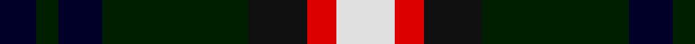
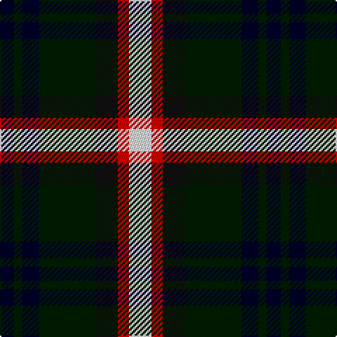

In pattern [KKKKKRW](/patterns/kkkkkrw/).

This was sourced from register-of-tartans.  It is a [7 stripes tartan](/stripes/stripes7/).

Original link https://www.tartanregister.gov.uk/tartanDetails.aspx?ref=5446

## Thread count
DB/10 DG6 DB12 DG40 K16 R8 LN/16

## Palette
Each colour and its ΔE from the base-6 reference it is a variant of.

| Colour | Shade | Base | ΔE (OKLab) |
|---|---|---|---|
| DB | <code style="background-color:#000028;">#000028</code> `#000028` | K <code style="background-color:#000000;">#000000</code> | 0.15 |
| DG | <code style="background-color:#001E00;">#001E00</code> `#001E00` | K <code style="background-color:#000000;">#000000</code> | 0.22 |
| K | <code style="background-color:#101010;">#101010</code> `#101010` | K <code style="background-color:#000000;">#000000</code> | 0.17 |
| LN | <code style="background-color:#E0E0E0;">#E0E0E0</code> `#E0E0E0` | W <code style="background-color:#F7F7F7;">#F7F7F7</code> | 0.07 |
| R | <code style="background-color:#DC0000;">#DC0000</code> `#DC0000` | R <code style="background-color:#CC0000;">#CC0000</code> | 0.03 |

# Sample pattern

## Nearest tartans

The nearest existing variants by ΔTartan distance.

1. [Brodie hunting](/setts/s7/r2b8g8k8y1k8r2x2~b304080-g008000-k000000-rc00000-yf0c000/) — ΔT 0.69
1. [Vosko](/setts/s9/b25k12y4k9r6k9y4k12g25x2~b304080-g008000-k000000-rc00000-yf0c000/) — ΔT 0.76
1. [MacCallum, of Berwick](/setts/s9/b10r7b31k25g23k8b7k8y5x2~b304080-g008000-k000000-rc00000-yf0c000/) — ΔT 0.81
1. [Brodie Hunting](/setts/s7/r2b8g8k8y1g8r2~b00004c-g004c00-k000000-rc80000-yffc800/) — ΔT 0.89
1. [Soutar (Name)](/setts/s9/k20w3b20k3r3g20r10w3k20x2~b2888c4-g285800-k101010-rc80000-we0e0e0/) — ΔT 0.92
1. [Argyll / MacCorquodale](/setts/s7/b2k1g8k8ba8k1r2x2~b5480b0-ba304080-g008000-k000000-rc00000/) — ΔT 0.94
1. [Dyce](/setts/s6/k2y1g6k6b6w1x4~b304080-g008000-k000000-we0e0e0-yf0c000/) — ΔT 0.95
1. [Lanark](/setts/s6/g31y4g6k19b18ba9x2~b304080-ba5480b0-g004010-k000000-yf0c000/) — ΔT 0.98
1. [MacDonald, (Flora.. )](/setts/s7/g17y2k14r2b9r2b10x2~b304080-g008000-k000000-rc00000-yf0c000/) — ΔT 0.98
1. [Vosko Family Tartan Tartan Number: 373. Earliest known date: 1989 Designed for a wedding. See products available Copyright © Blair Urquhart, Comrie, 2015](/setts/s9/b25k12y4k9r6k9y4k12g25x2~b2c2c80-g006818-k101010-rc80000-ye8c000/) — ΔT 0.99

## Neighbour map

Every grey dot is one of 15726 variants placed by the first two principal components of the ΔTartan feature space (44% of its variance). Red is this tartan; blue dots are its nearest — click one to open its page.

<svg viewBox="0 0 640 380" role="img" style="max-width:100%;height:auto;border:1px solid #e0e0e0;border-radius:4px;display:block" xmlns="http://www.w3.org/2000/svg"><image href="/nn/cloud.v1.png" width="640" height="380"/><a href="/setts/s7/r2b8g8k8y1k8r2x2~b304080-g008000-k000000-rc00000-yf0c000/"><circle cx="135.0" cy="214.6" r="4" fill="#3465a4"><title>Brodie hunting</title></circle></a><a href="/setts/s9/b25k12y4k9r6k9y4k12g25x2~b304080-g008000-k000000-rc00000-yf0c000/"><circle cx="101.9" cy="204.2" r="4" fill="#3465a4"><title>Vosko</title></circle></a><a href="/setts/s9/b10r7b31k25g23k8b7k8y5x2~b304080-g008000-k000000-rc00000-yf0c000/"><circle cx="116.4" cy="206.0" r="4" fill="#3465a4"><title>MacCallum, of Berwick</title></circle></a><a href="/setts/s7/r2b8g8k8y1g8r2~b00004c-g004c00-k000000-rc80000-yffc800/"><circle cx="150.7" cy="222.8" r="4" fill="#3465a4"><title>Brodie Hunting</title></circle></a><a href="/setts/s9/k20w3b20k3r3g20r10w3k20x2~b2888c4-g285800-k101010-rc80000-we0e0e0/"><circle cx="131.9" cy="195.1" r="4" fill="#3465a4"><title>Soutar (Name)</title></circle></a><a href="/setts/s7/b2k1g8k8ba8k1r2x2~b5480b0-ba304080-g008000-k000000-rc00000/"><circle cx="108.3" cy="198.4" r="4" fill="#3465a4"><title>Argyll / MacCorquodale</title></circle></a><a href="/setts/s6/k2y1g6k6b6w1x4~b304080-g008000-k000000-we0e0e0-yf0c000/"><circle cx="96.8" cy="223.8" r="4" fill="#3465a4"><title>Dyce</title></circle></a><a href="/setts/s6/g31y4g6k19b18ba9x2~b304080-ba5480b0-g004010-k000000-yf0c000/"><circle cx="150.4" cy="226.0" r="4" fill="#3465a4"><title>Lanark</title></circle></a><a href="/setts/s7/g17y2k14r2b9r2b10x2~b304080-g008000-k000000-rc00000-yf0c000/"><circle cx="112.9" cy="198.4" r="4" fill="#3465a4"><title>MacDonald, (Flora.. )</title></circle></a><a href="/setts/s9/b25k12y4k9r6k9y4k12g25x2~b2c2c80-g006818-k101010-rc80000-ye8c000/"><circle cx="128.8" cy="212.2" r="4" fill="#3465a4"><title>Vosko Family Tartan Tartan Number: 373. Earliest known date: 1989 Designed for a wedding. See products available Copyright © Blair Urquhart, Comrie, 2015</title></circle></a><circle cx="128.8" cy="209.8" r="5" fill="#c00000"/></svg>

ID: /setts/s7/w8r4k8ka20kb6ka3kb5x2~k101010-ka001e00-kb000028-rdc0000-we0e0e0/
