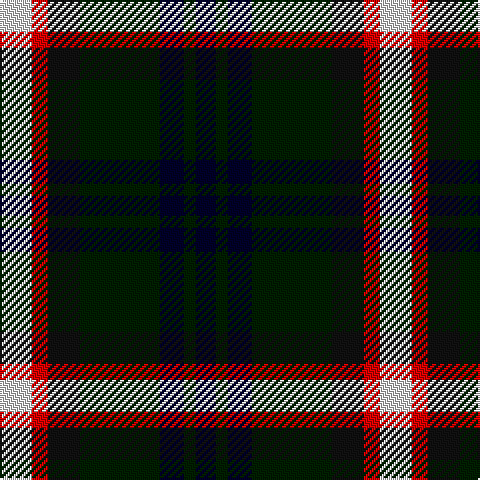

This page is one **sett** — a single exact thread-count. It belongs to the [tartan](/tartans/w8r4ki8kii20k6kii3k5/)
(the same proportion at any scale), whose colour order is pattern [KKKKKRW](/stripes/kkkkkrw/).

Sourced from register-of-tartans.  It is a [7 stripe tartan](/stripes/stripes7/).

Original link https://www.tartanregister.gov.uk/tartanDetails.aspx?ref=5446

## Register references

External register numbers recorded for this tartan.

- Scottish Register of Tartans: [5446](https://www.tartanregister.gov.uk/tartanDetails.aspx?ref=5446)
- Scottish Tartans World Register: 2718

## Thread count
LN/16 R8 K16 DG40 DB12 DG6 DB/10

## Palette

Palette: <strong>Tartan Register</strong> <small style="color:#888">(3 of 5 colours)</small>
<table><thead><tr><th>Colour</th><th>Threads</th><th>Shade</th><th>Base</th><th>OKLCh</th></tr></thead><tbody><tr><td>LN/</td><td style="text-align:right;font-variant-numeric:tabular-nums">16</td><td><code style="background-color:#E0E0E0;">#E0E0E0</code> <small style="color:#888">#E0E0E0</small></td><td>W <code style="background-color:#F7F7F7;">#F7F7F7</code></td><td><small style="color:#888">oklch(90.7% 0.000 89.9)</small></td></tr><tr><td>R</td><td style="text-align:right;font-variant-numeric:tabular-nums">8</td><td><code style="background-color:#DC0000;">#DC0000</code> <small style="color:#888">#DC0000</small></td><td>R <code style="background-color:#CC0000;">#CC0000</code></td><td><small style="color:#888">oklch(56.2% 0.230 29.2)</small></td></tr><tr><td>K</td><td style="text-align:right;font-variant-numeric:tabular-nums">16</td><td><code style="background-color:#101010;">#101010</code> <small style="color:#888">#101010</small></td><td>K <code style="background-color:#000000;">#000000</code></td><td><small style="color:#888">oklch(17.3% 0.000 89.9)</small></td></tr><tr><td>DG</td><td style="text-align:right;font-variant-numeric:tabular-nums">40</td><td><code style="background-color:#001E00;">#001E00</code> <small style="color:#888">#001E00</small></td><td>K <code style="background-color:#000000;">#000000</code></td><td><small style="color:#888">oklch(20.4% 0.069 142.5)</small></td></tr><tr><td>DB</td><td style="text-align:right;font-variant-numeric:tabular-nums">12</td><td><code style="background-color:#000028;">#000028</code> <small style="color:#888">#000028</small></td><td>K <code style="background-color:#000000;">#000000</code></td><td><small style="color:#888">oklch(12.5% 0.087 264.1)</small></td></tr><tr><td>DG</td><td style="text-align:right;font-variant-numeric:tabular-nums">6</td><td><code style="background-color:#001E00;">#001E00</code> <small style="color:#888">#001E00</small></td><td>K <code style="background-color:#000000;">#000000</code></td><td><small style="color:#888">oklch(20.4% 0.069 142.5)</small></td></tr><tr><td>DB/</td><td style="text-align:right;font-variant-numeric:tabular-nums">10</td><td><code style="background-color:#000028;">#000028</code> <small style="color:#888">#000028</small></td><td>K <code style="background-color:#000000;">#000000</code></td><td><small style="color:#888">oklch(12.5% 0.087 264.1)</small></td></tr></tbody></table>

# Sample pattern

## Nearest tartans

The nearest existing variants by ΔTartan distance, with this tartan at the top so the swatches line up against it.

ΔTartan

Tartan

Sett

—

<a href="/ttd/edit/#slug=w8r4ki8kii20k6kii3k5~x2">BlackRock (Asymmetrical)</a> <a class="nn-out" href="/setts/s7/w8r4ki8kii20k6kii3k5~x2/" title="open its dictionary page">↗</a>

0.69

<a href="/ttd/edit/#slug=r2k8ly1k8g8db8r2~x2">Brodie hunting</a> <a class="nn-out" href="/setts/s7/r2k8ly1k8g8db8r2~x2/" title="open its dictionary page">↗</a>

0.76

<a href="/ttd/edit/#slug=db25k12ly4k9r6k9ly4k12g25~x2">Vosko</a> <a class="nn-out" href="/setts/s9/db25k12ly4k9r6k9ly4k12g25~x2/" title="open its dictionary page">↗</a>

0.81

<a href="/ttd/edit/#slug=db10r7db31k25g23k8db7k8ly5~x2">MacCallum, of Berwick</a> <a class="nn-out" href="/setts/s9/db10r7db31k25g23k8db7k8ly5~x2/" title="open its dictionary page">↗</a>

0.89

<a href="/ttd/edit/#slug=r2dg8ly1k8dg8db8r2">Brodie Hunting</a> <a class="nn-out" href="/setts/s7/r2dg8ly1k8dg8db8r2/" title="open its dictionary page">↗</a>

0.92

<a href="/ttd/edit/#slug=k20w3t20k3r3dg20r10w3k20~x2">Soutar (Name)</a> <a class="nn-out" href="/setts/s9/k20w3t20k3r3dg20r10w3k20~x2/" title="open its dictionary page">↗</a>

0.95

<a href="/ttd/edit/#slug=k2ly1g6k6db6w1~x4">Dyce</a> <a class="nn-out" href="/setts/s6/k2ly1g6k6db6w1~x4/" title="open its dictionary page">↗</a>

0.98

<a href="/ttd/edit/#slug=dg31ly4dg6k19db18t9~x2">Lanark</a> <a class="nn-out" href="/setts/s6/dg31ly4dg6k19db18t9~x2/" title="open its dictionary page">↗</a>

0.98

<a href="/ttd/edit/#slug=g17ly2k14r2db9r2db10~x2">MacDonald, (Flora.. )</a> <a class="nn-out" href="/setts/s7/g17ly2k14r2db9r2db10~x2/" title="open its dictionary page">↗</a>

1.02

<a href="/ttd/edit/#slug=db1r1db6k6g6w1~x2">Wellington</a> <a class="nn-out" href="/setts/s6/db1r1db6k6g6w1~x2/" title="open its dictionary page">↗</a>

1.02

<a href="/ttd/edit/#slug=r4g16k16db4g3db12ly2~x2">Junior Chamber International</a> <a class="nn-out" href="/setts/s7/r4g16k16db4g3db12ly2~x2/" title="open its dictionary page">↗</a>

## Neighbour map

Every grey dot is one of 14359 variants placed by the first two principal components of the ΔTartan feature space (44% of its variance). Red is this tartan; blue dots are its nearest — click one to open its page.

<svg viewBox="0 0 640 380" role="img" style="max-width:100%;height:auto;border:1px solid #e0e0e0;border-radius:4px;display:block" xmlns="http://www.w3.org/2000/svg"><image href="/nn/cloud.v1.png" width="640" height="380"/><a href="/setts/s7/r2k8ly1k8g8db8r2~x2/"><circle cx="138.2" cy="215.2" r="4" fill="#3465a4"><title>Brodie hunting</title></circle></a><a href="/setts/s9/db25k12ly4k9r6k9ly4k12g25~x2/"><circle cx="105.4" cy="205.2" r="4" fill="#3465a4"><title>Vosko</title></circle></a><a href="/setts/s9/db10r7db31k25g23k8db7k8ly5~x2/"><circle cx="120.0" cy="207.7" r="4" fill="#3465a4"><title>MacCallum, of Berwick</title></circle></a><a href="/setts/s7/r2dg8ly1k8dg8db8r2/"><circle cx="154.0" cy="225.5" r="4" fill="#3465a4"><title>Brodie Hunting</title></circle></a><a href="/setts/s9/k20w3t20k3r3dg20r10w3k20~x2/"><circle cx="134.7" cy="196.7" r="4" fill="#3465a4"><title>Soutar (Name)</title></circle></a><a href="/setts/s6/k2ly1g6k6db6w1~x4/"><circle cx="100.8" cy="224.7" r="4" fill="#3465a4"><title>Dyce</title></circle></a><a href="/setts/s6/dg31ly4dg6k19db18t9~x2/"><circle cx="154.0" cy="229.3" r="4" fill="#3465a4"><title>Lanark</title></circle></a><a href="/setts/s7/g17ly2k14r2db9r2db10~x2/"><circle cx="116.5" cy="200.3" r="4" fill="#3465a4"><title>MacDonald, (Flora.. )</title></circle></a><a href="/setts/s6/db1r1db6k6g6w1~x2/"><circle cx="101.8" cy="218.6" r="4" fill="#3465a4"><title>Wellington</title></circle></a><a href="/setts/s7/r4g16k16db4g3db12ly2~x2/"><circle cx="109.4" cy="202.2" r="4" fill="#3465a4"><title>Junior Chamber International</title></circle></a><circle cx="132.0" cy="211.0" r="5" fill="#c00000"/></svg>

ID: /setts/s7/w8r4ki8kii20k6kii3k5~x2/
