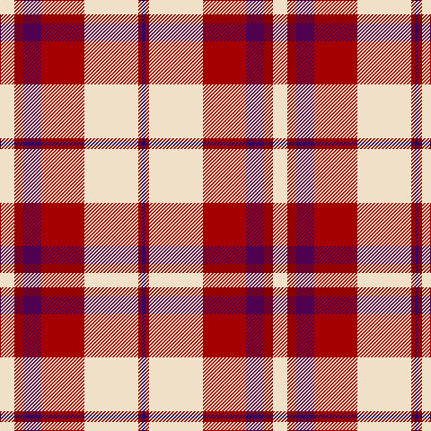

In pattern [BRWRBRW](/stripes/brwrbrw/).

This was sourced from tartans-authority.  It is a [7 stripe tartan](/stripes/stripes7/).

Original link http://www.tartansauthority.com/tartan-ferret/display/7574/

## Also known as

This cloth is also recorded under:

- Shiel, Claret

## Attestations

This cloth appears in 2 source records; the oldest owns this page.

- March 2008 — Shiel, Claret (Dance) (tartans-authority, [record](http://www.tartansauthority.com/tartan-ferret/display/7574/))
- undated — Shiel Claret (register-of-tartans, [record](https://www.tartanregister.gov.uk/tartanDetails.aspx?ref=5598))

## Register references

External register numbers recorded for this tartan.

- Scottish Register of Tartans: [5598](https://www.tartanregister.gov.uk/tartanDetails.aspx?ref=5598)
- Scottish Tartans Authority (ITI): 7574

## Thread count
W/16 DRa10 DP20 DR48 W60 DRa4 DB/4

## Palette
Each colour and the base-6 reference it is a variant of.

| Colour | Shade | Base |
|---|---|---|
| DB | <code style="background-color:#1C0070;">#1C0070</code> `oklch(26.3% 0.162 277.1)` <small>#1C0070</small> | B <code style="background-color:#2A418A;">#2A418A</code> |
| DP | <code style="background-color:#500050;">#500050</code> `oklch(30.3% 0.139 328.4)` <small>#500050</small> | B <code style="background-color:#2A418A;">#2A418A</code> |
| DR | <code style="background-color:#A40000;">#A40000</code> `oklch(45.1% 0.185 29.2)` <small>#A40000</small> | R <code style="background-color:#CC0000;">#CC0000</code> |
| DRa | <code style="background-color:#880000;">#880000</code> `oklch(39.4% 0.162 29.2)` <small>#880000</small> | R <code style="background-color:#CC0000;">#CC0000</code> |
| W | <code style="background-color:#F0E0C8;">#F0E0C8</code> `oklch(91.3% 0.036 78.1)` <small>#F0E0C8</small> | W <code style="background-color:#F7F7F7;">#F7F7F7</code> |

# Sample pattern

## Nearest tartans

The nearest existing variants by ΔTartan distance.

1. [Lennox, dress](/setts/s7/r8p2r24db5w26o2w8~x2/) — ΔT 0.79
1. [Etive, Burgundy (Dance)](/setts/s9/r15r1lg3k1w11r3lg3r3w1~x4/) — ΔT 0.82
1. [Lennox Dress](/setts/s7/r8dp2r24db5w26dy2w8~x2/) — ΔT 0.91
1. [Hearts Football Club (Corporate)](/setts/s9/db3w12k11r4w2r2w2r24ly3~x2/) — ΔT 1.15
1. [Rose, White dress](/setts/s6/r32db6k6g6w18k3/) — ΔT 1.16
1. [Drummond of Perth Dress #2](/setts/s9/r41ly3y7db3w24r10y7db7w3~x2/) — ΔT 1.19
1. [MacKellar Dress Red Fashion Tartan Tartan Number: 6563. Earliest known date: 01/01/2002 The Mackellar Dress sett was originally designed by AA Bottomley of Peter MacArthur's. The colours of this version have been changed (presumably by DC Dalgliesh of Selkirk) to produce a Dancers' tartan./Threadcount and colours aren't 100% original. Generated manually./ See products available Copyright © Blair Urquhart, Comrie, 2015](/setts/s11/r23w2r3p4r3w2r5k11r2w23k3~x2/) — ΔT 1.25
1. [Lennox, dress](/setts/s7/r8p2r24p5w25o2w8~x2/) — ΔT 1.26
1. [Rose White Dress](/setts/s6/r24n4k4g4w13k2~x4/) — ΔT 1.27
1. [Nesbit, Rose](/setts/s6/r6lb3r37k16lb16g4~x2/) — ΔT 1.29

## Neighbour map

Every grey dot is one of 14299 variants placed by the first two principal components of the ΔTartan feature space (44% of its variance). Red is this tartan; blue dots are its nearest — click one to open its page.

<svg viewBox="0 0 640 380" role="img" style="max-width:100%;height:auto;border:1px solid #e0e0e0;border-radius:4px;display:block" xmlns="http://www.w3.org/2000/svg"><image href="/nn/cloud.v1.png" width="640" height="380"/><a href="/setts/s7/r8p2r24db5w26o2w8~x2/"><circle cx="232.9" cy="141.3" r="4" fill="#3465a4"><title>Lennox, dress</title></circle></a><a href="/setts/s9/r15r1lg3k1w11r3lg3r3w1~x4/"><circle cx="205.0" cy="114.9" r="4" fill="#3465a4"><title>Etive, Burgundy (Dance)</title></circle></a><a href="/setts/s7/r8dp2r24db5w26dy2w8~x2/"><circle cx="234.2" cy="139.9" r="4" fill="#3465a4"><title>Lennox Dress</title></circle></a><a href="/setts/s9/db3w12k11r4w2r2w2r24ly3~x2/"><circle cx="212.2" cy="125.3" r="4" fill="#3465a4"><title>Hearts Football Club (Corporate)</title></circle></a><a href="/setts/s6/r32db6k6g6w18k3/"><circle cx="180.3" cy="154.9" r="4" fill="#3465a4"><title>Rose, White dress</title></circle></a><a href="/setts/s9/r41ly3y7db3w24r10y7db7w3~x2/"><circle cx="245.2" cy="122.0" r="4" fill="#3465a4"><title>Drummond of Perth Dress #2</title></circle></a><a href="/setts/s11/r23w2r3p4r3w2r5k11r2w23k3~x2/"><circle cx="187.6" cy="110.3" r="4" fill="#3465a4"><title>MacKellar Dress Red Fashion Tartan Tartan Number: 6563. Earliest known date: 01/01/2002 The Mackellar Dress sett was originally designed by AA Bottomley of Peter MacArthur's. The colours of this version have been changed (presumably by DC Dalgliesh of Selkirk) to produce a Dancers' tartan./Threadcount and colours aren't 100% original. Generated manually./ See products available Copyright © Blair Urquhart, Comrie, 2015</title></circle></a><a href="/setts/s7/r8p2r24p5w25o2w8~x2/"><circle cx="249.8" cy="158.4" r="4" fill="#3465a4"><title>Lennox, dress</title></circle></a><a href="/setts/s6/r24n4k4g4w13k2~x4/"><circle cx="202.2" cy="151.4" r="4" fill="#3465a4"><title>Rose White Dress</title></circle></a><a href="/setts/s6/r6lb3r37k16lb16g4~x2/"><circle cx="266.8" cy="172.0" r="4" fill="#3465a4"><title>Nesbit, Rose</title></circle></a><circle cx="211.6" cy="130.9" r="5" fill="#c00000"/></svg>

ID: /setts/s7/w8r5dp10r24w30r2db2~x2/
