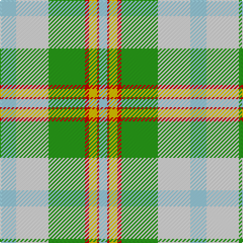

In pattern [WRYRGWW](/patterns/wryrgww/).

This was sourced from tartans-authority.  It is a [7 stripes tartan](/stripes/stripes7/).

Original link http://www.tartansauthority.com/tartan-ferret/display/586/

## Attestations

This cloth appears in 2 source records; the oldest owns this page.

- 1985 — Ainslie, Lake (District) (tartans-authority, [record](http://www.tartansauthority.com/tartan-ferret/display/586/))
- 01/01/2002 — Cooper/Couper Dress (Dalgleish #2) (register-of-tartans, [record](https://www.tartanregister.gov.uk/tartanDetails.aspx?ref=755))

## Thread count
LB/16 LN32 G36 R4 Y8 R2 LB/8

## Palette
Each colour and its ΔE from the base-6 reference it is a variant of.

| Colour | Shade | Base | ΔE (OKLab) |
|---|---|---|---|
| G | <code style="background-color:#289C18;">#289C18</code> `#289C18` | G <code style="background-color:#006100;">#006100</code> | 0.19 |
| LB | <code style="background-color:#98C8E8;">#98C8E8</code> `#98C8E8` | W <code style="background-color:#F7F7F7;">#F7F7F7</code> | 0.18 |
| LN | <code style="background-color:#E0E0E0;">#E0E0E0</code> `#E0E0E0` | W <code style="background-color:#F7F7F7;">#F7F7F7</code> | 0.07 |
| R | <code style="background-color:#C80000;">#C80000</code> `#C80000` | R <code style="background-color:#CC0000;">#CC0000</code> | 0.01 |
| Y | <code style="background-color:#E8C000;">#E8C000</code> `#E8C000` | Y <code style="background-color:#F2BF00;">#F2BF00</code> | 0.02 |

# Sample pattern

## Nearest tartans

The nearest existing variants by ΔTartan distance.

1. [Lake Ainslie Heritage](/setts/s7/w8wa16g18r2y4r1w4~g289c18-rc80000-w98c8e8-wafcfcfc-ye8c000~x2/) — ΔT 0.68
1. [Aviemore, Check](/setts/s8/g2r10g11y4r1w18g2r1~g008000-r806050-we0e0e0-yf0c000~x2/) — ΔT 1.45
1. [Alloway Primary School (Ayr)](/setts/s8/y18g10w4b1wa30b1w4g10~b14256b-g798a92-wffffff-wab2e5ff-yebaf01~x2/) — ΔT 1.47
1. [Postcode Lottery](/setts/s7/g3r1g12w4wa15y1wa3~g309c18-rdc0000-we0e0e0-wa98d0f0-yfadc00~x4/) — ΔT 1.60
1. [Barbie's Plaid](/setts/s6/b2y4ba22y20g19y2~b606090-ba8080d0-g30a010-yffe000~x2/) — ΔT 1.61
1. [Chambers, Christopher J (Personal)](/setts/s7/b16r1g16w1ga1w8ra3~b5f749c-g649848-ga5d321f-rca2625-ra86264d-wf9f5ef~x2/) — ΔT 1.67
1. [Bird Family (Australia) (Name)](/setts/s9/w3b19w1wa17y11g10w1b3w1~b1474b4-g006818-wfcfcfc-wa98c8e8-yfccc00~x2/) — ΔT 1.68
1. [Aviemore Check (Fashion)](/setts/s8/g2ga10g11y4ga1w18g2ga1~g007c1c-ga604000-we0e0e0-ye8c000~x2/) — ΔT 1.85
1. [Royal Pharmaceutical, Society](/setts/s9/r3w2g19w6g2w6ra14rb4wa2~g008000-r806050-raa08060-rb802040-wc0c0c0-wae0e0e0~x2/) — ΔT 1.88
1. [MacNappy](/setts/s6/w36wa12w1r12g16y2~g289c18-rc80000-we0e0e0-wa5cacdc-ye8c000~x2/) — ΔT 1.88

## Neighbour map

Every grey dot is one of 15726 variants placed by the first two principal components of the ΔTartan feature space (44% of its variance). Red is this tartan; blue dots are its nearest — click one to open its page.

<svg viewBox="0 0 640 380" role="img" style="max-width:100%;height:auto;border:1px solid #e0e0e0;border-radius:4px;display:block" xmlns="http://www.w3.org/2000/svg"><image href="/nn/cloud.v1.png" width="640" height="380"/><a href="/setts/s7/w8wa16g18r2y4r1w4~g289c18-rc80000-w98c8e8-wafcfcfc-ye8c000~x2/"><circle cx="153.6" cy="147.0" r="4" fill="#3465a4"><title>Lake Ainslie Heritage</title></circle></a><a href="/setts/s8/g2r10g11y4r1w18g2r1~g008000-r806050-we0e0e0-yf0c000~x2/"><circle cx="199.5" cy="152.0" r="4" fill="#3465a4"><title>Aviemore, Check</title></circle></a><a href="/setts/s8/y18g10w4b1wa30b1w4g10~b14256b-g798a92-wffffff-wab2e5ff-yebaf01~x2/"><circle cx="224.4" cy="120.8" r="4" fill="#3465a4"><title>Alloway Primary School (Ayr)</title></circle></a><a href="/setts/s7/g3r1g12w4wa15y1wa3~g309c18-rdc0000-we0e0e0-wa98d0f0-yfadc00~x4/"><circle cx="256.8" cy="166.3" r="4" fill="#3465a4"><title>Postcode Lottery</title></circle></a><a href="/setts/s6/b2y4ba22y20g19y2~b606090-ba8080d0-g30a010-yffe000~x2/"><circle cx="183.8" cy="195.4" r="4" fill="#3465a4"><title>Barbie's Plaid</title></circle></a><a href="/setts/s7/b16r1g16w1ga1w8ra3~b5f749c-g649848-ga5d321f-rca2625-ra86264d-wf9f5ef~x2/"><circle cx="168.6" cy="134.4" r="4" fill="#3465a4"><title>Chambers, Christopher J (Personal)</title></circle></a><a href="/setts/s9/w3b19w1wa17y11g10w1b3w1~b1474b4-g006818-wfcfcfc-wa98c8e8-yfccc00~x2/"><circle cx="140.0" cy="130.5" r="4" fill="#3465a4"><title>Bird Family (Australia) (Name)</title></circle></a><a href="/setts/s8/g2ga10g11y4ga1w18g2ga1~g007c1c-ga604000-we0e0e0-ye8c000~x2/"><circle cx="187.9" cy="148.8" r="4" fill="#3465a4"><title>Aviemore Check (Fashion)</title></circle></a><a href="/setts/s9/r3w2g19w6g2w6ra14rb4wa2~g008000-r806050-raa08060-rb802040-wc0c0c0-wae0e0e0~x2/"><circle cx="153.0" cy="158.1" r="4" fill="#3465a4"><title>Royal Pharmaceutical, Society</title></circle></a><a href="/setts/s6/w36wa12w1r12g16y2~g289c18-rc80000-we0e0e0-wa5cacdc-ye8c000~x2/"><circle cx="249.9" cy="126.5" r="4" fill="#3465a4"><title>MacNappy</title></circle></a><circle cx="172.4" cy="155.9" r="5" fill="#c00000"/></svg>

ID: /setts/s7/w8wa16g18r2y4r1w4~g289c18-rc80000-w98c8e8-wae0e0e0-ye8c000~x2/
