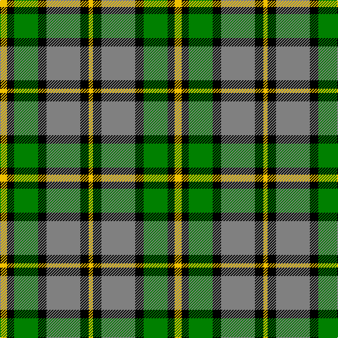

In pattern [YKGKGKY](/patterns/ykgkgky/).

This was sourced from weddslist.  It is a [7 stripes tartan](/stripes/stripes7/).

Original link http://www.weddslist.com/cgi-bin/tartans/pg.pl?source=sts

## Thread count
Y/10 K10 G34 K12 N48 K12 Y/6

## Palette
Each colour and its ΔE from the base-6 reference it is a variant of.

| Colour | Shade | Base | ΔE (OKLab) |
|---|---|---|---|
| G | <code style="background-color:#008000;">#008000</code> `#008000` | G <code style="background-color:#006400;">#006400</code> | 0.09 |
| K | <code style="background-color:#000000;">#000000</code> `#000000` | K <code style="background-color:#000000;">#000000</code> | 0.00 |
| N | <code style="background-color:#808080;">#808080</code> `#808080` | G <code style="background-color:#006400;">#006400</code> | 0.22 |
| Y | <code style="background-color:#F0C000;">#F0C000</code> `#F0C000` | Y <code style="background-color:#E8C000;">#E8C000</code> | 0.01 |

# Sample pattern

## Nearest tartans

The nearest existing variants by ΔTartan distance.

1. [Cape Breton District Tartan Tartan Number: 1883. Earliest known date: 1957 In 1907, Mrs Lillian Crewe Walsh of Glace Bay, Cape Breton, wrote a poem in praise of Cape Breton. This poem was given by Mrs Walsh to Mrs Grant in 1957 and the tartan designed to accord with the poem. Grey for our Cape Breton Steel, Green for our lofty See products available Copyright © Blair Urquhart, Comrie, 2015](/setts/s7/y10k10g34k12r48k12y6-g006818-k101010-r888888-ye8c000/) — ΔT 0.78
1. [MacKay, Dress (Corporate)](/setts/s6/k8g28k28g4w28b6-b1474b4-g006818-k101010-we0e0e0/) — ΔT 0.93
1. [Dalveen (1981)](/setts/s8/g18ga12g60ga6w66k60ga12k18-g604000-ga006818-k101010-we0e0e0/) — ΔT 0.98
1. [MacKay Dress](/setts/s6/b8w46g4k46g46k8-b1474b4-g006818-k101010-we0e0e0/) — ΔT 0.98
1. [Cape Breton (yellow stripes)](/setts/s7/y12k12g60k16w36k12y6-g789484-k000000-wc0c0c0-ye8c000/) — ΔT 1.06
1. [Hackett (Personal)](/setts/s7/k40w8r8g40w10g4ga4-g006818-ga289c18-k101010-rc80000-wfcfcfc/) — ΔT 1.08
1. [Lawson, William 2002](/setts/s7/k8w38k22g30k6g32y6-g003c14-k101010-we0e0e0-ye8c000/) — ΔT 1.11
1. [Antrim](/setts/s10/g10k4g34y4k10y4r10k34g4y8-g008000-k000030-rf06030-yf0c000/) — ΔT 1.12
1. [National Trust](/setts/s8/g4b16g16r6b2w24g4b2-b401000-g004010-r906030-we0e0e0/) — ΔT 1.13
1. [Unidentified #46](/setts/s9/w32g4k10r4k20g22y4g22k4-g005020-k101010-rdc0000-we0e0e0-ye8c000/) — ΔT 1.14

## Neighbour map

Every grey dot is one of 15726 variants placed by the first two principal components of the ΔTartan feature space (44% of its variance). Red is this tartan; blue dots are its nearest — click one to open its page.

<svg viewBox="0 0 640 380" role="img" style="max-width:100%;height:auto;border:1px solid #e0e0e0;border-radius:4px;display:block" xmlns="http://www.w3.org/2000/svg"><image href="/nn/cloud.v1.png" width="640" height="380"/><a href="/setts/s7/y10k10g34k12r48k12y6-g006818-k101010-r888888-ye8c000/"><circle cx="149.7" cy="207.2" r="4" fill="#3465a4"><title>Cape Breton District Tartan Tartan Number: 1883. Earliest known date: 1957 In 1907, Mrs Lillian Crewe Walsh of Glace Bay, Cape Breton, wrote a poem in praise of Cape Breton. This poem was given by Mrs Walsh to Mrs Grant in 1957 and the tartan designed to accord with the poem. Grey for our Cape Breton Steel, Green for our lofty See products available Copyright © Blair Urquhart, Comrie, 2015</title></circle></a><a href="/setts/s6/k8g28k28g4w28b6-b1474b4-g006818-k101010-we0e0e0/"><circle cx="117.9" cy="223.5" r="4" fill="#3465a4"><title>MacKay, Dress (Corporate)</title></circle></a><a href="/setts/s8/g18ga12g60ga6w66k60ga12k18-g604000-ga006818-k101010-we0e0e0/"><circle cx="123.2" cy="182.4" r="4" fill="#3465a4"><title>Dalveen (1981)</title></circle></a><a href="/setts/s6/b8w46g4k46g46k8-b1474b4-g006818-k101010-we0e0e0/"><circle cx="141.4" cy="195.7" r="4" fill="#3465a4"><title>MacKay Dress</title></circle></a><a href="/setts/s7/y12k12g60k16w36k12y6-g789484-k000000-wc0c0c0-ye8c000/"><circle cx="145.5" cy="181.3" r="4" fill="#3465a4"><title>Cape Breton (yellow stripes)</title></circle></a><a href="/setts/s7/k40w8r8g40w10g4ga4-g006818-ga289c18-k101010-rc80000-wfcfcfc/"><circle cx="149.8" cy="166.4" r="4" fill="#3465a4"><title>Hackett (Personal)</title></circle></a><a href="/setts/s7/k8w38k22g30k6g32y6-g003c14-k101010-we0e0e0-ye8c000/"><circle cx="146.7" cy="225.4" r="4" fill="#3465a4"><title>Lawson, William 2002</title></circle></a><a href="/setts/s10/g10k4g34y4k10y4r10k34g4y8-g008000-k000030-rf06030-yf0c000/"><circle cx="166.4" cy="177.4" r="4" fill="#3465a4"><title>Antrim</title></circle></a><a href="/setts/s8/g4b16g16r6b2w24g4b2-b401000-g004010-r906030-we0e0e0/"><circle cx="141.0" cy="170.1" r="4" fill="#3465a4"><title>National Trust</title></circle></a><a href="/setts/s9/w32g4k10r4k20g22y4g22k4-g005020-k101010-rdc0000-we0e0e0-ye8c000/"><circle cx="121.5" cy="177.0" r="4" fill="#3465a4"><title>Unidentified #46</title></circle></a><circle cx="130.0" cy="200.8" r="5" fill="#c00000"/></svg>

ID: /setts/s7/y10k10g34k12ga48k12y6-g008000-ga808080-k000000-yf0c000/
