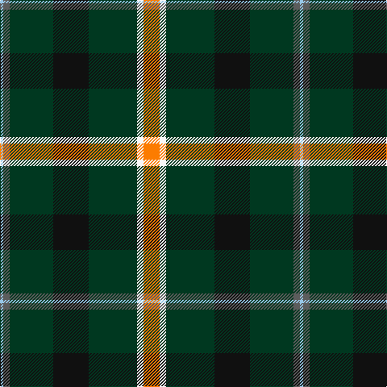

In pattern [WBGKGWY](/patterns/wbgkgwy/).

This was sourced from tartans-authority.  It is a [7 stripes tartan](/stripes/stripes7/).

Original link http://www.tartansauthority.com/tartan-ferret/display/7941/

## Thread count
LB/4 N8 DG54 K44 DG60 W8 O/20

## Palette
Each colour and its ΔE from the base-6 reference it is a variant of.

| Colour | Shade | Base | ΔE (OKLab) |
|---|---|---|---|
| DG | <code style="background-color:#003820;">#003820</code> `#003820` | G <code style="background-color:#006100;">#006100</code> | 0.15 |
| K | <code style="background-color:#101010;">#101010</code> `#101010` | K <code style="background-color:#000000;">#000000</code> | 0.17 |
| LB | <code style="background-color:#98C8E8;">#98C8E8</code> `#98C8E8` | W <code style="background-color:#F7F7F7;">#F7F7F7</code> | 0.18 |
| N | <code style="background-color:#5C5C5C;">#5C5C5C</code> `#5C5C5C` | B <code style="background-color:#2A418A;">#2A418A</code> | 0.15 |
| O | <code style="background-color:#FC7C00;">#FC7C00</code> `#FC7C00` | Y <code style="background-color:#F2BF00;">#F2BF00</code> | 0.16 |
| W | <code style="background-color:#F8F8F8;">#F8F8F8</code> `#F8F8F8` | W <code style="background-color:#F7F7F7;">#F7F7F7</code> | 0.00 |

# Sample pattern

## Nearest tartans

The nearest existing variants by ΔTartan distance.

1. [Lees-McRae College](/setts/s9/g4r1g12k1y4k1g3b5w2x2~b1474b4-g003820-k101010-r880000-wfcfcfc-yd8b000/) — ΔT 1.09
1. [Arkansas](/setts/s7/g3w1g12r6g3k3ga2x4~g004010-ga008000-k000000-rc00020-we0e0e0/) — ΔT 1.15
1. [Holestone (Corporate)](/setts/s8/k4y8k26r6g15r6k26w2x2~g006818-k101010-rc04c08-wf8f8f8-ybc8c00/) — ΔT 1.18
1. [Lossiemouth/Hersbruck](/setts/s6/g26b3g12k10ba15w2x2~b2c2c80-ba780078-g006818-k101010-we0e0e0/) — ΔT 1.20
1. [Asheville Firefighters, The](/setts/s6/k17g48y4r10w12g4~g004028-k101010-rc80000-wa8ace8-yffe600/) — ΔT 1.27
1. [State Seal of Maine (Fashion)](/setts/s10/g49k8y20ya3g23r6k5b3g10y10x2~b2888c4-g003820-k101010-rc80000-ya08858-yabc8c00/) — ΔT 1.33
1. [Woodward, R Glenn](/setts/s6/b25k84w5g32y5ba8x2~b202060-ba780078-g006818-k101010-wfcfcfc-ye8c000/) — ΔT 1.35
1. [Lee (Personal)](/setts/s7/g2k1g12r4g3b9w2x4~b00008c-g004c00-k000000-r8c0000-wc8c8c8/) — ΔT 1.36
1. [Cornish Brewery, Green](/setts/s7/y3g24k11g3ka10g3w2x2~g004800-k000030-ka000000-we0e0e0-y9c9c00/) — ΔT 1.43
1. [Asheville Firefighters, The](/setts/s6/k17g48y4r10b12g4~b202060-g006818-k101010-rc80000-ye8c000/) — ΔT 1.45

## Neighbour map

Every grey dot is one of 15726 variants placed by the first two principal components of the ΔTartan feature space (44% of its variance). Red is this tartan; blue dots are its nearest — click one to open its page.

<svg viewBox="0 0 640 380" role="img" style="max-width:100%;height:auto;border:1px solid #e0e0e0;border-radius:4px;display:block" xmlns="http://www.w3.org/2000/svg"><image href="/nn/cloud.v1.png" width="640" height="380"/><a href="/setts/s9/g4r1g12k1y4k1g3b5w2x2~b1474b4-g003820-k101010-r880000-wfcfcfc-yd8b000/"><circle cx="235.5" cy="150.1" r="4" fill="#3465a4"><title>Lees-McRae College</title></circle></a><a href="/setts/s7/g3w1g12r6g3k3ga2x4~g004010-ga008000-k000000-rc00020-we0e0e0/"><circle cx="292.9" cy="191.4" r="4" fill="#3465a4"><title>Arkansas</title></circle></a><a href="/setts/s8/k4y8k26r6g15r6k26w2x2~g006818-k101010-rc04c08-wf8f8f8-ybc8c00/"><circle cx="285.5" cy="182.5" r="4" fill="#3465a4"><title>Holestone (Corporate)</title></circle></a><a href="/setts/s6/g26b3g12k10ba15w2x2~b2c2c80-ba780078-g006818-k101010-we0e0e0/"><circle cx="273.2" cy="206.3" r="4" fill="#3465a4"><title>Lossiemouth/Hersbruck</title></circle></a><a href="/setts/s6/k17g48y4r10w12g4~g004028-k101010-rc80000-wa8ace8-yffe600/"><circle cx="259.4" cy="178.9" r="4" fill="#3465a4"><title>Asheville Firefighters, The</title></circle></a><a href="/setts/s10/g49k8y20ya3g23r6k5b3g10y10x2~b2888c4-g003820-k101010-rc80000-ya08858-yabc8c00/"><circle cx="311.4" cy="144.2" r="4" fill="#3465a4"><title>State Seal of Maine (Fashion)</title></circle></a><a href="/setts/s6/b25k84w5g32y5ba8x2~b202060-ba780078-g006818-k101010-wfcfcfc-ye8c000/"><circle cx="262.7" cy="153.5" r="4" fill="#3465a4"><title>Woodward, R Glenn</title></circle></a><a href="/setts/s7/g2k1g12r4g3b9w2x4~b00008c-g004c00-k000000-r8c0000-wc8c8c8/"><circle cx="245.3" cy="192.9" r="4" fill="#3465a4"><title>Lee (Personal)</title></circle></a><a href="/setts/s7/y3g24k11g3ka10g3w2x2~g004800-k000030-ka000000-we0e0e0-y9c9c00/"><circle cx="251.7" cy="185.9" r="4" fill="#3465a4"><title>Cornish Brewery, Green</title></circle></a><a href="/setts/s6/k17g48y4r10b12g4~b202060-g006818-k101010-rc80000-ye8c000/"><circle cx="276.3" cy="188.1" r="4" fill="#3465a4"><title>Asheville Firefighters, The</title></circle></a><circle cx="261.6" cy="170.0" r="5" fill="#c00000"/></svg>

ID: /setts/s7/y10w4g30k22g27b4wa2x2~b5c5c5c-g003820-k101010-wf8f8f8-wa98c8e8-yfc7c00/
