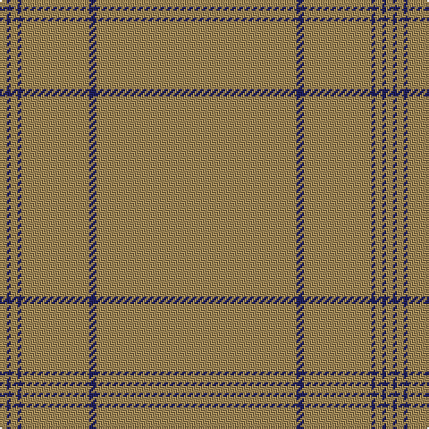

In pattern [YBYBYBY](/patterns/ybybyby/).

This was sourced from tartans-authority.  It is a [7 stripes tartan](/stripes/stripes7/).

Original link http://www.tartansauthority.com/tartan-ferret/display/5758/

## Thread count
LTa/4 DB2 LT4 DB2 LT38 DB4 LTa/112

## Palette
Each colour and its ΔE from the base-6 reference it is a variant of.

| Colour | Shade | Base | ΔE (OKLab) |
|---|---|---|---|
| DB | <code style="background-color:#202060;">#202060</code> `#202060` | B <code style="background-color:#2C4084;">#2C4084</code> | 0.11 |
| G | <code style="background-color:#005C34;">#005C34</code> `#005C34` | G <code style="background-color:#006400;">#006400</code> | 0.06 |
| LT | <code style="background-color:#A08858;">#A08858</code> `#A08858` | Y <code style="background-color:#E8C000;">#E8C000</code> | 0.21 |
| LTa | <code style="background-color:#A08858;">#A08858</code> `#A08858` | Y <code style="background-color:#E8C000;">#E8C000</code> | 0.21 |

# Sample pattern

## Nearest tartans

The nearest existing variants by ΔTartan distance.

1. [Weathered Cyclist (Corporate)](/setts/s7/r64w4r18y4r24ya42ra2-ra07c58-rac80000-wfcfcfc-yfccc00-yaa08858/) — ΔT 2.97
1. [Loch Garth](/setts/s4/r48ra24r8y4-r806050-ra906030-yf0c000/) — ΔT 3.73
1. [Masai Shuka 09 (Artefact)](/setts/s8/r120y30r8y4r4y4r4y4-ra45c30-ya08858/) — ΔT 3.91
1. [Unnamed Brown (Teddy Bear)](/setts/s5/r2ra14rb50ra14r2-rc00000-ra806050-rb906030/) — ΔT 4.05
1. [Harmony, 12](/setts/s6/g12r4g58r58g4r12-g808080-r806050/) — ΔT 4.15
1. [Bute Heather, Ancient Wth'd (Fashion](/setts/s11/y10b4g16b2g16b8g8b12g36ya2y10-b5c5c5c-g707070-ya08858-yaa0a0a0/) — ΔT 4.16
1. [McKerrell of Hillhouse Dress](/setts/s6/b96r56w8r56b96y6-b5c8ca8-r888888-we0e0e0-ye8c000/) — ΔT 4.42
1. [Wicklow Irish County Tartan Tartan Number: 2265. Earliest known date: 1995 One of a series of Irish District tartans designed by Polly Wittering of the House of Edgar, with colours reminiscent of the Country with soft warm colours dominating. See products available Copyright © Blair Urquhart, Comrie, 2015](/setts/s10/b4ba4bb4ba48bc4bb12ba6b24ba8bb4-b3c6060-ba646c84-bb644c40-bc0070a4/) — ΔT 4.46
1. [MacNab #4](/setts/s5/r172g6ra6g12ra170-g005020-rc82828-radc0000/) — ΔT 4.58
1. [Harmony, No 13](/setts/s6/b20g2b2g20b36g10-b5480b0-g808080/) — ΔT 4.61

## Neighbour map

Every grey dot is one of 15726 variants placed by the first two principal components of the ΔTartan feature space (44% of its variance). Red is this tartan; blue dots are its nearest — click one to open its page.

<svg viewBox="0 0 640 380" role="img" style="max-width:100%;height:auto;border:1px solid #e0e0e0;border-radius:4px;display:block" xmlns="http://www.w3.org/2000/svg"><image href="/nn/cloud.v1.png" width="640" height="380"/><a href="/setts/s7/r64w4r18y4r24ya42ra2-ra07c58-rac80000-wfcfcfc-yfccc00-yaa08858/"><circle cx="607.9" cy="231.6" r="4" fill="#3465a4"><title>Weathered Cyclist (Corporate)</title></circle></a><a href="/setts/s4/r48ra24r8y4-r806050-ra906030-yf0c000/"><circle cx="620.4" cy="337.3" r="4" fill="#3465a4"><title>Loch Garth</title></circle></a><a href="/setts/s8/r120y30r8y4r4y4r4y4-ra45c30-ya08858/"><circle cx="626.0" cy="251.8" r="4" fill="#3465a4"><title>Masai Shuka 09 (Artefact)</title></circle></a><a href="/setts/s5/r2ra14rb50ra14r2-rc00000-ra806050-rb906030/"><circle cx="626.0" cy="333.2" r="4" fill="#3465a4"><title>Unnamed Brown (Teddy Bear)</title></circle></a><a href="/setts/s6/g12r4g58r58g4r12-g808080-r806050/"><circle cx="626.0" cy="337.9" r="4" fill="#3465a4"><title>Harmony, 12</title></circle></a><a href="/setts/s11/y10b4g16b2g16b8g8b12g36ya2y10-b5c5c5c-g707070-ya08858-yaa0a0a0/"><circle cx="556.8" cy="272.2" r="4" fill="#3465a4"><title>Bute Heather, Ancient Wth'd (Fashion</title></circle></a><a href="/setts/s6/b96r56w8r56b96y6-b5c8ca8-r888888-we0e0e0-ye8c000/"><circle cx="548.3" cy="309.6" r="4" fill="#3465a4"><title>McKerrell of Hillhouse Dress</title></circle></a><a href="/setts/s10/b4ba4bb4ba48bc4bb12ba6b24ba8bb4-b3c6060-ba646c84-bb644c40-bc0070a4/"><circle cx="547.2" cy="276.3" r="4" fill="#3465a4"><title>Wicklow Irish County Tartan Tartan Number: 2265. Earliest known date: 1995 One of a series of Irish District tartans designed by Polly Wittering of the House of Edgar, with colours reminiscent of the Country with soft warm colours dominating. See products available Copyright © Blair Urquhart, Comrie, 2015</title></circle></a><a href="/setts/s5/r172g6ra6g12ra170-g005020-rc82828-radc0000/"><circle cx="610.1" cy="264.5" r="4" fill="#3465a4"><title>MacNab #4</title></circle></a><a href="/setts/s6/b20g2b2g20b36g10-b5480b0-g808080/"><circle cx="626.0" cy="357.7" r="4" fill="#3465a4"><title>Harmony, No 13</title></circle></a><circle cx="626.0" cy="225.6" r="5" fill="#c00000"/></svg>

ID: /setts/s7/y112b4y38b2y4b2y4-b202060-ya08858/
