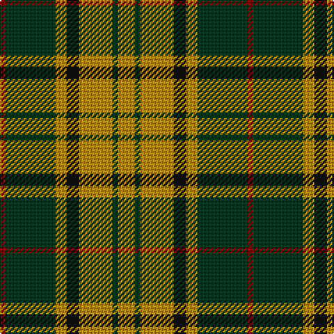

In pattern [RGYKYGY](/patterns/rgykygy/).

This was sourced from tartans-authority.  It is a [7 stripes tartan](/stripes/stripes7/).

Original link http://www.tartansauthority.com/tartan-ferret/display/2422/

## Thread count
DR/4 DG36 DY8 K9 DY24 DG4 DY/12

## Palette
Each colour and its ΔE from the base-6 reference it is a variant of.

| Colour | Shade | Base | ΔE (OKLab) |
|---|---|---|---|
| DG | <code style="background-color:#003820;">#003820</code> `#003820` | G <code style="background-color:#006100;">#006100</code> | 0.15 |
| DR | <code style="background-color:#880000;">#880000</code> `#880000` | R <code style="background-color:#CC0000;">#CC0000</code> | 0.15 |
| DY | <code style="background-color:#BC8C00;">#BC8C00</code> `#BC8C00` | Y <code style="background-color:#F2BF00;">#F2BF00</code> | 0.16 |
| K | <code style="background-color:#101010;">#101010</code> `#101010` | K <code style="background-color:#000000;">#000000</code> | 0.17 |

# Sample pattern

## Nearest tartans

The nearest existing variants by ΔTartan distance.

1. [Celtic Combat](/setts/s6/k2r20k8g18r3w2~g005010-k101010-rc04c04-we0e0e0~x2/) — ΔT 0.98
1. [Unidentified #57](/setts/s8/g20r8y2r8g5ya8g2ya8~g004c00-r8c0000-yb0b0b0-yac89800~x2/) — ΔT 0.98
1. [Blackstock Hunting](/setts/s7/k2r7k6g12y1g1k2~g006818-k101010-rc80000-ye8c000~x4/) — ΔT 1.01
1. [Invertere](/setts/s8/y5g14r4b4r27g3r4y5~b000050-g003000-r806050-yf0c000~x2/) — ΔT 1.04
1. [Harmer](/setts/s12/g36y8k9y24g4y12g4y24k9y8g36r4~g003820-k101010-r880000-ybc8c00/) — ΔT 1.12
1. [Wilson's, No 193](/setts/s5/g6k1r1b2r2~b5480b0-g008000-k000000-rc00000~x4/) — ΔT 1.15
1. [Invertere (Daks #2) (Fashion)](/setts/s8/y5g14ga4b4ga27g3ga4y5~b2c2c80-g289c18-ga604000-ye8c000~x2/) — ΔT 1.16
1. [Newfoundland](/setts/s7/r6g4b14w4b7g30y4~b441800-g006818-rc80000-we0e0e0-yd09800~x2/) — ΔT 1.16
1. [MacDuck](/setts/s6/k4g5k2r21ga8k2~g003000-ga30a010-k000000-r806050~x2/) — ΔT 1.17
1. [Crantock](/setts/s8/g24b3g3b3g3b7ga20r3~b800080-g30a010-ga003000-rc00000~x2/) — ΔT 1.18

## Neighbour map

Every grey dot is one of 15726 variants placed by the first two principal components of the ΔTartan feature space (44% of its variance). Red is this tartan; blue dots are its nearest — click one to open its page.

<svg viewBox="0 0 640 380" role="img" style="max-width:100%;height:auto;border:1px solid #e0e0e0;border-radius:4px;display:block" xmlns="http://www.w3.org/2000/svg"><image href="/nn/cloud.v1.png" width="640" height="380"/><a href="/setts/s6/k2r20k8g18r3w2~g005010-k101010-rc04c04-we0e0e0~x2/"><circle cx="235.8" cy="205.1" r="4" fill="#3465a4"><title>Celtic Combat</title></circle></a><a href="/setts/s8/g20r8y2r8g5ya8g2ya8~g004c00-r8c0000-yb0b0b0-yac89800~x2/"><circle cx="222.5" cy="209.7" r="4" fill="#3465a4"><title>Unidentified #57</title></circle></a><a href="/setts/s7/k2r7k6g12y1g1k2~g006818-k101010-rc80000-ye8c000~x4/"><circle cx="227.2" cy="195.1" r="4" fill="#3465a4"><title>Blackstock Hunting</title></circle></a><a href="/setts/s8/y5g14r4b4r27g3r4y5~b000050-g003000-r806050-yf0c000~x2/"><circle cx="269.3" cy="190.1" r="4" fill="#3465a4"><title>Invertere</title></circle></a><a href="/setts/s12/g36y8k9y24g4y12g4y24k9y8g36r4~g003820-k101010-r880000-ybc8c00/"><circle cx="225.9" cy="189.1" r="4" fill="#3465a4"><title>Harmer</title></circle></a><a href="/setts/s5/g6k1r1b2r2~b5480b0-g008000-k000000-rc00000~x4/"><circle cx="222.9" cy="238.0" r="4" fill="#3465a4"><title>Wilson's, No 193</title></circle></a><a href="/setts/s8/y5g14ga4b4ga27g3ga4y5~b2c2c80-g289c18-ga604000-ye8c000~x2/"><circle cx="276.8" cy="194.3" r="4" fill="#3465a4"><title>Invertere (Daks #2) (Fashion)</title></circle></a><a href="/setts/s7/r6g4b14w4b7g30y4~b441800-g006818-rc80000-we0e0e0-yd09800~x2/"><circle cx="231.0" cy="195.8" r="4" fill="#3465a4"><title>Newfoundland</title></circle></a><a href="/setts/s6/k4g5k2r21ga8k2~g003000-ga30a010-k000000-r806050~x2/"><circle cx="242.6" cy="196.5" r="4" fill="#3465a4"><title>MacDuck</title></circle></a><a href="/setts/s8/g24b3g3b3g3b7ga20r3~b800080-g30a010-ga003000-rc00000~x2/"><circle cx="217.0" cy="192.1" r="4" fill="#3465a4"><title>Crantock</title></circle></a><circle cx="236.8" cy="208.7" r="5" fill="#c00000"/></svg>

ID: /setts/s7/y12g4y24k9y8g36r4~g003820-k101010-r880000-ybc8c00/
