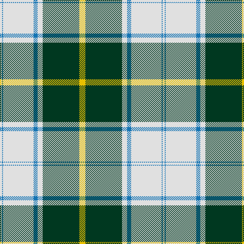

In pattern [WBWBWGY](/patterns/wbwbwgy/).

This was sourced from tartans-authority.  It is a [7 stripes tartan](/stripes/stripes7/).

Original link http://www.tartansauthority.com/tartan-ferret/display/8096/

## Thread count
LN/4 B2 LN60 B8 LN10 DG72 Y/12

## Palette
Each colour and its ΔE from the base-6 reference it is a variant of.

| Colour | Shade | Base | ΔE (OKLab) |
|---|---|---|---|
| B | <code style="background-color:#1474B4;">#1474B4</code> `#1474B4` | B <code style="background-color:#2A418A;">#2A418A</code> | 0.15 |
| DG | <code style="background-color:#003820;">#003820</code> `#003820` | G <code style="background-color:#006100;">#006100</code> | 0.15 |
| LN | <code style="background-color:#E0E0E0;">#E0E0E0</code> `#E0E0E0` | W <code style="background-color:#F7F7F7;">#F7F7F7</code> | 0.07 |
| Y | <code style="background-color:#E8C000;">#E8C000</code> `#E8C000` | Y <code style="background-color:#F2BF00;">#F2BF00</code> | 0.02 |

# Sample pattern

## Nearest tartans

The nearest existing variants by ΔTartan distance.

1. [British Columbia #2](/setts/s8/g8b28g28r12b2w60g4b2-b541c0c-g004c00-r9c8000-wffffff/) — ΔT 1.14
1. [McClurg (Name)](/setts/s8/b8ba64y6y64g2y4g2y8-b2888c4-ba2c2c80-g006818-ye8c000/) — ΔT 1.21
1. [Unidentified (shirt fabric)](/setts/s9/w5b3w25k2w2k16g8k1w4-b2c2c80-g009420-k101010-we0e0e0/) — ΔT 1.22
1. [Longniddry Green Error (Dance)](/setts/s8/g84y2w4y2g10ga24w64g8-g006818-ga003820-wfcfcfc-ye8c000/) — ΔT 1.25
1. [Dogwood](/setts/s8/g16b40g40r24b4w104g8b4-b381c0c-g004800-rb07430-wf8f4d0/) — ΔT 1.31
1. [Michigan State University (Corporate](/setts/s7/g18w55r19g20w2g20k5-g006818-k101010-r888888-wfcfcfc/) — ΔT 1.33
1. [Michigan State University](/setts/s7/g18w55r19g20w2g20k5-g006818-k101010-r888888-wffffff/) — ΔT 1.34
1. [Longniddry Green (Dance)](/setts/s8/g84ga4w4ga4g10b24w64g8-b1c1c1c-g006818-ga289c18-wfcfcfc/) — ΔT 1.36
1. [Dogwood Trade Tartan Tartan Number: 913. Earliest known date: 1968 The registered tartan of the Dinwiddie Clan. Dinwiddies are normally associated with the Maxwells, but Lord Lyon stated, in 1988, that Dinwiddies were a sept of no other clan. See products available Copyright © Blair Urquhart, Comrie, 2015](/setts/s8/g6r24g24y10r2w50g4r2-g006818-r880000-we0e0e0-ya08858/) — ΔT 1.47
1. [MacPherson Dress (1842)](/setts/s7/w6r2w60k40w6k18y2-k101010-rc80000-we0e0e0-yd8b000/) — ΔT 1.48

## Neighbour map

Every grey dot is one of 15726 variants placed by the first two principal components of the ΔTartan feature space (44% of its variance). Red is this tartan; blue dots are its nearest — click one to open its page.

<svg viewBox="0 0 640 380" role="img" style="max-width:100%;height:auto;border:1px solid #e0e0e0;border-radius:4px;display:block" xmlns="http://www.w3.org/2000/svg"><image href="/nn/cloud.v1.png" width="640" height="380"/><a href="/setts/s8/g8b28g28r12b2w60g4b2-b541c0c-g004c00-r9c8000-wffffff/"><circle cx="212.5" cy="113.1" r="4" fill="#3465a4"><title>British Columbia #2</title></circle></a><a href="/setts/s8/b8ba64y6y64g2y4g2y8-b2888c4-ba2c2c80-g006818-ye8c000/"><circle cx="272.3" cy="88.8" r="4" fill="#3465a4"><title>McClurg (Name)</title></circle></a><a href="/setts/s9/w5b3w25k2w2k16g8k1w4-b2c2c80-g009420-k101010-we0e0e0/"><circle cx="275.5" cy="119.7" r="4" fill="#3465a4"><title>Unidentified (shirt fabric)</title></circle></a><a href="/setts/s8/g84y2w4y2g10ga24w64g8-g006818-ga003820-wfcfcfc-ye8c000/"><circle cx="300.2" cy="104.5" r="4" fill="#3465a4"><title>Longniddry Green Error (Dance)</title></circle></a><a href="/setts/s8/g16b40g40r24b4w104g8b4-b381c0c-g004800-rb07430-wf8f4d0/"><circle cx="214.9" cy="120.2" r="4" fill="#3465a4"><title>Dogwood</title></circle></a><a href="/setts/s7/g18w55r19g20w2g20k5-g006818-k101010-r888888-wfcfcfc/"><circle cx="217.5" cy="147.3" r="4" fill="#3465a4"><title>Michigan State University (Corporate</title></circle></a><a href="/setts/s7/g18w55r19g20w2g20k5-g006818-k101010-r888888-wffffff/"><circle cx="216.3" cy="146.7" r="4" fill="#3465a4"><title>Michigan State University</title></circle></a><a href="/setts/s8/g84ga4w4ga4g10b24w64g8-b1c1c1c-g006818-ga289c18-wfcfcfc/"><circle cx="263.3" cy="130.3" r="4" fill="#3465a4"><title>Longniddry Green (Dance)</title></circle></a><a href="/setts/s8/g6r24g24y10r2w50g4r2-g006818-r880000-we0e0e0-ya08858/"><circle cx="220.4" cy="126.0" r="4" fill="#3465a4"><title>Dogwood Trade Tartan Tartan Number: 913. Earliest known date: 1968 The registered tartan of the Dinwiddie Clan. Dinwiddies are normally associated with the Maxwells, but Lord Lyon stated, in 1988, that Dinwiddies were a sept of no other clan. See products available Copyright © Blair Urquhart, Comrie, 2015</title></circle></a><a href="/setts/s7/w6r2w60k40w6k18y2-k101010-rc80000-we0e0e0-yd8b000/"><circle cx="320.5" cy="123.3" r="4" fill="#3465a4"><title>MacPherson Dress (1842)</title></circle></a><circle cx="266.3" cy="115.8" r="5" fill="#c00000"/></svg>

ID: /setts/s7/y12g72w10b8w60b2w4-b1474b4-g003820-we0e0e0-ye8c000/
