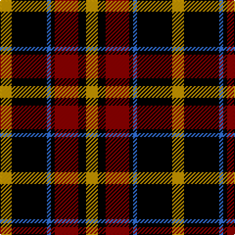

In pattern [YKBKRKY](/patterns/ykbkrky/).

This was sourced from register-of-tartans.  It is a [7 stripes tartan](/stripes/stripes7/).

Original link https://www.tartanregister.gov.uk/tartanDetails.aspx?ref=2240

## Thread count
DY/12 K36 B4 K4 DR24 K8 DY/12

## Palette
Each colour and its ΔE from the base-6 reference it is a variant of.

| Colour | Shade | Base | ΔE (OKLab) |
|---|---|---|---|
| B | <code style="background-color:#3474FC;">#3474FC</code> `#3474FC` | B <code style="background-color:#2C4084;">#2C4084</code> | 0.23 |
| DR | <code style="background-color:#8C0000;">#8C0000</code> `#8C0000` | R <code style="background-color:#C80000;">#C80000</code> | 0.13 |
| DY | <code style="background-color:#C89800;">#C89800</code> `#C89800` | Y <code style="background-color:#E8C000;">#E8C000</code> | 0.12 |
| K | <code style="background-color:#000000;">#000000</code> `#000000` | K <code style="background-color:#000000;">#000000</code> | 0.00 |

# Sample pattern

## Nearest tartans

The nearest existing variants by ΔTartan distance.

1. [LP Cover (Dance)](/setts/s7/y12k36y4k4k24k8y12-k000000-yc89800/) — ΔT 1.07
1. [MacMillan Variant (Unidentified)](/setts/s6/g6k62r34g12y36k6-g008000-k000000-rc00000-yf0c000/) — ΔT 1.11
1. [Wcwm 759-2](/setts/s6/w10r68k44r8ra48r8-k000000-r8c0000-ra8c8c8c-wc8c8c8/) — ΔT 1.22
1. [Unidentified #58](/setts/s9/r16k48w4g24r12k4r12w4r12-g004c00-k000000-r8c0000-wc8c8c8/) — ΔT 1.22
1. [Buchanan, Old dress](/setts/s9/k80w50k20y16k6y16k20r50w8-k000000-rc00000-we0e0e0-yf0c000/) — ΔT 1.25
1. [Unnamed No 5](/setts/s8/k20y4g22r22w2r2w2k18-g008000-k000000-rc00000-we0e0e0-yf0c000/) — ΔT 1.34
1. [Wallace Red Dress Tartan Tartan Number: 8186. Earliest known date: See products available Copyright © Blair Urquhart, Comrie, 2015](/setts/s5/b6k58ka22r58ka6-b2888c4-k000000-ka101010-rc80000/) — ΔT 1.34
1. [de Meuron (Neuchâtel) Dress, The](/setts/s7/k80b10k12y52ya26k18g6-b240f4c-g5b340a-k000000-yb28230-yaceb7a1/) — ΔT 1.36
1. [Graham of Menteith, (Red)](/setts/s6/r52b6r8k32ba32k8-b5480b0-ba304080-k000000-rc00000/) — ΔT 1.36
1. [Wcwm 759-3](/setts/s6/w10r68k48r8ra48r8-k000000-r8c8c8c-ra8c0000-wc8c8c8/) — ΔT 1.38

## Neighbour map

Every grey dot is one of 15726 variants placed by the first two principal components of the ΔTartan feature space (44% of its variance). Red is this tartan; blue dots are its nearest — click one to open its page.

<svg viewBox="0 0 640 380" role="img" style="max-width:100%;height:auto;border:1px solid #e0e0e0;border-radius:4px;display:block" xmlns="http://www.w3.org/2000/svg"><image href="/nn/cloud.v1.png" width="640" height="380"/><a href="/setts/s7/y12k36y4k4k24k8y12-k000000-yc89800/"><circle cx="208.1" cy="210.2" r="4" fill="#3465a4"><title>LP Cover (Dance)</title></circle></a><a href="/setts/s6/g6k62r34g12y36k6-g008000-k000000-rc00000-yf0c000/"><circle cx="178.6" cy="192.9" r="4" fill="#3465a4"><title>MacMillan Variant (Unidentified)</title></circle></a><a href="/setts/s6/w10r68k44r8ra48r8-k000000-r8c0000-ra8c8c8c-wc8c8c8/"><circle cx="205.7" cy="204.5" r="4" fill="#3465a4"><title>Wcwm 759-2</title></circle></a><a href="/setts/s9/r16k48w4g24r12k4r12w4r12-g004c00-k000000-r8c0000-wc8c8c8/"><circle cx="199.6" cy="176.7" r="4" fill="#3465a4"><title>Unidentified #58</title></circle></a><a href="/setts/s9/k80w50k20y16k6y16k20r50w8-k000000-rc00000-we0e0e0-yf0c000/"><circle cx="194.6" cy="162.6" r="4" fill="#3465a4"><title>Buchanan, Old dress</title></circle></a><a href="/setts/s8/k20y4g22r22w2r2w2k18-g008000-k000000-rc00000-we0e0e0-yf0c000/"><circle cx="153.3" cy="166.8" r="4" fill="#3465a4"><title>Unnamed No 5</title></circle></a><a href="/setts/s5/b6k58ka22r58ka6-b2888c4-k000000-ka101010-rc80000/"><circle cx="203.2" cy="212.3" r="4" fill="#3465a4"><title>Wallace Red Dress Tartan Tartan Number: 8186. Earliest known date: See products available Copyright © Blair Urquhart, Comrie, 2015</title></circle></a><a href="/setts/s7/k80b10k12y52ya26k18g6-b240f4c-g5b340a-k000000-yb28230-yaceb7a1/"><circle cx="237.0" cy="165.4" r="4" fill="#3465a4"><title>de Meuron (Neuchâtel) Dress, The</title></circle></a><a href="/setts/s6/r52b6r8k32ba32k8-b5480b0-ba304080-k000000-rc00000/"><circle cx="204.9" cy="208.8" r="4" fill="#3465a4"><title>Graham of Menteith, (Red)</title></circle></a><a href="/setts/s6/w10r68k48r8ra48r8-k000000-r8c8c8c-ra8c0000-wc8c8c8/"><circle cx="189.6" cy="203.8" r="4" fill="#3465a4"><title>Wcwm 759-3</title></circle></a><circle cx="209.0" cy="200.4" r="5" fill="#c00000"/></svg>

ID: /setts/s7/y12k36b4k4r24k8y12-b3474fc-k000000-r8c0000-yc89800/
