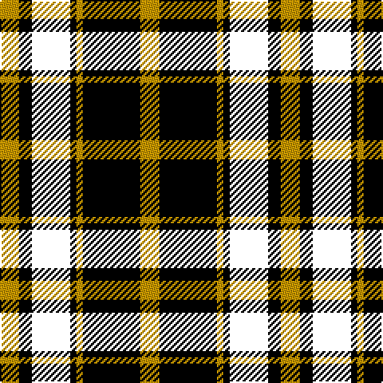

In pattern [YKKKYKY](/patterns/ykkkyky/).

This was sourced from tartans-authority.  It is a [7 stripes tartan](/stripes/stripes7/).

Original link http://www.tartansauthority.com/tartan-ferret/display/4949/

## Thread count
DY/12 K8 DR24 K4 DYa4 K36 DY/12

## Palette
Each colour and its ΔE from the base-6 reference it is a variant of.

| Colour | Shade | Base | ΔE (OKLab) |
|---|---|---|---|
| DY | <code style="background-color:#C89800;">#C89800</code> `#C89800` | Y <code style="background-color:#E8C000;">#E8C000</code> | 0.12 |
| DYa | <code style="background-color:#C89800;">#C89800</code> `#C89800` | Y <code style="background-color:#E8C000;">#E8C000</code> | 0.12 |
| K | <code style="background-color:#000000;">#000000</code> `#000000` | K <code style="background-color:#000000;">#000000</code> | 0.00 |

# Sample pattern

## Nearest tartans

The nearest existing variants by ΔTartan distance.

1. [LP Cover (Dance)](/setts/s7/y12k36b4k4r24k8y12-b3474fc-k000000-r8c0000-yc89800/) — ΔT 1.07
1. [Guthrie](/setts/s9/k6g48k54r6k6r6k54b48r6-b304080-g008000-k000000-rc00000/) — ΔT 1.14
1. [Sinclair, hunting](/setts/s7/g12r4g26k12w4k32r6-g008000-k000000-r900030-we0e0e0/) — ΔT 1.25
1. [Nairn](/setts/s5/r4k32g8b16r4-b304080-g008000-k000000-rc00000/) — ΔT 1.26
1. [Melville](/setts/s6/k10y4g36k34b32k6-b6e5058-g11450d-k000000-yaaaaaa/) — ΔT 1.32
1. [Melville](/setts/s6/k5y2g18k17b16k3-b6e5058-g11450d-k000000-yaaaaaa/) — ΔT 1.32
1. [Wilson's, No 108](/setts/s8/k28g28k4g28k28b4ba28k4-b5480b0-ba800080-g008000-k000000/) — ΔT 1.37
1. [Episcopal Clergy (Corporate)](/setts/s11/k4r4g28k32w4k32r4g8r4g16r4-g006818-k000000-r880000-wc8c8c8/) — ΔT 1.41
1. [Sonsub Corporate Tartan Tartan Number: 6984. Earliest known date: 2006 Corporate colours for Sonsub Ltd, Bridge of Don, Aberdeen. Sonsub is a well known provider of remote subsea systems technology, and provides services to the North Atlantic, Mediterranean, Africa, Caspian and Middle East. See products available Copyright © Blair Urquhart, Comrie, 2015](/setts/s10/k60ka10k38ka10k4b40y4b40ka10y8-b645858-k000000-ka101010-yc4bc68/) — ΔT 1.45
1. [de Meuron (Neuchâtel) Dress, The](/setts/s7/k80b10k12y52ya26k18g6-b240f4c-g5b340a-k000000-yb28230-yaceb7a1/) — ΔT 1.46

## Neighbour map

Every grey dot is one of 15726 variants placed by the first two principal components of the ΔTartan feature space (44% of its variance). Red is this tartan; blue dots are its nearest — click one to open its page.

<svg viewBox="0 0 640 380" role="img" style="max-width:100%;height:auto;border:1px solid #e0e0e0;border-radius:4px;display:block" xmlns="http://www.w3.org/2000/svg"><image href="/nn/cloud.v1.png" width="640" height="380"/><a href="/setts/s7/y12k36b4k4r24k8y12-b3474fc-k000000-r8c0000-yc89800/"><circle cx="209.0" cy="200.4" r="4" fill="#3465a4"><title>LP Cover (Dance)</title></circle></a><a href="/setts/s9/k6g48k54r6k6r6k54b48r6-b304080-g008000-k000000-rc00000/"><circle cx="229.8" cy="196.0" r="4" fill="#3465a4"><title>Guthrie</title></circle></a><a href="/setts/s7/g12r4g26k12w4k32r6-g008000-k000000-r900030-we0e0e0/"><circle cx="200.8" cy="216.0" r="4" fill="#3465a4"><title>Sinclair, hunting</title></circle></a><a href="/setts/s5/r4k32g8b16r4-b304080-g008000-k000000-rc00000/"><circle cx="231.4" cy="226.4" r="4" fill="#3465a4"><title>Nairn</title></circle></a><a href="/setts/s6/k10y4g36k34b32k6-b6e5058-g11450d-k000000-yaaaaaa/"><circle cx="192.5" cy="232.9" r="4" fill="#3465a4"><title>Melville</title></circle></a><a href="/setts/s6/k5y2g18k17b16k3-b6e5058-g11450d-k000000-yaaaaaa/"><circle cx="192.5" cy="232.9" r="4" fill="#3465a4"><title>Melville</title></circle></a><a href="/setts/s8/k28g28k4g28k28b4ba28k4-b5480b0-ba800080-g008000-k000000/"><circle cx="161.2" cy="228.4" r="4" fill="#3465a4"><title>Wilson's, No 108</title></circle></a><a href="/setts/s11/k4r4g28k32w4k32r4g8r4g16r4-g006818-k000000-r880000-wc8c8c8/"><circle cx="229.6" cy="190.0" r="4" fill="#3465a4"><title>Episcopal Clergy (Corporate)</title></circle></a><a href="/setts/s10/k60ka10k38ka10k4b40y4b40ka10y8-b645858-k000000-ka101010-yc4bc68/"><circle cx="234.3" cy="174.4" r="4" fill="#3465a4"><title>Sonsub Corporate Tartan Tartan Number: 6984. Earliest known date: 2006 Corporate colours for Sonsub Ltd, Bridge of Don, Aberdeen. Sonsub is a well known provider of remote subsea systems technology, and provides services to the North Atlantic, Mediterranean, Africa, Caspian and Middle East. See products available Copyright © Blair Urquhart, Comrie, 2015</title></circle></a><a href="/setts/s7/k80b10k12y52ya26k18g6-b240f4c-g5b340a-k000000-yb28230-yaceb7a1/"><circle cx="237.0" cy="165.4" r="4" fill="#3465a4"><title>de Meuron (Neuchâtel) Dress, The</title></circle></a><circle cx="208.1" cy="210.2" r="5" fill="#c00000"/></svg>

ID: /setts/s7/y12k36y4k4k24k8y12-k000000-yc89800/
