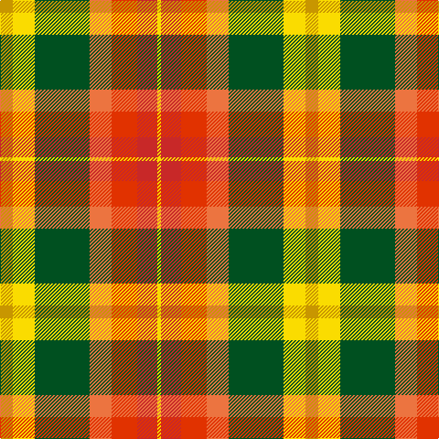

In pattern [YRRRGYY](/patterns/yrrrgyy/).

This was sourced from register-of-tartans.  It is a [7 stripes tartan](/stripes/stripes7/).

Original link https://www.tartanregister.gov.uk/tartanDetails.aspx?ref=4384

## Thread count
DY/14 Y24 G60 O24 Ra28 R22 Y/4

## Palette
Each colour and its ΔE from the base-6 reference it is a variant of.

| Colour | Shade | Base | ΔE (OKLab) |
|---|---|---|---|
| DY | <code style="background-color:#C89600;">#C89600</code> `#C89600` | Y <code style="background-color:#F2BF00;">#F2BF00</code> | 0.13 |
| G | <code style="background-color:#005020;">#005020</code> `#005020` | G <code style="background-color:#006100;">#006100</code> | 0.07 |
| O | <code style="background-color:#EC7440;">#EC7440</code> `#EC7440` | R <code style="background-color:#CC0000;">#CC0000</code> | 0.17 |
| R | <code style="background-color:#C82828;">#C82828</code> `#C82828` | R <code style="background-color:#CC0000;">#CC0000</code> | 0.03 |
| Ra | <code style="background-color:#E13200;">#E13200</code> `#E13200` | R <code style="background-color:#CC0000;">#CC0000</code> | 0.06 |
| Y | <code style="background-color:#FADC00;">#FADC00</code> `#FADC00` | Y <code style="background-color:#F2BF00;">#F2BF00</code> | 0.07 |

# Sample pattern

## Nearest tartans

The nearest existing variants by ΔTartan distance.

1. [Unidentified, Silk Plaid](/setts/s7/g14y24ga60r24ra28rb22y4-g908000-ga008000-rf07040-rae06000-rbd03030-yffe000/) — ΔT 1.15
1. [Kipp (Personal)](/setts/s7/b4y20w2r16g14ba20w4-b1c0070-ba4c0000-g006818-rb84c00-wc0c0c0-yd09800/) — ΔT 1.25
1. [Elystan Glodrydd (Name)](/setts/s7/w6g48r26ga8y22r16b4-b1c0070-g006818-ga048888-rc80000-we0e0e0-ybc8c00/) — ΔT 1.30
1. [Barbour - Muted](/setts/s7/y8r4y42b22w4ra42ya8-b1c1c1c-ra00000-ra98481c-wfcfcfc-yd8b000-yafccc00/) — ΔT 1.31
1. [Jacobite, Silk sash](/setts/s10/w2r8ra5y6w5g21w6r8rb4w2-g008000-rc00000-ra806050-rbd03030-we0e0e0-yf0c000/) — ΔT 1.32
1. [Jacobite Silk sash](/setts/s10/w2r8g5y6w5ga21w6r8ra4w2-g503c14-ga005020-rdc0000-rac82828-we0e0e0-ye8c000/) — ΔT 1.39
1. [Bathija (Name)](/setts/s7/y8g36b8r16b16ra42w2-b1474b4-g006818-ra00000-rac80000-wfcfcfc-yfccc00/) — ΔT 1.39
1. [Porcupine City of](/setts/s7/r40b12ba4w32ba4y8g20-b5c5c5c-ba1c0070-g006818-rb03000-wc0c0c0-yd09800/) — ΔT 1.46
1. [Bruce of Kinnaird (Fashion)](/setts/s10/y44ya44b4w12b4yb4b32yc10y16w4-b501400-wc0c0c0-ybc8c00-yac4bc68-ybd09800-yc00c4bc/) — ΔT 1.55
1. [Buchanan #6](/setts/s11/y60k4y30r30w4r30b30g30b8g30b30-b2c4084-g003c14-k101010-rdc0000-we0e0e0-ye8c000/) — ΔT 1.57

## Neighbour map

Every grey dot is one of 15726 variants placed by the first two principal components of the ΔTartan feature space (44% of its variance). Red is this tartan; blue dots are its nearest — click one to open its page.

<svg viewBox="0 0 640 380" role="img" style="max-width:100%;height:auto;border:1px solid #e0e0e0;border-radius:4px;display:block" xmlns="http://www.w3.org/2000/svg"><image href="/nn/cloud.v1.png" width="640" height="380"/><a href="/setts/s7/g14y24ga60r24ra28rb22y4-g908000-ga008000-rf07040-rae06000-rbd03030-yffe000/"><circle cx="122.4" cy="164.0" r="4" fill="#3465a4"><title>Unidentified, Silk Plaid</title></circle></a><a href="/setts/s7/b4y20w2r16g14ba20w4-b1c0070-ba4c0000-g006818-rb84c00-wc0c0c0-yd09800/"><circle cx="61.4" cy="173.3" r="4" fill="#3465a4"><title>Kipp (Personal)</title></circle></a><a href="/setts/s7/w6g48r26ga8y22r16b4-b1c0070-g006818-ga048888-rc80000-we0e0e0-ybc8c00/"><circle cx="160.1" cy="164.9" r="4" fill="#3465a4"><title>Elystan Glodrydd (Name)</title></circle></a><a href="/setts/s7/y8r4y42b22w4ra42ya8-b1c1c1c-ra00000-ra98481c-wfcfcfc-yd8b000-yafccc00/"><circle cx="146.9" cy="146.1" r="4" fill="#3465a4"><title>Barbour - Muted</title></circle></a><a href="/setts/s10/w2r8ra5y6w5g21w6r8rb4w2-g008000-rc00000-ra806050-rbd03030-we0e0e0-yf0c000/"><circle cx="86.4" cy="138.5" r="4" fill="#3465a4"><title>Jacobite, Silk sash</title></circle></a><a href="/setts/s10/w2r8g5y6w5ga21w6r8ra4w2-g503c14-ga005020-rdc0000-rac82828-we0e0e0-ye8c000/"><circle cx="78.2" cy="134.2" r="4" fill="#3465a4"><title>Jacobite Silk sash</title></circle></a><a href="/setts/s7/y8g36b8r16b16ra42w2-b1474b4-g006818-ra00000-rac80000-wfcfcfc-yfccc00/"><circle cx="151.7" cy="140.9" r="4" fill="#3465a4"><title>Bathija (Name)</title></circle></a><a href="/setts/s7/r40b12ba4w32ba4y8g20-b5c5c5c-ba1c0070-g006818-rb03000-wc0c0c0-yd09800/"><circle cx="113.6" cy="162.7" r="4" fill="#3465a4"><title>Porcupine City of</title></circle></a><a href="/setts/s10/y44ya44b4w12b4yb4b32yc10y16w4-b501400-wc0c0c0-ybc8c00-yac4bc68-ybd09800-yc00c4bc/"><circle cx="129.5" cy="133.5" r="4" fill="#3465a4"><title>Bruce of Kinnaird (Fashion)</title></circle></a><a href="/setts/s11/y60k4y30r30w4r30b30g30b8g30b30-b2c4084-g003c14-k101010-rdc0000-we0e0e0-ye8c000/"><circle cx="76.5" cy="138.6" r="4" fill="#3465a4"><title>Buchanan #6</title></circle></a><circle cx="105.5" cy="154.4" r="5" fill="#c00000"/></svg>

ID: /setts/s7/y14ya24g60r24ra28rb22ya4-g005020-rec7440-rae13200-rbc82828-yc89600-yafadc00/
