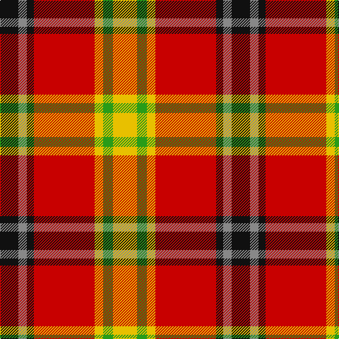

In pattern [KRKRYGY](/patterns/krkrygy/).

This was sourced from tartans-authority.  It is a [7 stripes tartan](/stripes/stripes7/).

Original link http://www.tartansauthority.com/tartan-ferret/display/10061/

## Thread count
K/26 N12 K10 R86 Y12 G14 Y/34

## Palette
Each colour and its ΔE from the base-6 reference it is a variant of.

| Colour | Shade | Base | ΔE (OKLab) |
|---|---|---|---|
| G | <code style="background-color:#289C18;">#289C18</code> `#289C18` | G <code style="background-color:#006100;">#006100</code> | 0.19 |
| K | <code style="background-color:#101010;">#101010</code> `#101010` | K <code style="background-color:#000000;">#000000</code> | 0.17 |
| N | <code style="background-color:#888888;">#888888</code> `#888888` | R <code style="background-color:#CC0000;">#CC0000</code> | 0.24 |
| R | <code style="background-color:#C80000;">#C80000</code> `#C80000` | R <code style="background-color:#CC0000;">#CC0000</code> | 0.01 |
| Y | <code style="background-color:#E8C000;">#E8C000</code> `#E8C000` | Y <code style="background-color:#F2BF00;">#F2BF00</code> | 0.02 |

# Sample pattern

## Nearest tartans

The nearest existing variants by ΔTartan distance.

1. [Keeling](/setts/s7/y17g7y6r43k5ra6k13x2~g008000-k000000-rcd0000-ra848484-yffff00/) — ΔT 0.80
1. [Melieres, Carolyn (Personal)](/setts/s10/y4w2y2w8r16g3r3g8r6k2x2~g006818-k101010-rc80000-we0e0e0-ye8c000/) — ΔT 1.06
1. [Carolyn, Melieres](/setts/s10/y4w2y2w8r16g3r3g8r6k2x2~g008000-k000000-rc00000-we0e0e0-yf0c000/) — ΔT 1.07
1. [Carlow County Crest (Fashion)](/setts/s10/w15g8k12g14r64k12r16k10y8k14~g006818-k101010-rc80000-we0e0e0-ye8c000/) — ΔT 1.17
1. [Benedict (Personal)](/setts/s5/g4w4k2r15y4x4~g003820-k101010-rc80000-wc0c0c0-yd8b000/) — ΔT 1.19
1. [Rose Dress White Dress Clan Tartan Tartan Number: 1227. Earliest known date: 1930-50 This sample comes from the MacGregor-Hastie collection which forms the basis of the cloth archive of the Scottish Tartans Society. Stocked by Dalgliesh See products available Copyright © Blair Urquhart, Comrie, 2015](/setts/s6/r32b6k6g6w18k3~b2c2c80-g006818-k101010-rc80000-we0e0e0/) — ΔT 1.22
1. [Mangles, Peter and Annette (Personal](/setts/s7/r20k5g5r5w5ra3g3x4~g285800-k101010-rc80000-ra888888-wfcfcfc/) — ΔT 1.22
1. [Thirkill (Dalgliesh)](/setts/s7/w6r18k2r6g7k8y6x4~g006818-k101010-rc80000-wfcfcfc-ye8c000/) — ΔT 1.23
1. [Rose, White dress](/setts/s6/r32b6k6g6w18k3~b304080-g008000-k000000-rc00000-we0e0e0/) — ΔT 1.23
1. [Rose White Dress](/setts/s6/r24b4k4g4w13k2x4~b447084-g006818-k101010-r880000-wf8f4d0/) — ΔT 1.23

## Neighbour map

Every grey dot is one of 15726 variants placed by the first two principal components of the ΔTartan feature space (44% of its variance). Red is this tartan; blue dots are its nearest — click one to open its page.

<svg viewBox="0 0 640 380" role="img" style="max-width:100%;height:auto;border:1px solid #e0e0e0;border-radius:4px;display:block" xmlns="http://www.w3.org/2000/svg"><image href="/nn/cloud.v1.png" width="640" height="380"/><a href="/setts/s7/y17g7y6r43k5ra6k13x2~g008000-k000000-rcd0000-ra848484-yffff00/"><circle cx="161.5" cy="154.0" r="4" fill="#3465a4"><title>Keeling</title></circle></a><a href="/setts/s10/y4w2y2w8r16g3r3g8r6k2x2~g006818-k101010-rc80000-we0e0e0-ye8c000/"><circle cx="173.6" cy="159.4" r="4" fill="#3465a4"><title>Melieres, Carolyn (Personal)</title></circle></a><a href="/setts/s10/y4w2y2w8r16g3r3g8r6k2x2~g008000-k000000-rc00000-we0e0e0-yf0c000/"><circle cx="168.0" cy="158.1" r="4" fill="#3465a4"><title>Carolyn, Melieres</title></circle></a><a href="/setts/s10/w15g8k12g14r64k12r16k10y8k14~g006818-k101010-rc80000-we0e0e0-ye8c000/"><circle cx="188.9" cy="153.3" r="4" fill="#3465a4"><title>Carlow County Crest (Fashion)</title></circle></a><a href="/setts/s5/g4w4k2r15y4x4~g003820-k101010-rc80000-wc0c0c0-yd8b000/"><circle cx="226.6" cy="193.4" r="4" fill="#3465a4"><title>Benedict (Personal)</title></circle></a><a href="/setts/s6/r32b6k6g6w18k3~b2c2c80-g006818-k101010-rc80000-we0e0e0/"><circle cx="186.7" cy="161.2" r="4" fill="#3465a4"><title>Rose Dress White Dress Clan Tartan Tartan Number: 1227. Earliest known date: 1930-50 This sample comes from the MacGregor-Hastie collection which forms the basis of the cloth archive of the Scottish Tartans Society. Stocked by Dalgliesh See products available Copyright © Blair Urquhart, Comrie, 2015</title></circle></a><a href="/setts/s7/r20k5g5r5w5ra3g3x4~g285800-k101010-rc80000-ra888888-wfcfcfc/"><circle cx="230.6" cy="179.9" r="4" fill="#3465a4"><title>Mangles, Peter and Annette (Personal</title></circle></a><a href="/setts/s7/w6r18k2r6g7k8y6x4~g006818-k101010-rc80000-wfcfcfc-ye8c000/"><circle cx="148.8" cy="184.6" r="4" fill="#3465a4"><title>Thirkill (Dalgliesh)</title></circle></a><a href="/setts/s6/r32b6k6g6w18k3~b304080-g008000-k000000-rc00000-we0e0e0/"><circle cx="179.1" cy="160.0" r="4" fill="#3465a4"><title>Rose, White dress</title></circle></a><a href="/setts/s6/r24b4k4g4w13k2x4~b447084-g006818-k101010-r880000-wf8f4d0/"><circle cx="200.8" cy="156.1" r="4" fill="#3465a4"><title>Rose White Dress</title></circle></a><circle cx="185.0" cy="161.3" r="5" fill="#c00000"/></svg>

ID: /setts/s7/y17g7y6r43k5ra6k13x2~g289c18-k101010-rc80000-ra888888-ye8c000/
