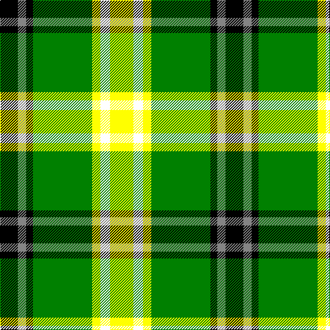

In pattern [KRKGYWY](/patterns/krkgywy/).

This was sourced from register-of-tartans.  It is a [7 stripes tartan](/stripes/stripes7/).

Original link https://www.tartanregister.gov.uk/tartanDetails.aspx?ref=10593

## Thread count
K/26 N12 K10 G86 Y12 W14 Y/34

## Palette
Each colour and its ΔE from the base-6 reference it is a variant of.

| Colour | Shade | Base | ΔE (OKLab) |
|---|---|---|---|
| G | <code style="background-color:#008000;">#008000</code> `#008000` | G <code style="background-color:#006100;">#006100</code> | 0.10 |
| K | <code style="background-color:#000000;">#000000</code> `#000000` | K <code style="background-color:#000000;">#000000</code> | 0.00 |
| N | <code style="background-color:#848484;">#848484</code> `#848484` | R <code style="background-color:#CC0000;">#CC0000</code> | 0.23 |
| W | <code style="background-color:#FFFFFF;">#FFFFFF</code> `#FFFFFF` | W <code style="background-color:#F7F7F7;">#F7F7F7</code> | 0.02 |
| Y | <code style="background-color:#FFFF00;">#FFFF00</code> `#FFFF00` | Y <code style="background-color:#F2BF00;">#F2BF00</code> | 0.16 |

# Sample pattern

## Nearest tartans

The nearest existing variants by ΔTartan distance.

1. [Keeling Dress (Fashion)](/setts/s7/y17w7y6g43k5r6k13x2~g289c18-k101010-r888888-we0e0e0-ye8c000/) — ΔT 0.83
1. [Alberta](/setts/s7/g18k2y2k2b3k2ya6x4~b5480b0-g008000-k000000-ye0a0a0-yaf0c000/) — ΔT 1.17
1. [Forrester / Foster, hunting](/setts/s10/k3y2g18w3g18k3y4k3ga18w3x2~g008000-ga30a010-k000000-we0e0e0-yf0c000/) — ΔT 1.33
1. [Forrester/Foster Hunting](/setts/s10/k3y2g18w3g13k3y4k3ga18w3x2~g006818-ga289c18-k101010-wfcfcfc-ye8c000/) — ΔT 1.40
1. [Driver, RC](/setts/s6/g11w11k3y3ga36r7x2~g008000-ga004f00-k101010-rcd3700-wffffff-yeeee00/) — ΔT 1.49
1. [Unnamed 9](/setts/s9/w16g2k5r2k10g11y2g11k2x2~g008000-k000000-rc00000-we0e0e0-yf0c000/) — ΔT 1.58
1. [Mellor (Name)](/setts/s6/w8k16g32b3y5w5x2~b003c64-g006818-k101010-we0e0e0-ybc8c00/) — ΔT 1.61
1. [Kilkenny](/setts/s7/r5g27ra2ga25y7g3r3x2~g003000-ga30a010-r802040-ra906030-yf0c000/) — ΔT 1.66
1. [Drummond of Perth Dress (Dance)](/setts/s9/g41y3ga7b3w24g10ga7b7w3x2~b5c5c5c-g285800-ga408060-wfcfcfc-ybc8c00/) — ΔT 1.71
1. [Parkhead](/setts/s11/g1k1g9k7y1g5ga4w2ga1w1g1x4~g006818-ga289c18-k101010-wfcfcfc-ye8c000/) — ΔT 1.71

## Neighbour map

Every grey dot is one of 15726 variants placed by the first two principal components of the ΔTartan feature space (44% of its variance). Red is this tartan; blue dots are its nearest — click one to open its page.

<svg viewBox="0 0 640 380" role="img" style="max-width:100%;height:auto;border:1px solid #e0e0e0;border-radius:4px;display:block" xmlns="http://www.w3.org/2000/svg"><image href="/nn/cloud.v1.png" width="640" height="380"/><a href="/setts/s7/y17w7y6g43k5r6k13x2~g289c18-k101010-r888888-we0e0e0-ye8c000/"><circle cx="161.5" cy="172.0" r="4" fill="#3465a4"><title>Keeling Dress (Fashion)</title></circle></a><a href="/setts/s7/g18k2y2k2b3k2ya6x4~b5480b0-g008000-k000000-ye0a0a0-yaf0c000/"><circle cx="206.6" cy="161.7" r="4" fill="#3465a4"><title>Alberta</title></circle></a><a href="/setts/s10/k3y2g18w3g18k3y4k3ga18w3x2~g008000-ga30a010-k000000-we0e0e0-yf0c000/"><circle cx="176.0" cy="164.0" r="4" fill="#3465a4"><title>Forrester / Foster, hunting</title></circle></a><a href="/setts/s10/k3y2g18w3g13k3y4k3ga18w3x2~g006818-ga289c18-k101010-wfcfcfc-ye8c000/"><circle cx="162.0" cy="166.3" r="4" fill="#3465a4"><title>Forrester/Foster Hunting</title></circle></a><a href="/setts/s6/g11w11k3y3ga36r7x2~g008000-ga004f00-k101010-rcd3700-wffffff-yeeee00/"><circle cx="191.7" cy="151.4" r="4" fill="#3465a4"><title>Driver, RC</title></circle></a><a href="/setts/s9/w16g2k5r2k10g11y2g11k2x2~g008000-k000000-rc00000-we0e0e0-yf0c000/"><circle cx="109.5" cy="175.1" r="4" fill="#3465a4"><title>Unnamed 9</title></circle></a><a href="/setts/s6/w8k16g32b3y5w5x2~b003c64-g006818-k101010-we0e0e0-ybc8c00/"><circle cx="184.1" cy="179.6" r="4" fill="#3465a4"><title>Mellor (Name)</title></circle></a><a href="/setts/s7/r5g27ra2ga25y7g3r3x2~g003000-ga30a010-r802040-ra906030-yf0c000/"><circle cx="199.8" cy="164.0" r="4" fill="#3465a4"><title>Kilkenny</title></circle></a><a href="/setts/s9/g41y3ga7b3w24g10ga7b7w3x2~b5c5c5c-g285800-ga408060-wfcfcfc-ybc8c00/"><circle cx="209.9" cy="137.8" r="4" fill="#3465a4"><title>Drummond of Perth Dress (Dance)</title></circle></a><a href="/setts/s11/g1k1g9k7y1g5ga4w2ga1w1g1x4~g006818-ga289c18-k101010-wfcfcfc-ye8c000/"><circle cx="183.8" cy="163.1" r="4" fill="#3465a4"><title>Parkhead</title></circle></a><circle cx="139.0" cy="166.0" r="5" fill="#c00000"/></svg>

ID: /setts/s7/y17w7y6g43k5r6k13x2~g008000-k000000-r848484-wffffff-yffff00/
