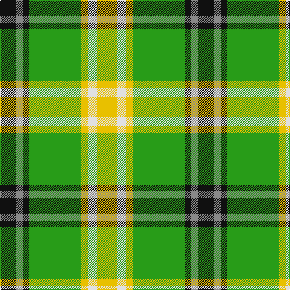

In pattern [KRKGYWY](/patterns/krkgywy/).

This was sourced from tartans-authority.  It is a [7 stripes tartan](/stripes/stripes7/).

Original link http://www.tartansauthority.com/tartan-ferret/display/10593/

## Thread count
K/26 N12 K10 G86 Y12 LN14 Y/34

## Palette
Each colour and its ΔE from the base-6 reference it is a variant of.

| Colour | Shade | Base | ΔE (OKLab) |
|---|---|---|---|
| G | <code style="background-color:#289C18;">#289C18</code> `#289C18` | G <code style="background-color:#006100;">#006100</code> | 0.19 |
| K | <code style="background-color:#101010;">#101010</code> `#101010` | K <code style="background-color:#000000;">#000000</code> | 0.17 |
| LN | <code style="background-color:#E0E0E0;">#E0E0E0</code> `#E0E0E0` | W <code style="background-color:#F7F7F7;">#F7F7F7</code> | 0.07 |
| N | <code style="background-color:#888888;">#888888</code> `#888888` | R <code style="background-color:#CC0000;">#CC0000</code> | 0.24 |
| Y | <code style="background-color:#E8C000;">#E8C000</code> `#E8C000` | Y <code style="background-color:#F2BF00;">#F2BF00</code> | 0.02 |

# Sample pattern

## Nearest tartans

The nearest existing variants by ΔTartan distance.

1. [Keeling Dress](/setts/s7/y17w7y6g43k5r6k13~g008000-k000000-r848484-wffffff-yffff00~x2/) — ΔT 0.83
1. [Forrester/Foster Hunting](/setts/s10/k3y2g18w3g13k3y4k3ga18w3~g006818-ga289c18-k101010-wfcfcfc-ye8c000~x2/) — ΔT 1.11
1. [Forrester / Foster, hunting](/setts/s10/k3y2g18w3g18k3y4k3ga18w3~g008000-ga30a010-k000000-we0e0e0-yf0c000~x2/) — ΔT 1.23
1. [Alberta](/setts/s7/g18k2y2k2b3k2ya6~b5480b0-g008000-k000000-ye0a0a0-yaf0c000~x4/) — ΔT 1.25
1. [Forrester Hunting Clan Tartan Tartan Number: 2385. Earliest known date: 1997 A clan society that has been in existence since the 1980's. This hunting tartan was fully adopted in 1997. Can be worn with anyone with the name. Note from EBW "From the book "The Forresters" by Colin D.I.G.Forrester, 1988" See products available Copyright © Blair Urquhart, Comrie, 2015](/setts/s10/k3y2g18w3g18k3y4k3ga18w3~g006818-ga289c18-k101010-we0e0e0-ye8c000~x2/) — ΔT 1.36
1. [Driver, RC](/setts/s6/g11w11k3y3ga36r7~g008000-ga004f00-k101010-rcd3700-wffffff-yeeee00~x2/) — ΔT 1.40
1. [Kilkenny](/setts/s7/r5g27ra2ga25y7g3r3~g003000-ga30a010-r802040-ra906030-yf0c000~x2/) — ΔT 1.41
1. [Fraser, Yellow](/setts/s7/r2w2y27g14y2b14y2~b304080-g008000-rc00000-we0e0e0-yf0c000~x2/) — ΔT 1.41
1. [Drummond of Perth Dress (Dance)](/setts/s9/g41y3ga7b3w24g10ga7b7w3~b5c5c5c-g285800-ga408060-wfcfcfc-ybc8c00~x2/) — ΔT 1.42
1. [Fraser Yellow Tartan Tartan Number: 1709. Earliest known date: pre 2003 Similar to Vestiarium Scoticum See products available Copyright © Blair Urquhart, Comrie, 2015](/setts/s7/r2w2y27g14y2b14y2~b2c2c80-g006818-rc80000-we0e0e0-ye8c000~x2/) — ΔT 1.46

## Neighbour map

Every grey dot is one of 15726 variants placed by the first two principal components of the ΔTartan feature space (44% of its variance). Red is this tartan; blue dots are its nearest — click one to open its page.

<svg viewBox="0 0 640 380" role="img" style="max-width:100%;height:auto;border:1px solid #e0e0e0;border-radius:4px;display:block" xmlns="http://www.w3.org/2000/svg"><image href="/nn/cloud.v1.png" width="640" height="380"/><a href="/setts/s7/y17w7y6g43k5r6k13~g008000-k000000-r848484-wffffff-yffff00~x2/"><circle cx="139.0" cy="166.0" r="4" fill="#3465a4"><title>Keeling Dress</title></circle></a><a href="/setts/s10/k3y2g18w3g13k3y4k3ga18w3~g006818-ga289c18-k101010-wfcfcfc-ye8c000~x2/"><circle cx="162.0" cy="166.3" r="4" fill="#3465a4"><title>Forrester/Foster Hunting</title></circle></a><a href="/setts/s10/k3y2g18w3g18k3y4k3ga18w3~g008000-ga30a010-k000000-we0e0e0-yf0c000~x2/"><circle cx="176.0" cy="164.0" r="4" fill="#3465a4"><title>Forrester / Foster, hunting</title></circle></a><a href="/setts/s7/g18k2y2k2b3k2ya6~b5480b0-g008000-k000000-ye0a0a0-yaf0c000~x4/"><circle cx="206.6" cy="161.7" r="4" fill="#3465a4"><title>Alberta</title></circle></a><a href="/setts/s10/k3y2g18w3g18k3y4k3ga18w3~g006818-ga289c18-k101010-we0e0e0-ye8c000~x2/"><circle cx="193.9" cy="170.4" r="4" fill="#3465a4"><title>Forrester Hunting Clan Tartan Tartan Number: 2385. Earliest known date: 1997 A clan society that has been in existence since the 1980's. This hunting tartan was fully adopted in 1997. Can be worn with anyone with the name. Note from EBW &quot;From the book &quot;The Forresters&quot; by Colin D.I.G.Forrester, 1988&quot; See products available Copyright © Blair Urquhart, Comrie, 2015</title></circle></a><a href="/setts/s6/g11w11k3y3ga36r7~g008000-ga004f00-k101010-rcd3700-wffffff-yeeee00~x2/"><circle cx="191.7" cy="151.4" r="4" fill="#3465a4"><title>Driver, RC</title></circle></a><a href="/setts/s7/r5g27ra2ga25y7g3r3~g003000-ga30a010-r802040-ra906030-yf0c000~x2/"><circle cx="199.8" cy="164.0" r="4" fill="#3465a4"><title>Kilkenny</title></circle></a><a href="/setts/s7/r2w2y27g14y2b14y2~b304080-g008000-rc00000-we0e0e0-yf0c000~x2/"><circle cx="227.2" cy="145.9" r="4" fill="#3465a4"><title>Fraser, Yellow</title></circle></a><a href="/setts/s9/g41y3ga7b3w24g10ga7b7w3~b5c5c5c-g285800-ga408060-wfcfcfc-ybc8c00~x2/"><circle cx="209.9" cy="137.8" r="4" fill="#3465a4"><title>Drummond of Perth Dress (Dance)</title></circle></a><a href="/setts/s7/r2w2y27g14y2b14y2~b2c2c80-g006818-rc80000-we0e0e0-ye8c000~x2/"><circle cx="221.0" cy="144.6" r="4" fill="#3465a4"><title>Fraser Yellow Tartan Tartan Number: 1709. Earliest known date: pre 2003 Similar to Vestiarium Scoticum See products available Copyright © Blair Urquhart, Comrie, 2015</title></circle></a><circle cx="161.5" cy="172.0" r="5" fill="#c00000"/></svg>

ID: /setts/s7/y17w7y6g43k5r6k13~g289c18-k101010-r888888-we0e0e0-ye8c000~x2/
