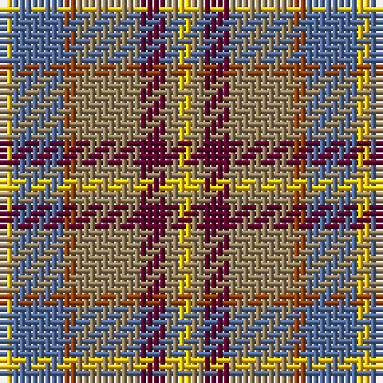

In pattern [YBRRBRY](/patterns/ybrrbry/).

This was sourced from weddslist.  It is a [7 stripes tartan](/stripes/stripes7/).

Original link http://www.weddslist.com/cgi-bin/tartans/pg.pl?source=rb

## Thread count
Y/2 B8 R2 LT10 DR4 LT2 Ya/2

## Palette
Each colour and its ΔE from the base-6 reference it is a variant of.

| Colour | Shade | Base | ΔE (OKLab) |
|---|---|---|---|
| B | <code style="background-color:#536C9A;">#536C9A</code> `#536C9A` | B <code style="background-color:#2A418A;">#2A418A</code> | 0.14 |
| DR | <code style="background-color:#5D002C;">#5D002C</code> `#5D002C` | B <code style="background-color:#2A418A;">#2A418A</code> | 0.20 |
| LT | <code style="background-color:#96815C;">#96815C</code> `#96815C` | R <code style="background-color:#CC0000;">#CC0000</code> | 0.21 |
| R | <code style="background-color:#9B4000;">#9B4000</code> `#9B4000` | R <code style="background-color:#CC0000;">#CC0000</code> | 0.11 |
| Y | <code style="background-color:#FFC800;">#FFC800</code> `#FFC800` | Y <code style="background-color:#F2BF00;">#F2BF00</code> | 0.03 |
| Ya | <code style="background-color:#FFC800;">#FFC800</code> `#FFC800` | Y <code style="background-color:#F2BF00;">#F2BF00</code> | 0.03 |

# Sample pattern

## Nearest tartans

The nearest existing variants by ΔTartan distance.

1. [Tinkler, Andrew (Stobart Group)](/setts/s9/g2y9ga6r3ga2r3ga2r10w2x4~g1b6453-ga5c4033-r8b4513-wfffff0-ycdb38b/) — ΔT 1.23
1. [Ryan/Fehder (Personal)](/setts/s6/w4r7y5b13ra18g3x2~b296ca0-g20561c-rc23d2c-ra71190b-wffffff-yc29339/) — ΔT 1.28
1. [Barbour Dress](/setts/s7/r4b2r21ba11w2ra20rb3x2~b4c3428-ba141e46-rb07430-ra888888-rbc8002c-wf8f8f8/) — ΔT 1.28
1. [Falardeau-Murphy (Canada) (Personal)](/setts/s7/g21b21y3r21ba3bb5ba3x2~b5c8ca8-ba5c5c5c-bb780078-g006818-ra00000-yfccc00/) — ΔT 1.33
1. [Christmas Hill Game Farm](/setts/s7/g5y20r3ga13g13b3w3x2~b500050-g4c3400-ga004828-ra00000-w00ccd0-ya08858/) — ΔT 1.34
1. [Crossbill](/setts/s7/k2r15g15ga15ra2ga3y2x2~g604000-ga00643c-k101010-r9c68a4-rac80000-ye8c000/) — ΔT 1.40
1. [Ontario, Northern](/setts/s7/r17g5b2w12b2y4ga7x2~b304080-g808080-ga008000-r806050-we0e0e0-yf0c000/) — ΔT 1.48
1. [Muirhead (Clan)](/setts/s11/y3g14ga9b4ga8w2ga12r12ga2r5w2x2~b1c0070-g006818-ga408060-rc80000-we0e0e0-ye8c000/) — ΔT 1.49
1. [Porcupine City of](/setts/s7/r10b3ba1w8ba1y2g5x4~b5c5c5c-ba1c0070-g006818-rb03000-wc0c0c0-yd09800/) — ΔT 1.49
1. [Brittany National Walking](/setts/s9/b4g27y8k4y8k4y8r11ya3x2~b2888c4-g604000-k101010-rb03000-ya08858-yae8c000/) — ΔT 1.51

## Neighbour map

Every grey dot is one of 15726 variants placed by the first two principal components of the ΔTartan feature space (44% of its variance). Red is this tartan; blue dots are its nearest — click one to open its page.

<svg viewBox="0 0 640 380" role="img" style="max-width:100%;height:auto;border:1px solid #e0e0e0;border-radius:4px;display:block" xmlns="http://www.w3.org/2000/svg"><image href="/nn/cloud.v1.png" width="640" height="380"/><a href="/setts/s9/g2y9ga6r3ga2r3ga2r10w2x4~g1b6453-ga5c4033-r8b4513-wfffff0-ycdb38b/"><circle cx="162.5" cy="208.0" r="4" fill="#3465a4"><title>Tinkler, Andrew (Stobart Group)</title></circle></a><a href="/setts/s6/w4r7y5b13ra18g3x2~b296ca0-g20561c-rc23d2c-ra71190b-wffffff-yc29339/"><circle cx="101.0" cy="199.2" r="4" fill="#3465a4"><title>Ryan/Fehder (Personal)</title></circle></a><a href="/setts/s7/r4b2r21ba11w2ra20rb3x2~b4c3428-ba141e46-rb07430-ra888888-rbc8002c-wf8f8f8/"><circle cx="188.4" cy="163.7" r="4" fill="#3465a4"><title>Barbour Dress</title></circle></a><a href="/setts/s7/g21b21y3r21ba3bb5ba3x2~b5c8ca8-ba5c5c5c-bb780078-g006818-ra00000-yfccc00/"><circle cx="110.1" cy="187.5" r="4" fill="#3465a4"><title>Falardeau-Murphy (Canada) (Personal)</title></circle></a><a href="/setts/s7/g5y20r3ga13g13b3w3x2~b500050-g4c3400-ga004828-ra00000-w00ccd0-ya08858/"><circle cx="132.7" cy="200.1" r="4" fill="#3465a4"><title>Christmas Hill Game Farm</title></circle></a><a href="/setts/s7/k2r15g15ga15ra2ga3y2x2~g604000-ga00643c-k101010-r9c68a4-rac80000-ye8c000/"><circle cx="161.5" cy="193.1" r="4" fill="#3465a4"><title>Crossbill</title></circle></a><a href="/setts/s7/r17g5b2w12b2y4ga7x2~b304080-g808080-ga008000-r806050-we0e0e0-yf0c000/"><circle cx="102.9" cy="170.7" r="4" fill="#3465a4"><title>Ontario, Northern</title></circle></a><a href="/setts/s11/y3g14ga9b4ga8w2ga12r12ga2r5w2x2~b1c0070-g006818-ga408060-rc80000-we0e0e0-ye8c000/"><circle cx="137.8" cy="179.1" r="4" fill="#3465a4"><title>Muirhead (Clan)</title></circle></a><a href="/setts/s7/r10b3ba1w8ba1y2g5x4~b5c5c5c-ba1c0070-g006818-rb03000-wc0c0c0-yd09800/"><circle cx="114.8" cy="161.3" r="4" fill="#3465a4"><title>Porcupine City of</title></circle></a><a href="/setts/s9/b4g27y8k4y8k4y8r11ya3x2~b2888c4-g604000-k101010-rb03000-ya08858-yae8c000/"><circle cx="151.1" cy="164.8" r="4" fill="#3465a4"><title>Brittany National Walking</title></circle></a><circle cx="140.1" cy="201.3" r="5" fill="#c00000"/></svg>

ID: /setts/s7/y1b4r1ra5ba2ra1y1x2~b536c9a-ba5d002c-r9b4000-ra96815c-yffc800/
