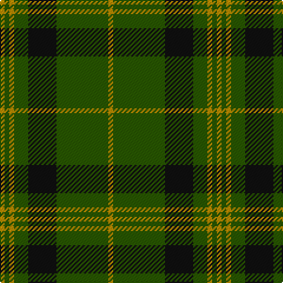

In pattern [YGKGYGY](/patterns/ygkgygy/).

This was sourced from tartans-authority.  It is a [7 stripes tartan](/stripes/stripes7/).

Original link http://www.tartansauthority.com/tartan-ferret/display/3514/

## Attestations

This cloth appears in 2 source records; the oldest owns this page.

- 1986 — Angle, Green (Fashion) (tartans-authority, [record](http://www.tartansauthority.com/tartan-ferret/display/3514/))
- undated — Angle Green (register-of-tartans, [record](https://www.tartanregister.gov.uk/tartanDetails.aspx?ref=5264))

## Thread count
DY/4 G4 DY4 G12 K24 G44 DY/4

## Palette
Each colour and its ΔE from the base-6 reference it is a variant of.

| Colour | Shade | Base | ΔE (OKLab) |
|---|---|---|---|
| DY | <code style="background-color:#BC8C00;">#BC8C00</code> `#BC8C00` | Y <code style="background-color:#F2BF00;">#F2BF00</code> | 0.16 |
| G | <code style="background-color:#285800;">#285800</code> `#285800` | G <code style="background-color:#006100;">#006100</code> | 0.03 |
| K | <code style="background-color:#101010;">#101010</code> `#101010` | K <code style="background-color:#000000;">#000000</code> | 0.17 |

# Sample pattern

## Nearest tartans

The nearest existing variants by ΔTartan distance.

1. [Maxwell Htg (Clan)](/setts/s7/g3r16g4k6g28r2g3~g006818-k101010-r880000~x2/) — ΔT 0.88
1. [Northcroft (Personal)](/setts/s7/g24r4g3k14g5r2g10~g006818-k101010-rc80000~x2/) — ΔT 0.94
1. [Glenbarr](/setts/s8/g3k6r2k6g3k2g16k1~g006818-k101010-rc80000~x4/) — ΔT 1.00
1. [Paton (Personal)](/setts/s7/r3g20k20g20y2g2y2~g006818-k101010-r880000-yd09800~x2/) — ΔT 1.05
1. [MacLean of Duart Hunting Clan Tartan Tartan Number: 824. Earliest known date: 1842 (1587) Perhaps dating back as far as 1587 but there is some debate as to the validity of the historical evidence. A charter granted to Hector MacLean, Heir of Duart, in the lands of Islay, the feu duty to be payable in the form of 60 ells cloth of white, black and green colours. This may well account for the colours, the proportions being the invention of the Sobieski Stuarts. See products available Copyright © Blair Urquhart, Comrie, 2015](/setts/s8/g3k6w1k6g2k2g16k1~g006818-k101010-we0e0e0~x2/) — ΔT 1.15
1. [Connell (Personal?)](/setts/s6/r2g2r1g12r3k1~g006818-k101010-rc80000~x4/) — ΔT 1.22
1. [Glen Trool](/setts/s5/g37r9g3ra9r3~g003000-r806050-rac00000~x2/) — ΔT 1.23
1. [MacKintosh Hunting Clan Tartan Tartan Number: 544. Earliest known date: 1951 This sett appears in D.C. Stewarts book, The Setts of the Scottish Tartans, with slightly different proportions. The Lyon Court Book No. 1 records the sett in relation to the narrowest stripe. ie Y 1, Vt (Vert meaning green) 10 1/2, Bu 5, etc. The rendering illustrated here multiplies the Lyon count by two. Commercially manufactured cloth may vary from these proportions. D.C. Stewart calls the sett "a modern arrangement". See products available Copyright © Blair Urquhart, Comrie, 2015](/setts/s7/b1r3g11r2b5g11y1~b2c2c80-g006818-rc80000-ye8c000~x2/) — ΔT 1.29
1. [Romsdal](/setts/s5/g22b5r4b5r3~b1c1c1c-g006818-rc80000~x2/) — ΔT 1.30
1. [Green Watch](/setts/s7/g10r1g1r1y2g1r1~g004c00-ra0783c-yb0b0b0~x4/) — ΔT 1.30

## Neighbour map

Every grey dot is one of 15726 variants placed by the first two principal components of the ΔTartan feature space (44% of its variance). Red is this tartan; blue dots are its nearest — click one to open its page.

<svg viewBox="0 0 640 380" role="img" style="max-width:100%;height:auto;border:1px solid #e0e0e0;border-radius:4px;display:block" xmlns="http://www.w3.org/2000/svg"><image href="/nn/cloud.v1.png" width="640" height="380"/><a href="/setts/s7/g3r16g4k6g28r2g3~g006818-k101010-r880000~x2/"><circle cx="418.8" cy="220.9" r="4" fill="#3465a4"><title>Maxwell Htg (Clan)</title></circle></a><a href="/setts/s7/g24r4g3k14g5r2g10~g006818-k101010-rc80000~x2/"><circle cx="416.1" cy="239.4" r="4" fill="#3465a4"><title>Northcroft (Personal)</title></circle></a><a href="/setts/s8/g3k6r2k6g3k2g16k1~g006818-k101010-rc80000~x4/"><circle cx="374.4" cy="213.7" r="4" fill="#3465a4"><title>Glenbarr</title></circle></a><a href="/setts/s7/r3g20k20g20y2g2y2~g006818-k101010-r880000-yd09800~x2/"><circle cx="345.4" cy="220.2" r="4" fill="#3465a4"><title>Paton (Personal)</title></circle></a><a href="/setts/s8/g3k6w1k6g2k2g16k1~g006818-k101010-we0e0e0~x2/"><circle cx="376.6" cy="205.8" r="4" fill="#3465a4"><title>MacLean of Duart Hunting Clan Tartan Tartan Number: 824. Earliest known date: 1842 (1587) Perhaps dating back as far as 1587 but there is some debate as to the validity of the historical evidence. A charter granted to Hector MacLean, Heir of Duart, in the lands of Islay, the feu duty to be payable in the form of 60 ells cloth of white, black and green colours. This may well account for the colours, the proportions being the invention of the Sobieski Stuarts. See products available Copyright © Blair Urquhart, Comrie, 2015</title></circle></a><a href="/setts/s6/r2g2r1g12r3k1~g006818-k101010-rc80000~x4/"><circle cx="444.8" cy="219.1" r="4" fill="#3465a4"><title>Connell (Personal?)</title></circle></a><a href="/setts/s5/g37r9g3ra9r3~g003000-r806050-rac00000~x2/"><circle cx="440.3" cy="237.9" r="4" fill="#3465a4"><title>Glen Trool</title></circle></a><a href="/setts/s7/b1r3g11r2b5g11y1~b2c2c80-g006818-rc80000-ye8c000~x2/"><circle cx="367.5" cy="218.3" r="4" fill="#3465a4"><title>MacKintosh Hunting Clan Tartan Tartan Number: 544. Earliest known date: 1951 This sett appears in D.C. Stewarts book, The Setts of the Scottish Tartans, with slightly different proportions. The Lyon Court Book No. 1 records the sett in relation to the narrowest stripe. ie Y 1, Vt (Vert meaning green) 10 1/2, Bu 5, etc. The rendering illustrated here multiplies the Lyon count by two. Commercially manufactured cloth may vary from these proportions. D.C. Stewart calls the sett &quot;a modern arrangement&quot;. See products available Copyright © Blair Urquhart, Comrie, 2015</title></circle></a><a href="/setts/s5/g22b5r4b5r3~b1c1c1c-g006818-rc80000~x2/"><circle cx="340.1" cy="255.8" r="4" fill="#3465a4"><title>Romsdal</title></circle></a><a href="/setts/s7/g10r1g1r1y2g1r1~g004c00-ra0783c-yb0b0b0~x4/"><circle cx="457.6" cy="214.7" r="4" fill="#3465a4"><title>Green Watch</title></circle></a><circle cx="394.9" cy="225.0" r="5" fill="#c00000"/></svg>

ID: /setts/s7/y1g11k6g3y1g1y1~g285800-k101010-ybc8c00~x4/
