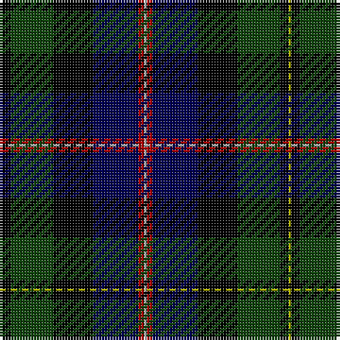

In pattern [YKGKBRY](/patterns/ykgkbry/).

This was sourced from weddslist.  It is a [7 stripes tartan](/stripes/stripes7/).

Original link http://www.weddslist.com/cgi-bin/tartans/pg.pl?source=x

## Thread count
LG/1 K3 DG15 K14 DB16 DR2 N/1

## Palette
Each colour and its ΔE from the base-6 reference it is a variant of.

| Colour | Shade | Base | ΔE (OKLab) |
|---|---|---|---|
| DB | <code style="background-color:#000052;">#000052</code> `#000052` | B <code style="background-color:#2C4084;">#2C4084</code> | 0.20 |
| DG | <code style="background-color:#11450D;">#11450D</code> `#11450D` | G <code style="background-color:#006400;">#006400</code> | 0.10 |
| DR | <code style="background-color:#AA0000;">#AA0000</code> `#AA0000` | R <code style="background-color:#C80000;">#C80000</code> | 0.06 |
| K | <code style="background-color:#000000;">#000000</code> `#000000` | K <code style="background-color:#000000;">#000000</code> | 0.00 |
| LG | <code style="background-color:#AAAA00;">#AAAA00</code> `#AAAA00` | Y <code style="background-color:#E8C000;">#E8C000</code> | 0.11 |
| N | <code style="background-color:#AAAAAA;">#AAAAAA</code> `#AAAAAA` | Y <code style="background-color:#E8C000;">#E8C000</code> | 0.19 |

# Sample pattern

## Nearest tartans

The nearest existing variants by ΔTartan distance.

1. [MacNeil](/setts/s7/y2k6g30k28b32r4ya2-b000052-g11450d-k000000-raa0000-yaaaa00-yaaaaaaa/) — ΔT 0.00
1. [MacNeil](/setts/s7/w2r4b32k28g30k6y2-b000064-g004c00-k000000-rc80000-wd0d0d0-yffff00/) — ΔT 0.59
1. [Fettes College](/setts/s7/b8g46k44ba6bb44b2w4-b3c0014-ba9800a0-bb000048-g004028-k000000-wfcfcfc/) — ΔT 0.78
1. [National Wedding (Fashion)](/setts/s9/g44y4g8b6g8k40ba40k2w6-b64008c-ba000064-g003014-k000000-wc8c8c8-yc48800/) — ΔT 0.90
1. [National Wedding](/setts/s9/g44y4g8b6g8k40ba40k2w6-b64008c-ba000080-g003014-k000000-wc8c8c8-yc48800/) — ΔT 0.97
1. [Mitchell](/setts/s6/k4g24k24r2b24y4-b000052-g11450d-k000000-raa0000-yaaaaaa/) — ΔT 1.10
1. [Mitchell](/setts/s6/k2g12k12r1b12y2-b000052-g11450d-k000000-raa0000-yaaaaaa/) — ΔT 1.10
1. [St Andrews Golf Club](/setts/s9/r4g12ga4g20k4g4k36b48w4-b141c50-g40584c-ga5c8898-k000000-rec5c28-we0e0d8/) — ΔT 1.12
1. [MacLeod](/setts/s7/r6k4g30k20b40k4y4-b000052-g11450d-k000000-raa0000-yaaaa00/) — ΔT 1.16
1. [MacLeod](/setts/s7/r3k2g15k10b20k2y2-b000052-g11450d-k000000-raa0000-yaaaa00/) — ΔT 1.16

## Neighbour map

Every grey dot is one of 15726 variants placed by the first two principal components of the ΔTartan feature space (44% of its variance). Red is this tartan; blue dots are its nearest — click one to open its page.

<svg viewBox="0 0 640 380" role="img" style="max-width:100%;height:auto;border:1px solid #e0e0e0;border-radius:4px;display:block" xmlns="http://www.w3.org/2000/svg"><image href="/nn/cloud.v1.png" width="640" height="380"/><a href="/setts/s7/y2k6g30k28b32r4ya2-b000052-g11450d-k000000-raa0000-yaaaa00-yaaaaaaa/"><circle cx="162.4" cy="165.0" r="4" fill="#3465a4"><title>MacNeil</title></circle></a><a href="/setts/s7/w2r4b32k28g30k6y2-b000064-g004c00-k000000-rc80000-wd0d0d0-yffff00/"><circle cx="144.6" cy="157.2" r="4" fill="#3465a4"><title>MacNeil</title></circle></a><a href="/setts/s7/b8g46k44ba6bb44b2w4-b3c0014-ba9800a0-bb000048-g004028-k000000-wfcfcfc/"><circle cx="158.8" cy="151.1" r="4" fill="#3465a4"><title>Fettes College</title></circle></a><a href="/setts/s9/g44y4g8b6g8k40ba40k2w6-b64008c-ba000064-g003014-k000000-wc8c8c8-yc48800/"><circle cx="188.3" cy="137.0" r="4" fill="#3465a4"><title>National Wedding (Fashion)</title></circle></a><a href="/setts/s9/g44y4g8b6g8k40ba40k2w6-b64008c-ba000080-g003014-k000000-wc8c8c8-yc48800/"><circle cx="183.3" cy="134.6" r="4" fill="#3465a4"><title>National Wedding</title></circle></a><a href="/setts/s6/k4g24k24r2b24y4-b000052-g11450d-k000000-raa0000-yaaaaaa/"><circle cx="165.4" cy="207.5" r="4" fill="#3465a4"><title>Mitchell</title></circle></a><a href="/setts/s6/k2g12k12r1b12y2-b000052-g11450d-k000000-raa0000-yaaaaaa/"><circle cx="165.4" cy="207.5" r="4" fill="#3465a4"><title>Mitchell</title></circle></a><a href="/setts/s9/r4g12ga4g20k4g4k36b48w4-b141c50-g40584c-ga5c8898-k000000-rec5c28-we0e0d8/"><circle cx="152.0" cy="144.3" r="4" fill="#3465a4"><title>St Andrews Golf Club</title></circle></a><a href="/setts/s7/r6k4g30k20b40k4y4-b000052-g11450d-k000000-raa0000-yaaaa00/"><circle cx="177.1" cy="196.5" r="4" fill="#3465a4"><title>MacLeod</title></circle></a><a href="/setts/s7/r3k2g15k10b20k2y2-b000052-g11450d-k000000-raa0000-yaaaa00/"><circle cx="177.1" cy="196.5" r="4" fill="#3465a4"><title>MacLeod</title></circle></a><circle cx="162.4" cy="165.0" r="5" fill="#c00000"/></svg>

ID: /setts/s7/y1k3g15k14b16r2ya1-b000052-g11450d-k000000-raa0000-yaaaa00-yaaaaaaa/
