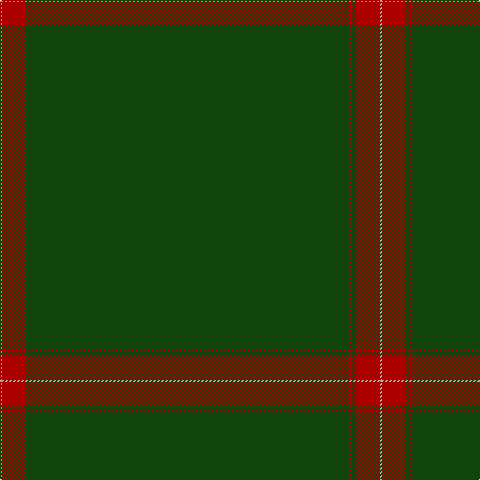

In pattern [YRGRGRY](/patterns/yrgrgry/).

This was sourced from weddslist.  It is a [7 stripes tartan](/stripes/stripes7/).

Original link http://www.weddslist.com/cgi-bin/tartans/pg.pl?source=tinsel

## Thread count
LG/2 DR24 DG324 DR2 DG4 DR24 N/2

## Palette
Each colour and its ΔE from the base-6 reference it is a variant of.

| Colour | Shade | Base | ΔE (OKLab) |
|---|---|---|---|
| DG | <code style="background-color:#11450D;">#11450D</code> `#11450D` | G <code style="background-color:#006100;">#006100</code> | 0.09 |
| DR | <code style="background-color:#AA0000;">#AA0000</code> `#AA0000` | R <code style="background-color:#CC0000;">#CC0000</code> | 0.07 |
| LG | <code style="background-color:#AAAA00;">#AAAA00</code> `#AAAA00` | Y <code style="background-color:#F2BF00;">#F2BF00</code> | 0.13 |
| N | <code style="background-color:#AAAAAA;">#AAAAAA</code> `#AAAAAA` | Y <code style="background-color:#F2BF00;">#F2BF00</code> | 0.19 |

# Sample pattern

## Nearest tartans

The nearest existing variants by ΔTartan distance.

1. [Lagrande](/setts/s5/g100y4g2ya3yb6x2~g285800-ya08858-yabc8c00-ybc4bc68/) — ΔT 1.43
1. [Stewart from Cairnie](/setts/s8/g83k6g3k9r2k5g2y2x2~g005020-k101010-rdc0000-ye8c000/) — ΔT 1.58
1. [Braveheart Htg (Fashion)](/setts/s10/g3b2g40b1g2b1g9r4g3r2x4~b202060-g006818-r880000/) — ΔT 1.64
1. [Unidentified #12](/setts/s11/b2k1g36k1r2k1r2k1g36k1y2x2~b3c82af-g005020-k101010-rdc0000-ye8c000/) — ΔT 1.81
1. [Burnett of Leys Hunting Family Tartan Tartan Number: 1657. Earliest known date: 1988 Nothing See products available Copyright © Blair Urquhart, Comrie, 2015](/setts/s8/g96b8g8w3g8ga3g8r3x2~b2c2c80-g604000-ga006818-rc80000-we0e0e0/) — ΔT 1.92
1. [Coeur D'Alene Firefighters (Corporat](/setts/s13/g61g1g1b2g1g1g16g1b4g2b6g1b4x2~b1c1c50-g006818/) — ΔT 2.10
1. [St. David's (District)](/setts/s6/g60r2g8r1g5k2~g003820-k000000-rc80000/) — ΔT 2.18
1. [Crane of Cluny (Personal)](/setts/s8/g82k6g3k9r2k5g2y2x2~g006818-k101010-rc8002c-ye8c000/) — ΔT 2.18
1. [Eternity, Dedicated 2 Weddings](/setts/s5/b88r3y2k2ya1x2~b433e3b-k101010-r8c7853-yeec591-yab0b0b0/) — ΔT 2.24
1. [Walters (Personal)](/setts/s6/g2b2g20g2g2b1x4~b6c0070-g006818/) — ΔT 2.32

## Neighbour map

Every grey dot is one of 15726 variants placed by the first two principal components of the ΔTartan feature space (44% of its variance). Red is this tartan; blue dots are its nearest — click one to open its page.

<svg viewBox="0 0 640 380" role="img" style="max-width:100%;height:auto;border:1px solid #e0e0e0;border-radius:4px;display:block" xmlns="http://www.w3.org/2000/svg"><image href="/nn/cloud.v1.png" width="640" height="380"/><a href="/setts/s5/g100y4g2ya3yb6x2~g285800-ya08858-yabc8c00-ybc4bc68/"><circle cx="626.0" cy="169.7" r="4" fill="#3465a4"><title>Lagrande</title></circle></a><a href="/setts/s8/g83k6g3k9r2k5g2y2x2~g005020-k101010-rdc0000-ye8c000/"><circle cx="621.2" cy="144.5" r="4" fill="#3465a4"><title>Stewart from Cairnie</title></circle></a><a href="/setts/s10/g3b2g40b1g2b1g9r4g3r2x4~b202060-g006818-r880000/"><circle cx="626.0" cy="167.2" r="4" fill="#3465a4"><title>Braveheart Htg (Fashion)</title></circle></a><a href="/setts/s11/b2k1g36k1r2k1r2k1g36k1y2x2~b3c82af-g005020-k101010-rdc0000-ye8c000/"><circle cx="624.7" cy="122.0" r="4" fill="#3465a4"><title>Unidentified #12</title></circle></a><a href="/setts/s8/g96b8g8w3g8ga3g8r3x2~b2c2c80-g604000-ga006818-rc80000-we0e0e0/"><circle cx="626.0" cy="143.9" r="4" fill="#3465a4"><title>Burnett of Leys Hunting Family Tartan Tartan Number: 1657. Earliest known date: 1988 Nothing See products available Copyright © Blair Urquhart, Comrie, 2015</title></circle></a><a href="/setts/s13/g61g1g1b2g1g1g16g1b4g2b6g1b4x2~b1c1c50-g006818/"><circle cx="626.0" cy="121.6" r="4" fill="#3465a4"><title>Coeur D'Alene Firefighters (Corporat</title></circle></a><a href="/setts/s6/g60r2g8r1g5k2~g003820-k000000-rc80000/"><circle cx="626.0" cy="198.2" r="4" fill="#3465a4"><title>St. David's (District)</title></circle></a><a href="/setts/s8/g82k6g3k9r2k5g2y2x2~g006818-k101010-rc8002c-ye8c000/"><circle cx="587.9" cy="132.1" r="4" fill="#3465a4"><title>Crane of Cluny (Personal)</title></circle></a><a href="/setts/s5/b88r3y2k2ya1x2~b433e3b-k101010-r8c7853-yeec591-yab0b0b0/"><circle cx="626.0" cy="153.9" r="4" fill="#3465a4"><title>Eternity, Dedicated 2 Weddings</title></circle></a><a href="/setts/s6/g2b2g20g2g2b1x4~b6c0070-g006818/"><circle cx="626.0" cy="225.1" r="4" fill="#3465a4"><title>Walters (Personal)</title></circle></a><circle cx="626.0" cy="146.3" r="5" fill="#c00000"/></svg>

ID: /setts/s7/y1r12g162r1g2r12ya1x2~g11450d-raa0000-yaaaa00-yaaaaaaa/
