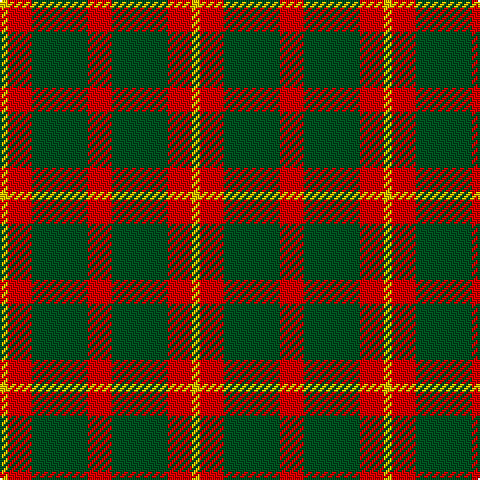

In pattern [YRGRGRY](/patterns/yrgrgry/).

This was sourced from register-of-tartans.  It is a [7 stripes tartan](/stripes/stripes7/).

Original link https://www.tartanregister.gov.uk/tartanDetails.aspx?ref=4243

## Register references

External register numbers recorded for this tartan.

- Scottish Register of Tartans: [4243](https://www.tartanregister.gov.uk/tartanDetails.aspx?ref=4243)
- Scottish Tartans World Register: 1889

## Thread count
Y/4 R12 G28 R12 G28 R12 Y/4

## Palette
Each colour and its ΔE from the base-6 reference it is a variant of.

| Colour | Shade | Base | ΔE (OKLab) |
|---|---|---|---|
| G | <code style="background-color:#005020;">#005020</code> `#005020` | G <code style="background-color:#006100;">#006100</code> | 0.07 |
| R | <code style="background-color:#DC0000;">#DC0000</code> `#DC0000` | R <code style="background-color:#CC0000;">#CC0000</code> | 0.03 |
| Y | <code style="background-color:#E8C000;">#E8C000</code> `#E8C000` | Y <code style="background-color:#F2BF00;">#F2BF00</code> | 0.02 |

# Sample pattern

## Nearest tartans

The nearest existing variants by ΔTartan distance.

1. [Murray, Lord George (Hose)](/setts/s5/g1r5g10r5k1~g006818-k000000-rc80000~x4/) — ΔT 1.12
1. [MacDonald, Lord of the Isles](/setts/s5/g16r5g2r18k2~g008000-k000000-rc00000~x2/) — ΔT 1.14
1. [Unidentified 24](/setts/s7/y1r3g7r3g7r3y1~g008000-rc00000-yf0c000~x4/) — ΔT 1.16
1. [Confederate Artillery](/setts/s6/g2r14g8r3g12ra2~g003014-ra0783c-ra8c0000~x2/) — ΔT 1.32
1. [Bruce](/setts/s10/r8g2r2g6r1g6r2g2r8y1~g004c00-rc80000-yffc800/) — ΔT 1.34
1. [MacDonald, Lord of The Isles (Artef)](/setts/s5/g16r5g2r18k2~g006818-k101010-rc80000~x2/) — ΔT 1.38
1. [Caspari (Corporate)](/setts/s7/r8y2r15g10r4g10r4~g006818-rc80000-ye8c000~x2/) — ΔT 1.39
1. [Norwich No.077](/setts/s9/g5r9g10w2g2y2g10r9g5~g044028-rc80000-wfcfcfc-ydcbc00~x2/) — ΔT 1.41
1. [Makhtoum](/setts/s6/w11r40g13r5g12r5~g008000-rc00000-we0e0e0~x2/) — ΔT 1.43
1. [Al-Maktoum](/setts/s6/w11r32g12r5g12r5~g006818-rc80000-wfcfcfc~x2/) — ΔT 1.43

## Neighbour map

Every grey dot is one of 15726 variants placed by the first two principal components of the ΔTartan feature space (44% of its variance). Red is this tartan; blue dots are its nearest — click one to open its page.

<svg viewBox="0 0 640 380" role="img" style="max-width:100%;height:auto;border:1px solid #e0e0e0;border-radius:4px;display:block" xmlns="http://www.w3.org/2000/svg"><image href="/nn/cloud.v1.png" width="640" height="380"/><a href="/setts/s5/g1r5g10r5k1~g006818-k000000-rc80000~x4/"><circle cx="323.2" cy="242.7" r="4" fill="#3465a4"><title>Murray, Lord George (Hose)</title></circle></a><a href="/setts/s5/g16r5g2r18k2~g008000-k000000-rc00000~x2/"><circle cx="333.3" cy="236.9" r="4" fill="#3465a4"><title>MacDonald, Lord of the Isles</title></circle></a><a href="/setts/s7/y1r3g7r3g7r3y1~g008000-rc00000-yf0c000~x4/"><circle cx="307.4" cy="252.3" r="4" fill="#3465a4"><title>Unidentified 24</title></circle></a><a href="/setts/s6/g2r14g8r3g12ra2~g003014-ra0783c-ra8c0000~x2/"><circle cx="318.6" cy="263.6" r="4" fill="#3465a4"><title>Confederate Artillery</title></circle></a><a href="/setts/s10/r8g2r2g6r1g6r2g2r8y1~g004c00-rc80000-yffc800/"><circle cx="334.8" cy="224.3" r="4" fill="#3465a4"><title>Bruce</title></circle></a><a href="/setts/s5/g16r5g2r18k2~g006818-k101010-rc80000~x2/"><circle cx="352.3" cy="243.1" r="4" fill="#3465a4"><title>MacDonald, Lord of The Isles (Artef)</title></circle></a><a href="/setts/s7/r8y2r15g10r4g10r4~g006818-rc80000-ye8c000~x2/"><circle cx="342.0" cy="259.4" r="4" fill="#3465a4"><title>Caspari (Corporate)</title></circle></a><a href="/setts/s9/g5r9g10w2g2y2g10r9g5~g044028-rc80000-wfcfcfc-ydcbc00~x2/"><circle cx="267.8" cy="245.5" r="4" fill="#3465a4"><title>Norwich No.077</title></circle></a><a href="/setts/s6/w11r40g13r5g12r5~g008000-rc00000-we0e0e0~x2/"><circle cx="328.8" cy="222.1" r="4" fill="#3465a4"><title>Makhtoum</title></circle></a><a href="/setts/s6/w11r32g12r5g12r5~g006818-rc80000-wfcfcfc~x2/"><circle cx="275.8" cy="234.5" r="4" fill="#3465a4"><title>Al-Maktoum</title></circle></a><circle cx="300.3" cy="247.8" r="5" fill="#c00000"/></svg>

ID: /setts/s7/y1r3g7r3g7r3y1~g005020-rdc0000-ye8c000~x4/
