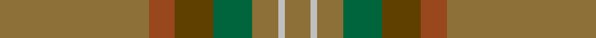
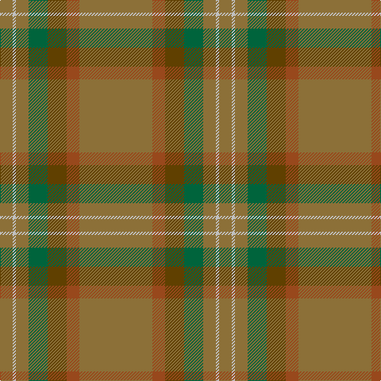

In pattern [GRGGGWG](/stripes/grgggwg/).

This was sourced from tartans-authority.  It is a [7 stripe tartan](/stripes/stripes7/).

Original link http://www.tartansauthority.com/tartan-ferret/display/5823/

## Thread count
LT/92 Ta16 T24 G24 LT16 N4 LT/16

## Palette
Each colour and the base-6 reference it is a variant of.

| Colour | Shade | Base |
|---|---|---|
| G | <code style="background-color:#00643C;">#00643C</code> `oklch(44.3% 0.104 157.7)` <small>#00643C</small> | G <code style="background-color:#006100;">#006100</code> |
| LT | <code style="background-color:#8C7038;">#8C7038</code> `oklch(56.0% 0.082 83.0)` <small>#8C7038</small> | G <code style="background-color:#006100;">#006100</code> |
| N | <code style="background-color:#C0C0C0;">#C0C0C0</code> `oklch(80.8% 0.000 89.9)` <small>#C0C0C0</small> | W <code style="background-color:#F7F7F7;">#F7F7F7</code> |
| T | <code style="background-color:#604000;">#604000</code> `oklch(39.8% 0.083 76.8)` <small>#604000</small> | G <code style="background-color:#006100;">#006100</code> |
| Ta | <code style="background-color:#98481C;">#98481C</code> `oklch(49.6% 0.121 46.1)` <small>#98481C</small> | R <code style="background-color:#CC0000;">#CC0000</code> |

# Sample pattern

## Nearest tartans

The nearest existing variants by ΔTartan distance.

1. [Huntsman](/setts/s8/y3dy3y4k4dy14k3y41g2~x2/) — ΔT 1.67
1. [Weathered Cyclist](/setts/s7/y32w2y9ly2y12o21r1~x2/) — ΔT 1.69
1. [Highland Greenford (Personal)](/setts/s4/y50dy25ly2dp6~x2/) — ΔT 1.73
1. [Historic Scotland Corporate Tartan Tartan Number: 2122. Earliest known date: 1988 Custodians at Historic Scotland properties throughout Scotland, including Edinburgh Castle, wear this distinctive tartan. See products available Copyright © Blair Urquhart, Comrie, 2015](/setts/s9/k2y7k1y9dy21o2dy1o1dy2~x2/) — ΔT 1.89
1. [Ulster (Peat) (District](/setts/s10/y28k2y28k2y2k2dy29k2r2k2~x2/) — ΔT 1.91
1. [Tricor](/setts/s12/y23o4dy6g6y4lb1y4~x4/) — ΔT 2.02
1. [Williams (Fashion)](/setts/s11/dy50do6o3do3y3do3dt10dy8do3dy6y3~x2/) — ΔT 2.04
1. [Isaia (Fashion)](/setts/s7/o80o8o4dy4lr4dy45n8/) — ΔT 2.05
1. [McGuigan, Julia (St Monans, Fife) (Personal)](/setts/s4/y9y52dy15ly4~x2/) — ΔT 2.11
1. [Orkney Slate (Fashion)](/setts/s8/n8o74lb8n42o11dp2o16n4/) — ΔT 2.21

## Neighbour map

Every grey dot is one of 14299 variants placed by the first two principal components of the ΔTartan feature space (44% of its variance). Red is this tartan; blue dots are its nearest — click one to open its page.

<svg viewBox="0 0 640 380" role="img" style="max-width:100%;height:auto;border:1px solid #e0e0e0;border-radius:4px;display:block" xmlns="http://www.w3.org/2000/svg"><image href="/nn/cloud.v1.png" width="640" height="380"/><a href="/setts/s8/y3dy3y4k4dy14k3y41g2~x2/"><circle cx="499.9" cy="192.6" r="4" fill="#3465a4"><title>Huntsman</title></circle></a><a href="/setts/s7/y32w2y9ly2y12o21r1~x2/"><circle cx="560.9" cy="225.6" r="4" fill="#3465a4"><title>Weathered Cyclist</title></circle></a><a href="/setts/s4/y50dy25ly2dp6~x2/"><circle cx="505.7" cy="261.9" r="4" fill="#3465a4"><title>Highland Greenford (Personal)</title></circle></a><a href="/setts/s9/k2y7k1y9dy21o2dy1o1dy2~x2/"><circle cx="457.3" cy="212.9" r="4" fill="#3465a4"><title>Historic Scotland Corporate Tartan Tartan Number: 2122. Earliest known date: 1988 Custodians at Historic Scotland properties throughout Scotland, including Edinburgh Castle, wear this distinctive tartan. See products available Copyright © Blair Urquhart, Comrie, 2015</title></circle></a><a href="/setts/s10/y28k2y28k2y2k2dy29k2r2k2~x2/"><circle cx="480.9" cy="219.9" r="4" fill="#3465a4"><title>Ulster (Peat) (District</title></circle></a><a href="/setts/s12/y23o4dy6g6y4lb1y4~x4/"><circle cx="385.0" cy="190.5" r="4" fill="#3465a4"><title>Tricor</title></circle></a><a href="/setts/s11/dy50do6o3do3y3do3dt10dy8do3dy6y3~x2/"><circle cx="527.7" cy="193.4" r="4" fill="#3465a4"><title>Williams (Fashion)</title></circle></a><a href="/setts/s7/o80o8o4dy4lr4dy45n8/"><circle cx="442.2" cy="184.4" r="4" fill="#3465a4"><title>Isaia (Fashion)</title></circle></a><a href="/setts/s4/y9y52dy15ly4~x2/"><circle cx="537.8" cy="304.1" r="4" fill="#3465a4"><title>McGuigan, Julia (St Monans, Fife) (Personal)</title></circle></a><a href="/setts/s8/n8o74lb8n42o11dp2o16n4/"><circle cx="524.6" cy="194.5" r="4" fill="#3465a4"><title>Orkney Slate (Fashion)</title></circle></a><circle cx="506.5" cy="221.6" r="5" fill="#c00000"/></svg>

ID: /setts/s7/y23o4dy6g6y4lb1y4~x4/
