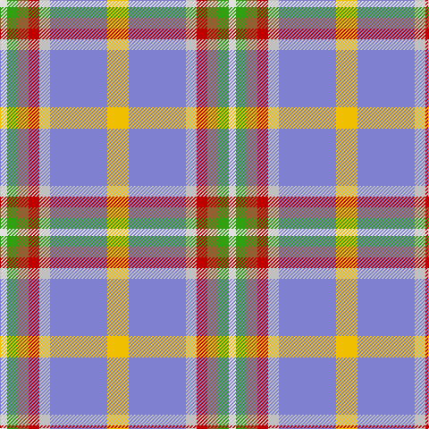

In pattern [WGRRWBY](/patterns/wgrrwby/).

This was sourced from weddslist.  It is a [7 stripes tartan](/stripes/stripes7/).

Original link http://www.weddslist.com/cgi-bin/tartans/pg.pl?source=sts

## Thread count
LN/8 G12 LT12 R12 N12 B64 Y/24

## Palette
Each colour and its ΔE from the base-6 reference it is a variant of.

| Colour | Shade | Base | ΔE (OKLab) |
|---|---|---|---|
| B | <code style="background-color:#8080D0;">#8080D0</code> `#8080D0` | B <code style="background-color:#2C4084;">#2C4084</code> | 0.24 |
| G | <code style="background-color:#30A010;">#30A010</code> `#30A010` | G <code style="background-color:#006400;">#006400</code> | 0.19 |
| LN | <code style="background-color:#E0E0E0;">#E0E0E0</code> `#E0E0E0` | W <code style="background-color:#F4F4F0;">#F4F4F0</code> | 0.06 |
| LT | <code style="background-color:#906030;">#906030</code> `#906030` | R <code style="background-color:#C80000;">#C80000</code> | 0.15 |
| N | <code style="background-color:#C0C0C0;">#C0C0C0</code> `#C0C0C0` | W <code style="background-color:#F4F4F0;">#F4F4F0</code> | 0.16 |
| R | <code style="background-color:#C00000;">#C00000</code> `#C00000` | R <code style="background-color:#C80000;">#C80000</code> | 0.02 |
| Y | <code style="background-color:#F0C000;">#F0C000</code> `#F0C000` | Y <code style="background-color:#E8C000;">#E8C000</code> | 0.01 |

# Sample pattern

## Nearest tartans

The nearest existing variants by ΔTartan distance.

1. [Atikokan](/setts/s7/y24b64w12r12ra12g12wa8-b0596fa-g309c18-rdc0000-rabe7832-wc0c0c0-wae0e0e0-ye8c000/) — ΔT 1.00
1. [Atikokan (District)](/setts/s7/y24b64w12g12r12ga12wa8-b2888c4-g886414-ga289c18-rc47c2c-wc0c0c0-wafcfcfc-yc48008/) — ΔT 1.14
1. [Australian Heavy Horse (Corporate)](/setts/s10/y8g4y36k4b10r32w4b4ra4y8-b5c5c5c-g006818-k101010-r944810-rab08070-we0e0e0-yb0b0b0/) — ΔT 1.23
1. [Curd (2013)](/setts/s8/b4y36w12ya12b36ya4g4r4-b5f749c-g649848-rc82828-we0e0e0-yafb8bb-yaf8e38c/) — ΔT 1.42
1. [Saint Joseph de Sorel #2](/setts/s13/b32r48g8y20g8w36ya12b32wa4b12wa4b12wa4-b2888c4-g289c18-rc80000-wc0c0c0-wafcfcfc-ya08858-yae8c000/) — ΔT 1.61
1. [Ontario, Northern](/setts/s7/r34g10b4w24b4y8ga14-b304080-g808080-ga008000-r806050-we0e0e0-yf0c000/) — ΔT 1.63
1. [Barbour Dress](/setts/s7/r8b4r42ba22w4ra40rb6-b4c3428-ba141e46-rb07430-ra888888-rbc8002c-wf8f8f8/) — ΔT 1.64
1. [Seaside (Fashion)](/setts/s7/w12wa8b16wa56ba8bb56y8-b9058d8-ba346488-bb2888c4-wfcfcfc-wac8c8c8-yc88c00/) — ΔT 1.68
1. [Traill (Personal)](/setts/s7/r32y4g14y4b48k4ga4-b2888c4-g604000-ga289c18-k101010-rc80000-ye8c000/) — ΔT 1.69
1. [Ontex](/setts/s7/b16w4ba48y48r16bb4w8-b2c2c80-ba5c5c5c-bb2888c4-rb458ac-we0e0e0-ya0a0a0/) — ΔT 1.70

## Neighbour map

Every grey dot is one of 15726 variants placed by the first two principal components of the ΔTartan feature space (44% of its variance). Red is this tartan; blue dots are its nearest — click one to open its page.

<svg viewBox="0 0 640 380" role="img" style="max-width:100%;height:auto;border:1px solid #e0e0e0;border-radius:4px;display:block" xmlns="http://www.w3.org/2000/svg"><image href="/nn/cloud.v1.png" width="640" height="380"/><a href="/setts/s7/y24b64w12r12ra12g12wa8-b0596fa-g309c18-rdc0000-rabe7832-wc0c0c0-wae0e0e0-ye8c000/"><circle cx="135.9" cy="148.2" r="4" fill="#3465a4"><title>Atikokan</title></circle></a><a href="/setts/s7/y24b64w12g12r12ga12wa8-b2888c4-g886414-ga289c18-rc47c2c-wc0c0c0-wafcfcfc-yc48008/"><circle cx="163.9" cy="163.3" r="4" fill="#3465a4"><title>Atikokan (District)</title></circle></a><a href="/setts/s10/y8g4y36k4b10r32w4b4ra4y8-b5c5c5c-g006818-k101010-r944810-rab08070-we0e0e0-yb0b0b0/"><circle cx="187.9" cy="127.1" r="4" fill="#3465a4"><title>Australian Heavy Horse (Corporate)</title></circle></a><a href="/setts/s8/b4y36w12ya12b36ya4g4r4-b5f749c-g649848-rc82828-we0e0e0-yafb8bb-yaf8e38c/"><circle cx="161.0" cy="159.1" r="4" fill="#3465a4"><title>Curd (2013)</title></circle></a><a href="/setts/s13/b32r48g8y20g8w36ya12b32wa4b12wa4b12wa4-b2888c4-g289c18-rc80000-wc0c0c0-wafcfcfc-ya08858-yae8c000/"><circle cx="105.5" cy="116.4" r="4" fill="#3465a4"><title>Saint Joseph de Sorel #2</title></circle></a><a href="/setts/s7/r34g10b4w24b4y8ga14-b304080-g808080-ga008000-r806050-we0e0e0-yf0c000/"><circle cx="101.8" cy="172.6" r="4" fill="#3465a4"><title>Ontario, Northern</title></circle></a><a href="/setts/s7/r8b4r42ba22w4ra40rb6-b4c3428-ba141e46-rb07430-ra888888-rbc8002c-wf8f8f8/"><circle cx="186.9" cy="165.1" r="4" fill="#3465a4"><title>Barbour Dress</title></circle></a><a href="/setts/s7/w12wa8b16wa56ba8bb56y8-b9058d8-ba346488-bb2888c4-wfcfcfc-wac8c8c8-yc88c00/"><circle cx="162.9" cy="177.8" r="4" fill="#3465a4"><title>Seaside (Fashion)</title></circle></a><a href="/setts/s7/r32y4g14y4b48k4ga4-b2888c4-g604000-ga289c18-k101010-rc80000-ye8c000/"><circle cx="200.0" cy="140.2" r="4" fill="#3465a4"><title>Traill (Personal)</title></circle></a><a href="/setts/s7/b16w4ba48y48r16bb4w8-b2c2c80-ba5c5c5c-bb2888c4-rb458ac-we0e0e0-ya0a0a0/"><circle cx="159.9" cy="162.9" r="4" fill="#3465a4"><title>Ontex</title></circle></a><circle cx="152.6" cy="149.1" r="5" fill="#c00000"/></svg>

ID: /setts/s7/y24b64w12r12ra12g12wa8-b8080d0-g30a010-rc00000-ra906030-wc0c0c0-wae0e0e0-yf0c000/
