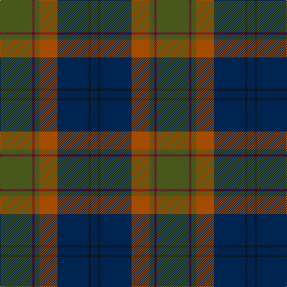

In pattern [BKBRGBG](/stripes/bkbrgbg/).

This was sourced from house-of-tartan.  It is a [7 stripe tartan](/stripes/stripes7/).

Original link http://www.house-of-tartan.scotland.net/house/TartanViewjs.asp?colr=Def&tnam=3628

## Thread count
G/54 DR4 G8 DO30 DB52 K4 DB/12

## Palette
Each colour and the base-6 reference it is a variant of.

| Colour | Shade | Base |
|---|---|---|
| B | <code style="background-color:#1084AC;">#1084AC</code> `oklch(57.4% 0.110 229.0)` <small>#1084AC</small> | B <code style="background-color:#2A418A;">#2A418A</code> |
| DB | <code style="background-color:#002450;">#002450</code> `oklch(26.6% 0.090 255.8)` <small>#002450</small> | B <code style="background-color:#2A418A;">#2A418A</code> |
| DO | <code style="background-color:#A44C00;">#A44C00</code> `oklch(52.0% 0.136 50.6)` <small>#A44C00</small> | R <code style="background-color:#CC0000;">#CC0000</code> |
| DR | <code style="background-color:#680028;">#680028</code> `oklch(33.1% 0.133 8.3)` <small>#680028</small> | B <code style="background-color:#2A418A;">#2A418A</code> |
| G | <code style="background-color:#48581C;">#48581C</code> `oklch(43.3% 0.086 122.8)` <small>#48581C</small> | G <code style="background-color:#006100;">#006100</code> |
| Ga | <code style="background-color:#848850;">#848850</code> `oklch(61.0% 0.078 112.0)` <small>#848850</small> | G <code style="background-color:#006100;">#006100</code> |
| K | <code style="background-color:#101010;">#101010</code> `oklch(17.3% 0.000 89.9)` <small>#101010</small> | K <code style="background-color:#000000;">#000000</code> |
| R | <code style="background-color:#CC4438;">#CC4438</code> `oklch(57.7% 0.174 28.7)` <small>#CC4438</small> | R <code style="background-color:#CC0000;">#CC0000</code> |

# Sample pattern

## Nearest tartans

The nearest existing variants by ΔTartan distance.

1. [Lisbon](/setts/s6/r2do22g22do3db12y2~x2/) — ΔT 0.74
1. [Kilkenny, County (District)](/setts/s7/dr4dg27o2db25lo5dg3o3~x2/) — ΔT 0.85
1. [Bailies of Bennachie (Corporate)](/setts/s7/g27r2g4r15db26k2db6~x2/) — ΔT 0.85
1. [Andover](/setts/s6/r1n12k6k1do10r1~x4/) — ΔT 0.87
1. [Andover (Fashion)](/setts/s6/r1n12k6ly1do10r1~x4/) — ΔT 0.89
1. [Montrose (1983)](/setts/s6/dg6ly3dg26k10n30lb3~x2/) — ΔT 0.92
1. [Loch Long One Design](/setts/s6/lo4k28r2do22t8do3~x2/) — ΔT 0.94
1. [Mica, Green (Fashion)](/setts/s8/dy6o2dy12k4dt14k1dy3ly2~x2/) — ΔT 0.99
1. [Wcwm 9275-1410](/setts/s7/g3dy32g4lb3g18dp18lo3~x2/) — ΔT 1.01
1. [Eachaidh (Personal)](/setts/s6/k6t1r18db6dg18k2~x2/) — ΔT 1.01

## Neighbour map

Every grey dot is one of 14299 variants placed by the first two principal components of the ΔTartan feature space (44% of its variance). Red is this tartan; blue dots are its nearest — click one to open its page.

<svg viewBox="0 0 640 380" role="img" style="max-width:100%;height:auto;border:1px solid #e0e0e0;border-radius:4px;display:block" xmlns="http://www.w3.org/2000/svg"><image href="/nn/cloud.v1.png" width="640" height="380"/><a href="/setts/s6/r2do22g22do3db12y2~x2/"><circle cx="241.0" cy="217.9" r="4" fill="#3465a4"><title>Lisbon</title></circle></a><a href="/setts/s7/dr4dg27o2db25lo5dg3o3~x2/"><circle cx="282.8" cy="195.0" r="4" fill="#3465a4"><title>Kilkenny, County (District)</title></circle></a><a href="/setts/s7/g27r2g4r15db26k2db6~x2/"><circle cx="240.9" cy="194.9" r="4" fill="#3465a4"><title>Bailies of Bennachie (Corporate)</title></circle></a><a href="/setts/s6/r1n12k6k1do10r1~x4/"><circle cx="255.5" cy="216.6" r="4" fill="#3465a4"><title>Andover</title></circle></a><a href="/setts/s6/r1n12k6ly1do10r1~x4/"><circle cx="241.7" cy="208.0" r="4" fill="#3465a4"><title>Andover (Fashion)</title></circle></a><a href="/setts/s6/dg6ly3dg26k10n30lb3~x2/"><circle cx="254.3" cy="228.2" r="4" fill="#3465a4"><title>Montrose (1983)</title></circle></a><a href="/setts/s6/lo4k28r2do22t8do3~x2/"><circle cx="265.4" cy="201.5" r="4" fill="#3465a4"><title>Loch Long One Design</title></circle></a><a href="/setts/s8/dy6o2dy12k4dt14k1dy3ly2~x2/"><circle cx="274.6" cy="194.8" r="4" fill="#3465a4"><title>Mica, Green (Fashion)</title></circle></a><a href="/setts/s7/g3dy32g4lb3g18dp18lo3~x2/"><circle cx="235.7" cy="199.3" r="4" fill="#3465a4"><title>Wcwm 9275-1410</title></circle></a><a href="/setts/s6/k6t1r18db6dg18k2~x2/"><circle cx="237.4" cy="197.9" r="4" fill="#3465a4"><title>Eachaidh (Personal)</title></circle></a><circle cx="261.3" cy="207.1" r="5" fill="#c00000"/></svg>

ID: /setts/s7/y27dr2y4o15db26k2db6~x2/
