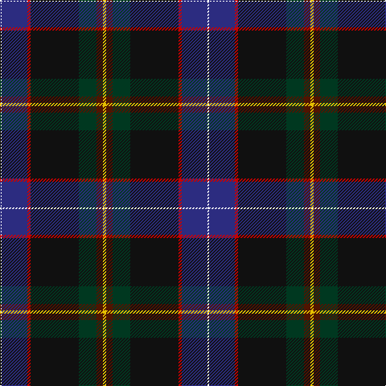

In pattern [WBRKGBY](/patterns/wbrkgby/).

This was sourced from tartans-authority.  It is a [7 stripes tartan](/stripes/stripes7/).

Original link http://www.tartansauthority.com/tartan-ferret/display/10899/

## Thread count
W/2 DB32 R4 K60 DG22 DR8 Y/4

## Palette
Each colour and its ΔE from the base-6 reference it is a variant of.

| Colour | Shade | Base | ΔE (OKLab) |
|---|---|---|---|
| DB | <code style="background-color:#2C2C80;">#2C2C80</code> `#2C2C80` | B <code style="background-color:#2A418A;">#2A418A</code> | 0.06 |
| DG | <code style="background-color:#003820;">#003820</code> `#003820` | G <code style="background-color:#006100;">#006100</code> | 0.15 |
| DR | <code style="background-color:#501400;">#501400</code> `#501400` | B <code style="background-color:#2A418A;">#2A418A</code> | 0.23 |
| K | <code style="background-color:#101010;">#101010</code> `#101010` | K <code style="background-color:#000000;">#000000</code> | 0.17 |
| R | <code style="background-color:#C80000;">#C80000</code> `#C80000` | R <code style="background-color:#CC0000;">#CC0000</code> | 0.01 |
| W | <code style="background-color:#FCFCFC;">#FCFCFC</code> `#FCFCFC` | W <code style="background-color:#F7F7F7;">#F7F7F7</code> | 0.01 |
| Y | <code style="background-color:#E8C000;">#E8C000</code> `#E8C000` | Y <code style="background-color:#F2BF00;">#F2BF00</code> | 0.02 |

# Sample pattern

## Nearest tartans

The nearest existing variants by ΔTartan distance.

1. [Buschke (Skye) (Personal)](/setts/s7/y2b4g11k30r2ba16w1x2~b441800-ba0000cd-g003c14-k101010-rc8002c-wffffff-yd8b000/) — ΔT 1.13
1. [Pictou County](/setts/s8/b23w1r3w1b12y9g40b3x2~b181034-g003c28-r700014-wfcf8ec-yb0840c/) — ΔT 1.22
1. [Beauly Firth and Glens](/setts/s8/b3ba3b3ba27w1bb15k22r3x2~b5a008c-ba505050-bb067396-k101010-rdc0000-we0e0e0/) — ΔT 1.35
1. [Scragg Moran (Personal)](/setts/s10/g1b28k11r5w1r5k11y1k2g1x2~b14465c-g509721-k120a01-r89051b-wddd5af-yc1ae8c/) — ΔT 1.41
1. [St. Columba (one green)](/setts/s8/b20g1w1y3ga14ba4g1bb4x2~b202060-ba5c5c5c-bb780078-g789484-ga006818-wfcfcfc-ya08858/) — ΔT 1.42
1. [Sidey Family Tartan (Name)](/setts/s10/b4w1k2b25k12ba1k2g16k2r1x2~b202060-ba1474b4-g006818-k101010-rc80000-we0e0e0/) — ΔT 1.42
1. [Stirling University](/setts/s9/g28r4k3ga2k1gb2r3b20y2x2~b2c4084-g005020-ga808080-gb002814-k101010-rdc0000-ye8c000/) — ΔT 1.47
1. [Anne Arundel County](/setts/s8/g4b7ba33k9r2k9ra10rb4x2~b003c64-ba2c2c80-g006818-k101010-rb84c00-ra888888-rbc80000/) — ΔT 1.47
1. [Fujitsu](/setts/s8/w1b6ba9r12k12g32k6y1x2~b1c1c50-ba780078-g006818-k101010-r880000-we0e0e0-ye8c000/) — ΔT 1.48
1. [Chesters, Eric (Personal)](/setts/s7/k12g8y1ga13w1b31k8x2~b000064-g006818-ga003c14-k101010-w98c8e8-yfccc00/) — ΔT 1.48

## Neighbour map

Every grey dot is one of 15726 variants placed by the first two principal components of the ΔTartan feature space (44% of its variance). Red is this tartan; blue dots are its nearest — click one to open its page.

<svg viewBox="0 0 640 380" role="img" style="max-width:100%;height:auto;border:1px solid #e0e0e0;border-radius:4px;display:block" xmlns="http://www.w3.org/2000/svg"><image href="/nn/cloud.v1.png" width="640" height="380"/><a href="/setts/s7/y2b4g11k30r2ba16w1x2~b441800-ba0000cd-g003c14-k101010-rc8002c-wffffff-yd8b000/"><circle cx="223.8" cy="110.9" r="4" fill="#3465a4"><title>Buschke (Skye) (Personal)</title></circle></a><a href="/setts/s8/b23w1r3w1b12y9g40b3x2~b181034-g003c28-r700014-wfcf8ec-yb0840c/"><circle cx="291.6" cy="117.8" r="4" fill="#3465a4"><title>Pictou County</title></circle></a><a href="/setts/s8/b3ba3b3ba27w1bb15k22r3x2~b5a008c-ba505050-bb067396-k101010-rdc0000-we0e0e0/"><circle cx="231.2" cy="131.6" r="4" fill="#3465a4"><title>Beauly Firth and Glens</title></circle></a><a href="/setts/s10/g1b28k11r5w1r5k11y1k2g1x2~b14465c-g509721-k120a01-r89051b-wddd5af-yc1ae8c/"><circle cx="273.9" cy="110.3" r="4" fill="#3465a4"><title>Scragg Moran (Personal)</title></circle></a><a href="/setts/s8/b20g1w1y3ga14ba4g1bb4x2~b202060-ba5c5c5c-bb780078-g789484-ga006818-wfcfcfc-ya08858/"><circle cx="203.5" cy="114.7" r="4" fill="#3465a4"><title>St. Columba (one green)</title></circle></a><a href="/setts/s10/b4w1k2b25k12ba1k2g16k2r1x2~b202060-ba1474b4-g006818-k101010-rc80000-we0e0e0/"><circle cx="272.0" cy="122.0" r="4" fill="#3465a4"><title>Sidey Family Tartan (Name)</title></circle></a><a href="/setts/s9/g28r4k3ga2k1gb2r3b20y2x2~b2c4084-g005020-ga808080-gb002814-k101010-rdc0000-ye8c000/"><circle cx="244.9" cy="92.5" r="4" fill="#3465a4"><title>Stirling University</title></circle></a><a href="/setts/s8/g4b7ba33k9r2k9ra10rb4x2~b003c64-ba2c2c80-g006818-k101010-rb84c00-ra888888-rbc80000/"><circle cx="193.5" cy="135.9" r="4" fill="#3465a4"><title>Anne Arundel County</title></circle></a><a href="/setts/s8/w1b6ba9r12k12g32k6y1x2~b1c1c50-ba780078-g006818-k101010-r880000-we0e0e0-ye8c000/"><circle cx="198.0" cy="106.6" r="4" fill="#3465a4"><title>Fujitsu</title></circle></a><a href="/setts/s7/k12g8y1ga13w1b31k8x2~b000064-g006818-ga003c14-k101010-w98c8e8-yfccc00/"><circle cx="250.4" cy="155.3" r="4" fill="#3465a4"><title>Chesters, Eric (Personal)</title></circle></a><circle cx="250.3" cy="119.4" r="5" fill="#c00000"/></svg>

ID: /setts/s7/y2b4g11k30r2ba16w1x2~b501400-ba2c2c80-g003820-k101010-rc80000-wfcfcfc-ye8c000/
