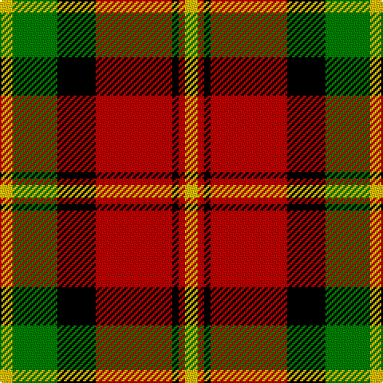

In pattern [YGKRKRY](/patterns/ygkrkry/).

This was sourced from weddslist.  It is a [7 stripes tartan](/stripes/stripes7/).

Original link http://www.weddslist.com/cgi-bin/tartans/pg.pl?source=sts

## Thread count
Y/8 G28 K24 R48 K4 R4 Y/8

## Palette
Each colour and its ΔE from the base-6 reference it is a variant of.

| Colour | Shade | Base | ΔE (OKLab) |
|---|---|---|---|
| G | <code style="background-color:#008000;">#008000</code> `#008000` | G <code style="background-color:#006100;">#006100</code> | 0.10 |
| K | <code style="background-color:#000000;">#000000</code> `#000000` | K <code style="background-color:#000000;">#000000</code> | 0.00 |
| R | <code style="background-color:#C00000;">#C00000</code> `#C00000` | R <code style="background-color:#CC0000;">#CC0000</code> | 0.03 |
| Y | <code style="background-color:#F0C000;">#F0C000</code> `#F0C000` | Y <code style="background-color:#F2BF00;">#F2BF00</code> | 0.00 |

# Sample pattern

## Nearest tartans

The nearest existing variants by ΔTartan distance.

1. [Blackstock Dress Family Tartan Tartan Number: 1881. Earliest known date: 1982 Commissioned by Herbert Earl Blackstock in 1983, President of the Clan Blackstock Society in the USA. Blackstocks were a 'Scotch-Irish' family who emigrated to the US from Ulster. Designed by kiltmaker and historian Bob Martin of Greenville, South Carolina. www.clanblackstocksociety.com See products available Copyright © Blair Urquhart, Comrie, 2015](/setts/s7/y2g7k6r12k1r1y2x4~g006818-k101010-rc80000-ye8c000/) — ΔT 0.67
1. [Blackstock Red (Dress)](/setts/s7/y2g7k6r11k1r1y2x4~g285800-k000000-rb00000-yc89800/) — ΔT 0.70
1. [MacMillan Varient (Unidentified)](/setts/s6/g3k31r17g6y18k3x2~g005020-k101010-rdc0000-ye8c000/) — ΔT 0.71
1. [Strathspey, Check](/setts/s6/g3r22b5g10k10g2x2~b5480b0-g008000-k000000-rc00000/) — ΔT 0.79
1. [MacNaughton](/setts/s9/k1w1r16g16k12w8r16w1k1x2~g004c00-k000000-rc80000-wd0d0d0/) — ΔT 0.96
1. [Island of Innis, The](/setts/s8/k15g1k3r9g1r3y11k1x4~g285800-k101010-ra00000-yd09800/) — ΔT 1.00
1. [MacMillan Variant (Unidentified)](/setts/s6/g3k31r17g6y18k3x2~g008000-k000000-rc00000-yf0c000/) — ΔT 1.04
1. [Dickie](/setts/s8/g8r2g12k6g3b6r24k4x2~b00008c-g146400-k000000-rc82800/) — ΔT 1.06
1. [Unidentified 12](/setts/s6/k6r2g17r16k1b2x2~b5480b0-g008000-k000000-rc00000/) — ΔT 1.07
1. [MacLachlan W](/setts/s7/r24w2y3g16k16w2y3~g004c00-k000000-rc80000-wd0d0d0-yffff00/) — ΔT 1.08

## Neighbour map

Every grey dot is one of 15726 variants placed by the first two principal components of the ΔTartan feature space (44% of its variance). Red is this tartan; blue dots are its nearest — click one to open its page.

<svg viewBox="0 0 640 380" role="img" style="max-width:100%;height:auto;border:1px solid #e0e0e0;border-radius:4px;display:block" xmlns="http://www.w3.org/2000/svg"><image href="/nn/cloud.v1.png" width="640" height="380"/><a href="/setts/s7/y2g7k6r12k1r1y2x4~g006818-k101010-rc80000-ye8c000/"><circle cx="206.3" cy="177.3" r="4" fill="#3465a4"><title>Blackstock Dress Family Tartan Tartan Number: 1881. Earliest known date: 1982 Commissioned by Herbert Earl Blackstock in 1983, President of the Clan Blackstock Society in the USA. Blackstocks were a 'Scotch-Irish' family who emigrated to the US from Ulster. Designed by kiltmaker and historian Bob Martin of Greenville, South Carolina. www.clanblackstocksociety.com See products available Copyright © Blair Urquhart, Comrie, 2015</title></circle></a><a href="/setts/s7/y2g7k6r11k1r1y2x4~g285800-k000000-rb00000-yc89800/"><circle cx="186.9" cy="185.7" r="4" fill="#3465a4"><title>Blackstock Red (Dress)</title></circle></a><a href="/setts/s6/g3k31r17g6y18k3x2~g005020-k101010-rdc0000-ye8c000/"><circle cx="187.8" cy="195.1" r="4" fill="#3465a4"><title>MacMillan Varient (Unidentified)</title></circle></a><a href="/setts/s6/g3r22b5g10k10g2x2~b5480b0-g008000-k000000-rc00000/"><circle cx="196.3" cy="196.7" r="4" fill="#3465a4"><title>Strathspey, Check</title></circle></a><a href="/setts/s9/k1w1r16g16k12w8r16w1k1x2~g004c00-k000000-rc80000-wd0d0d0/"><circle cx="207.3" cy="154.1" r="4" fill="#3465a4"><title>MacNaughton</title></circle></a><a href="/setts/s8/k15g1k3r9g1r3y11k1x4~g285800-k101010-ra00000-yd09800/"><circle cx="232.0" cy="165.4" r="4" fill="#3465a4"><title>Island of Innis, The</title></circle></a><a href="/setts/s6/g3k31r17g6y18k3x2~g008000-k000000-rc00000-yf0c000/"><circle cx="177.8" cy="195.4" r="4" fill="#3465a4"><title>MacMillan Variant (Unidentified)</title></circle></a><a href="/setts/s8/g8r2g12k6g3b6r24k4x2~b00008c-g146400-k000000-rc82800/"><circle cx="198.6" cy="182.2" r="4" fill="#3465a4"><title>Dickie</title></circle></a><a href="/setts/s6/k6r2g17r16k1b2x2~b5480b0-g008000-k000000-rc00000/"><circle cx="233.6" cy="173.6" r="4" fill="#3465a4"><title>Unidentified 12</title></circle></a><a href="/setts/s7/r24w2y3g16k16w2y3~g004c00-k000000-rc80000-wd0d0d0-yffff00/"><circle cx="138.0" cy="153.1" r="4" fill="#3465a4"><title>MacLachlan W</title></circle></a><circle cx="189.0" cy="172.8" r="5" fill="#c00000"/></svg>

ID: /setts/s7/y2g7k6r12k1r1y2x4~g008000-k000000-rc00000-yf0c000/
