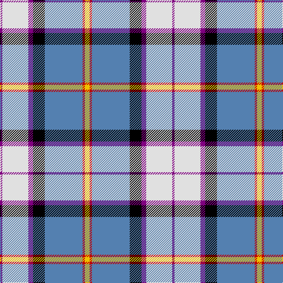

In pattern [BWBKBRY](/patterns/bwbkbry/).

This was sourced from weddslist.  It is a [7 stripes tartan](/stripes/stripes7/).

Original link http://www.weddslist.com/cgi-bin/tartans/pg.pl?source=sts

## Thread count
P/4 LN44 P8 K20 B64 R4 Y/8

## Palette
Each colour and its ΔE from the base-6 reference it is a variant of.

| Colour | Shade | Base | ΔE (OKLab) |
|---|---|---|---|
| B | <code style="background-color:#5480B0;">#5480B0</code> `#5480B0` | B <code style="background-color:#2A418A;">#2A418A</code> | 0.19 |
| K | <code style="background-color:#000000;">#000000</code> `#000000` | K <code style="background-color:#000000;">#000000</code> | 0.00 |
| LN | <code style="background-color:#E0E0E0;">#E0E0E0</code> `#E0E0E0` | W <code style="background-color:#F7F7F7;">#F7F7F7</code> | 0.07 |
| P | <code style="background-color:#800080;">#800080</code> `#800080` | B <code style="background-color:#2A418A;">#2A418A</code> | 0.17 |
| R | <code style="background-color:#C00000;">#C00000</code> `#C00000` | R <code style="background-color:#CC0000;">#CC0000</code> | 0.03 |
| Y | <code style="background-color:#F0C000;">#F0C000</code> `#F0C000` | Y <code style="background-color:#F2BF00;">#F2BF00</code> | 0.00 |

# Sample pattern

## Nearest tartans

The nearest existing variants by ΔTartan distance.

1. [Alexander of Menstry Dress](/setts/s8/b5w30y9k9ba9g2ba2g5~b2c2c80-ba780078-g006818-k101010-wf8f8f8-ya0a0a0~x2/) — ΔT 0.78
1. [Minnesota Dress](/setts/s9/b4k2w3k2ba30g9k4w20y3~b780078-ba2c2c80-g289c18-k101010-we0e0e0-ye8c000~x2/) — ΔT 0.82
1. [Pipers' Trail Dance, The](/setts/s6/k6w49b50ba6bb8y4~b003c64-ba5a008c-bb5c8ca8-k101010-wfcfcfc-ye0a126/) — ΔT 0.82
1. [Christian Dress (Personal)](/setts/s7/r3w2b27k19w27ba2y3~b2c2c80-ba780078-k101010-rc80000-wf8f8f8-ye8c000~x2/) — ΔT 0.84
1. [Pipers' Trail Dance, The](/setts/s6/k6w49b50ba6bb8y4~b202060-ba780078-bb2c2c80-k101010-wfcfcfc-yfccc00/) — ΔT 0.86
1. [Edgar-Feyen (Personal)](/setts/s6/w18k1b4g4ba10y2~b2c2c80-ba780078-g006818-k101010-we0e0e0-yd87c00~x4/) — ΔT 0.93
1. [Alberta Dress](/setts/s10/w4g3w19g8k1r4k1b18k1y2~b2c40a0-g006818-k101010-r880000-wf8f8f8-yd09800~x2/) — ΔT 1.02
1. [Edinburgh Dress District Tartan Tartan Number: 1461. Earliest known date: Edinburgh One of a number of dress tartans produced by Hugh Macpherson, a kiltmaker in Edinburgh, intended for dancing and other informal occassions. The 'dress' version of clan tartan is usually created by substituting white for one of the 'ground' colours. See products available Copyright © Blair Urquhart, Comrie, 2015](/setts/s10/w4k2w30g3b3g3b7ba14g3r3~b780078-ba2c2c80-g006818-k101010-rc80000-we0e0e0~x2/) — ΔT 1.03
1. [Haymarket Dress Blue Trade Tartan Tartan Number: 713. Earliest known date: pre 1992 One of a number of dress tartans produced by Hugh Macpherson, a kiltmaker in Edinburgh, whose shop is a short walk from Haymarket railway station. See products available Copyright © Blair Urquhart, Comrie, 2015](/setts/s9/g5b22g6k10w24y2b2w2r2~b2c2c80-g006818-k101010-rc80000-we0e0e0-ye8c000~x2/) — ΔT 1.06
1. [Manx Dress](/setts/s6/g4w28b8y2ba17g4~b780078-ba2c2c80-g006818-we0e0e0-ye8c000~x2/) — ΔT 1.06

## Neighbour map

Every grey dot is one of 15726 variants placed by the first two principal components of the ΔTartan feature space (44% of its variance). Red is this tartan; blue dots are its nearest — click one to open its page.

<svg viewBox="0 0 640 380" role="img" style="max-width:100%;height:auto;border:1px solid #e0e0e0;border-radius:4px;display:block" xmlns="http://www.w3.org/2000/svg"><image href="/nn/cloud.v1.png" width="640" height="380"/><a href="/setts/s8/b5w30y9k9ba9g2ba2g5~b2c2c80-ba780078-g006818-k101010-wf8f8f8-ya0a0a0~x2/"><circle cx="129.1" cy="109.3" r="4" fill="#3465a4"><title>Alexander of Menstry Dress</title></circle></a><a href="/setts/s9/b4k2w3k2ba30g9k4w20y3~b780078-ba2c2c80-g289c18-k101010-we0e0e0-ye8c000~x2/"><circle cx="139.3" cy="106.4" r="4" fill="#3465a4"><title>Minnesota Dress</title></circle></a><a href="/setts/s6/k6w49b50ba6bb8y4~b003c64-ba5a008c-bb5c8ca8-k101010-wfcfcfc-ye0a126/"><circle cx="155.4" cy="133.1" r="4" fill="#3465a4"><title>Pipers' Trail Dance, The</title></circle></a><a href="/setts/s7/r3w2b27k19w27ba2y3~b2c2c80-ba780078-k101010-rc80000-wf8f8f8-ye8c000~x2/"><circle cx="116.3" cy="126.4" r="4" fill="#3465a4"><title>Christian Dress (Personal)</title></circle></a><a href="/setts/s6/k6w49b50ba6bb8y4~b202060-ba780078-bb2c2c80-k101010-wfcfcfc-yfccc00/"><circle cx="156.2" cy="131.7" r="4" fill="#3465a4"><title>Pipers' Trail Dance, The</title></circle></a><a href="/setts/s6/w18k1b4g4ba10y2~b2c2c80-ba780078-g006818-k101010-we0e0e0-yd87c00~x4/"><circle cx="182.6" cy="123.7" r="4" fill="#3465a4"><title>Edgar-Feyen (Personal)</title></circle></a><a href="/setts/s10/w4g3w19g8k1r4k1b18k1y2~b2c40a0-g006818-k101010-r880000-wf8f8f8-yd09800~x2/"><circle cx="134.3" cy="89.3" r="4" fill="#3465a4"><title>Alberta Dress</title></circle></a><a href="/setts/s10/w4k2w30g3b3g3b7ba14g3r3~b780078-ba2c2c80-g006818-k101010-rc80000-we0e0e0~x2/"><circle cx="180.3" cy="92.3" r="4" fill="#3465a4"><title>Edinburgh Dress District Tartan Tartan Number: 1461. Earliest known date: Edinburgh One of a number of dress tartans produced by Hugh Macpherson, a kiltmaker in Edinburgh, intended for dancing and other informal occassions. The 'dress' version of clan tartan is usually created by substituting white for one of the 'ground' colours. See products available Copyright © Blair Urquhart, Comrie, 2015</title></circle></a><a href="/setts/s9/g5b22g6k10w24y2b2w2r2~b2c2c80-g006818-k101010-rc80000-we0e0e0-ye8c000~x2/"><circle cx="106.9" cy="119.7" r="4" fill="#3465a4"><title>Haymarket Dress Blue Trade Tartan Tartan Number: 713. Earliest known date: pre 1992 One of a number of dress tartans produced by Hugh Macpherson, a kiltmaker in Edinburgh, whose shop is a short walk from Haymarket railway station. See products available Copyright © Blair Urquhart, Comrie, 2015</title></circle></a><a href="/setts/s6/g4w28b8y2ba17g4~b780078-ba2c2c80-g006818-we0e0e0-ye8c000~x2/"><circle cx="178.9" cy="153.5" r="4" fill="#3465a4"><title>Manx Dress</title></circle></a><circle cx="157.0" cy="117.7" r="5" fill="#c00000"/></svg>

ID: /setts/s7/y2r1b16k5ba2w11ba1~b5480b0-ba800080-k000000-rc00000-we0e0e0-yf0c000~x4/
