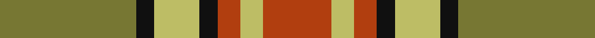

This page is one **sett** — a single exact thread-count. It belongs to the [tartan](/tartans/y30k4ly10k4o5ly5o15/)
(the same proportion at any scale), whose colour order is pattern [GKYKRYR](/stripes/gkykryr/).

Sourced from register-of-tartans.  It is a [7 stripe tartan](/stripes/stripes7/).

Original link https://www.tartanregister.gov.uk/tartanDetails.aspx?ref=1498

## Register references

External register numbers recorded for this tartan.

- Scottish Register of Tartans: [1498](https://www.tartanregister.gov.uk/tartanDetails.aspx?ref=1498)
- Scottish Tartans Authority (ITI): 960
- Scottish Tartans World Register: 960

## Thread count
LT/60 K8 LG20 K8 R10 LG10 R/30

## Palette

Palette: <strong>Logan (The Scottish Gael, 1831)</strong> <small style="color:#888">(1 of 4 colours)</small>
<table><thead><tr><th>Colour</th><th>Threads</th><th>Shade</th><th>Base</th><th>OKLCh</th></tr></thead><tbody><tr><td>LT/</td><td style="text-align:right;font-variant-numeric:tabular-nums">60</td><td><code style="background-color:#777733;">#777733</code> <small style="color:#888">#777733</small></td><td>G <code style="background-color:#006100;">#006100</code></td><td><small style="color:#888">oklch(55.4% 0.090 109.0)</small></td></tr><tr><td>K</td><td style="text-align:right;font-variant-numeric:tabular-nums">8</td><td><code style="background-color:#101010;">#101010</code> <small style="color:#888">#101010</small></td><td>K <code style="background-color:#000000;">#000000</code></td><td><small style="color:#888">oklch(17.3% 0.000 89.9)</small></td></tr><tr><td>LG</td><td style="text-align:right;font-variant-numeric:tabular-nums">20</td><td><code style="background-color:#BDBD65;">#BDBD65</code> <small style="color:#888">#BDBD65</small></td><td>Y <code style="background-color:#F2BF00;">#F2BF00</code></td><td><small style="color:#888">oklch(77.9% 0.111 108.7)</small></td></tr><tr><td>K</td><td style="text-align:right;font-variant-numeric:tabular-nums">8</td><td><code style="background-color:#101010;">#101010</code> <small style="color:#888">#101010</small></td><td>K <code style="background-color:#000000;">#000000</code></td><td><small style="color:#888">oklch(17.3% 0.000 89.9)</small></td></tr><tr><td>R</td><td style="text-align:right;font-variant-numeric:tabular-nums">10</td><td><code style="background-color:#B13E0F;">#B13E0F</code> <small style="color:#888">#B13E0F</small></td><td>R <code style="background-color:#CC0000;">#CC0000</code></td><td><small style="color:#888">oklch(52.1% 0.159 39.0)</small></td></tr><tr><td>LG</td><td style="text-align:right;font-variant-numeric:tabular-nums">10</td><td><code style="background-color:#BDBD65;">#BDBD65</code> <small style="color:#888">#BDBD65</small></td><td>Y <code style="background-color:#F2BF00;">#F2BF00</code></td><td><small style="color:#888">oklch(77.9% 0.111 108.7)</small></td></tr><tr><td>R/</td><td style="text-align:right;font-variant-numeric:tabular-nums">30</td><td><code style="background-color:#B13E0F;">#B13E0F</code> <small style="color:#888">#B13E0F</small></td><td>R <code style="background-color:#CC0000;">#CC0000</code></td><td><small style="color:#888">oklch(52.1% 0.159 39.0)</small></td></tr></tbody></table>

# Sample pattern

## Nearest tartans

The nearest existing variants by ΔTartan distance, with this tartan at the top so the swatches line up against it.

ΔTartan

Tartan

Sett

—

<a href="/ttd/edit/#slug=y30k4ly10k4o5ly5o15~x2">Alister Grant 'Mohr', the Laird's Champion</a> <a class="nn-out" href="/setts/s7/y30k4ly10k4o5ly5o15~x2/" title="open its dictionary page">↗</a>

1.16

<a href="/ttd/edit/#slug=o6k2g12lo8o5k2g3~x4">Londonderry, County (District)</a> <a class="nn-out" href="/setts/s7/o6k2g12lo8o5k2g3~x4/" title="open its dictionary page">↗</a>

1.18

<a href="/ttd/edit/#slug=r2ri1r10ri2g10w1g2~x2">Lennox</a> <a class="nn-out" href="/setts/s7/r2ri1r10ri2g10w1g2~x2/" title="open its dictionary page">↗</a>

1.19

<a href="/ttd/edit/#slug=lo3dr2o14g17dr14lo8o14dr2lo3~x2">Monaghan</a> <a class="nn-out" href="/setts/s9/lo3dr2o14g17dr14lo8o14dr2lo3~x2/" title="open its dictionary page">↗</a>

1.22

<a href="/setts/s8/g6ly1r1t2r2~x4/">Wilson's No.179</a>

1.24

<a href="/ttd/edit/#slug=dg20r8lr2r8dg5ly8dg2ly8~x2">Unidentified #57</a> <a class="nn-out" href="/setts/s8/dg20r8lr2r8dg5ly8dg2ly8~x2/" title="open its dictionary page">↗</a>

1.24

<a href="/ttd/edit/#slug=r3o14g8r2g2w2g2r1~x2">Scott, hunting</a> <a class="nn-out" href="/setts/s8/r3o14g8r2g2w2g2r1~x2/" title="open its dictionary page">↗</a>

1.29

<a href="/ttd/edit/#slug=dy24g2dy5o14g2o5lo17dy2~x2">Loch Rannoch #2</a> <a class="nn-out" href="/setts/s8/dy24g2dy5o14g2o5lo17dy2~x2/" title="open its dictionary page">↗</a>

1.31

<a href="/ttd/edit/#slug=dg4dy3dg21dy2w14o22dy3o4~x2">Bannock Bane M.406</a> <a class="nn-out" href="/setts/s8/dg4dy3dg21dy2w14o22dy3o4~x2/" title="open its dictionary page">↗</a>

1.32

<a href="/ttd/edit/#slug=o18dt2o2dt2o2dt14r14ly3~x2">Talladale</a> <a class="nn-out" href="/setts/s8/o18dt2o2dt2o2dt14r14ly3~x2/" title="open its dictionary page">↗</a>

1.34

<a href="/ttd/edit/#slug=ri8r1g4r1g1t2~x2">Moray of Abercairney</a> <a class="nn-out" href="/setts/s6/ri8r1g4r1g1t2~x2/" title="open its dictionary page">↗</a>

## Neighbour map

Every grey dot is one of 14359 variants placed by the first two principal components of the ΔTartan feature space (44% of its variance). Red is this tartan; blue dots are its nearest — click one to open its page.

<svg viewBox="0 0 640 380" role="img" style="max-width:100%;height:auto;border:1px solid #e0e0e0;border-radius:4px;display:block" xmlns="http://www.w3.org/2000/svg"><image href="/nn/cloud.v1.png" width="640" height="380"/><a href="/setts/s7/o6k2g12lo8o5k2g3~x4/"><circle cx="184.6" cy="249.4" r="4" fill="#3465a4"><title>Londonderry, County (District)</title></circle></a><a href="/setts/s7/r2ri1r10ri2g10w1g2~x2/"><circle cx="269.2" cy="192.0" r="4" fill="#3465a4"><title>Lennox</title></circle></a><a href="/setts/s9/lo3dr2o14g17dr14lo8o14dr2lo3~x2/"><circle cx="185.3" cy="221.5" r="4" fill="#3465a4"><title>Monaghan</title></circle></a><a href="/setts/s8/g6ly1r1t2r2~x4/"><circle cx="161.7" cy="213.9" r="4" fill="#3465a4"><title>Wilson's No.179</title></circle></a><a href="/setts/s8/dg20r8lr2r8dg5ly8dg2ly8~x2/"><circle cx="223.4" cy="211.2" r="4" fill="#3465a4"><title>Unidentified #57</title></circle></a><a href="/setts/s8/r3o14g8r2g2w2g2r1~x2/"><circle cx="261.6" cy="179.0" r="4" fill="#3465a4"><title>Scott, hunting</title></circle></a><a href="/setts/s8/dy24g2dy5o14g2o5lo17dy2~x2/"><circle cx="268.0" cy="188.8" r="4" fill="#3465a4"><title>Loch Rannoch #2</title></circle></a><a href="/setts/s8/dg4dy3dg21dy2w14o22dy3o4~x2/"><circle cx="180.4" cy="179.5" r="4" fill="#3465a4"><title>Bannock Bane M.406</title></circle></a><a href="/setts/s8/o18dt2o2dt2o2dt14r14ly3~x2/"><circle cx="220.9" cy="192.4" r="4" fill="#3465a4"><title>Talladale</title></circle></a><a href="/setts/s6/ri8r1g4r1g1t2~x2/"><circle cx="277.4" cy="215.3" r="4" fill="#3465a4"><title>Moray of Abercairney</title></circle></a><circle cx="213.4" cy="211.0" r="5" fill="#c00000"/></svg>

ID: /setts/s7/y30k4ly10k4o5ly5o15~x2/
