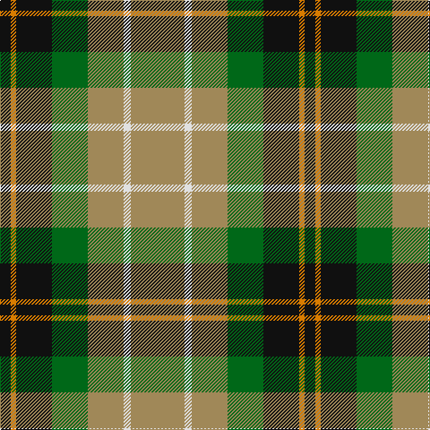

In pattern [KYKGYWY](/patterns/kykgywy/).

This was sourced from register-of-tartans.  It is a [7 stripes tartan](/stripes/stripes7/).

Original link https://www.tartanregister.gov.uk/tartanDetails.aspx?ref=3876

## Attestations

This cloth appears in 2 source records; the oldest owns this page.

- 01/01/2003 — St Andrews Bay (register-of-tartans, [record](https://www.tartanregister.gov.uk/tartanDetails.aspx?ref=3876))
- pre 2003 — St. Andrews Bay Hotel (Corporate) (tartans-authority, [record](http://www.tartansauthority.com/tartan-ferret/display/5904/))

## Register references

External register numbers recorded for this tartan.

- Scottish Register of Tartans: [3876](https://www.tartanregister.gov.uk/tartanDetails.aspx?ref=3876)
- Scottish Tartans Authority (ITI): 5904
- Scottish Tartans World Register: 2867

## Thread count
K/12 O6 K40 G40 LT40 LN8 LT/60

## Palette
Each colour and its ΔE from the base-6 reference it is a variant of.

| Colour | Shade | Base | ΔE (OKLab) |
|---|---|---|---|
| G | <code style="background-color:#006818;">#006818</code> `#006818` | G <code style="background-color:#006100;">#006100</code> | 0.02 |
| K | <code style="background-color:#101010;">#101010</code> `#101010` | K <code style="background-color:#000000;">#000000</code> | 0.17 |
| LG | <code style="background-color:#C4BC68;">#C4BC68</code> `#C4BC68` | Y <code style="background-color:#F2BF00;">#F2BF00</code> | 0.08 |
| LN | <code style="background-color:#E0E0E0;">#E0E0E0</code> `#E0E0E0` | W <code style="background-color:#F7F7F7;">#F7F7F7</code> | 0.07 |
| LT | <code style="background-color:#A08858;">#A08858</code> `#A08858` | Y <code style="background-color:#F2BF00;">#F2BF00</code> | 0.21 |
| O | <code style="background-color:#D87C00;">#D87C00</code> `#D87C00` | Y <code style="background-color:#F2BF00;">#F2BF00</code> | 0.17 |

# Sample pattern

## Nearest tartans

The nearest existing variants by ΔTartan distance.

1. [Entre Rios Province (Provisional](/setts/s6/g36w4g8k29r24wa7~g44a054-k101010-rc80000-wa8ace8-wae0e0e0~x2/) — ΔT 1.01
1. [ChuMac (Personal)](/setts/s5/g15y3r3b8w2~b543060-g006430-re01c18-we8e8e8-yf0c400~x6/) — ΔT 1.05
1. [ChuMac (Personal)](/setts/s5/g15y3r3b8w2~b440044-g006818-rc80000-wfcfcfc-ye8c000~x6/) — ΔT 1.05
1. [Red Dirt Girl](/setts/s9/b21r2y18r2y18r2g8w6b10~b441800-g003820-rb03000-wffffff-y86c67c~x2/) — ΔT 1.17
1. [Mayo](/setts/s7/k4g16b11r16g25y2ba3~b304080-ba5480b0-g008000-k000000-rc00000-yf0c000~x2/) — ΔT 1.18
1. [Lindley-Highfield of Ballumbie Castle](/setts/s7/g7b3w1y2g1wa2b1~b800080-g006400-wffffff-wadda0dd-y32cd32~x8/) — ΔT 1.19
1. [Rotary](/setts/s7/g25r4b25r13g25y2ba6~b304080-ba5480b0-g008000-rc00000-yf0c000~x2/) — ΔT 1.22
1. [Fraser Hunting Dress Clan Tartan Tartan Number: 603. Earliest known date: pre 2003 In the Hunting Fraser, brown replaces the red of the Clan sett. The late Charles Ian Fraser of Reeling said, in his publication, "Clan Fraser", that this sett was designed by the Sobieski Stuart brothers at the request of Lord Lovat for use by the Inverness and Nairn militia. A letter to Lord Lovat from the War Office, c.1855, authorised the use of the Fraser tartan for the corps. The tartan is worn by the Boghall & Bathgate pipe bands. (Strathallan 1994) See products available Copyright © Blair Urquhart, Comrie, 2015](/setts/s11/b4g24ga17g3w18g3w18g3ga17g24r4~b2c2c80-g604000-ga006818-rc80000-we0e0e0~x2/) — ΔT 1.23
1. [Bannockbane, Green](/setts/s7/g8ga6g48w31r42gb6r8~g003000-ga30a010-gb008000-r906030-we0e0e0/) — ΔT 1.23
1. [Hamilton of Brandon (Fashion)](/setts/s6/y16k7w1g7k1ya3~g006818-k101010-we0e0e0-ya08858-yae8c000~x4/) — ΔT 1.24

## Neighbour map

Every grey dot is one of 15726 variants placed by the first two principal components of the ΔTartan feature space (44% of its variance). Red is this tartan; blue dots are its nearest — click one to open its page.

<svg viewBox="0 0 640 380" role="img" style="max-width:100%;height:auto;border:1px solid #e0e0e0;border-radius:4px;display:block" xmlns="http://www.w3.org/2000/svg"><image href="/nn/cloud.v1.png" width="640" height="380"/><a href="/setts/s6/g36w4g8k29r24wa7~g44a054-k101010-rc80000-wa8ace8-wae0e0e0~x2/"><circle cx="142.3" cy="195.5" r="4" fill="#3465a4"><title>Entre Rios Province (Provisional</title></circle></a><a href="/setts/s5/g15y3r3b8w2~b543060-g006430-re01c18-we8e8e8-yf0c400~x6/"><circle cx="203.6" cy="210.8" r="4" fill="#3465a4"><title>ChuMac (Personal)</title></circle></a><a href="/setts/s5/g15y3r3b8w2~b440044-g006818-rc80000-wfcfcfc-ye8c000~x6/"><circle cx="190.1" cy="205.5" r="4" fill="#3465a4"><title>ChuMac (Personal)</title></circle></a><a href="/setts/s9/b21r2y18r2y18r2g8w6b10~b441800-g003820-rb03000-wffffff-y86c67c~x2/"><circle cx="149.3" cy="165.0" r="4" fill="#3465a4"><title>Red Dirt Girl</title></circle></a><a href="/setts/s7/k4g16b11r16g25y2ba3~b304080-ba5480b0-g008000-k000000-rc00000-yf0c000~x2/"><circle cx="220.9" cy="174.5" r="4" fill="#3465a4"><title>Mayo</title></circle></a><a href="/setts/s7/g7b3w1y2g1wa2b1~b800080-g006400-wffffff-wadda0dd-y32cd32~x8/"><circle cx="167.7" cy="188.3" r="4" fill="#3465a4"><title>Lindley-Highfield of Ballumbie Castle</title></circle></a><a href="/setts/s7/g25r4b25r13g25y2ba6~b304080-ba5480b0-g008000-rc00000-yf0c000~x2/"><circle cx="240.8" cy="201.6" r="4" fill="#3465a4"><title>Rotary</title></circle></a><a href="/setts/s11/b4g24ga17g3w18g3w18g3ga17g24r4~b2c2c80-g604000-ga006818-rc80000-we0e0e0~x2/"><circle cx="146.1" cy="176.5" r="4" fill="#3465a4"><title>Fraser Hunting Dress Clan Tartan Tartan Number: 603. Earliest known date: pre 2003 In the Hunting Fraser, brown replaces the red of the Clan sett. The late Charles Ian Fraser of Reeling said, in his publication, &quot;Clan Fraser&quot;, that this sett was designed by the Sobieski Stuart brothers at the request of Lord Lovat for use by the Inverness and Nairn militia. A letter to Lord Lovat from the War Office, c.1855, authorised the use of the Fraser tartan for the corps. The tartan is worn by the Boghall &amp; Bathgate pipe bands. (Strathallan 1994) See products available Copyright © Blair Urquhart, Comrie, 2015</title></circle></a><a href="/setts/s7/g8ga6g48w31r42gb6r8~g003000-ga30a010-gb008000-r906030-we0e0e0/"><circle cx="140.3" cy="184.8" r="4" fill="#3465a4"><title>Bannockbane, Green</title></circle></a><a href="/setts/s6/y16k7w1g7k1ya3~g006818-k101010-we0e0e0-ya08858-yae8c000~x4/"><circle cx="213.8" cy="163.5" r="4" fill="#3465a4"><title>Hamilton of Brandon (Fashion)</title></circle></a><circle cx="197.2" cy="198.3" r="5" fill="#c00000"/></svg>

ID: /setts/s7/y30w4y20g20k20ya3k6~g006818-k101010-we0e0e0-ya08858-yad87c00~x2/
