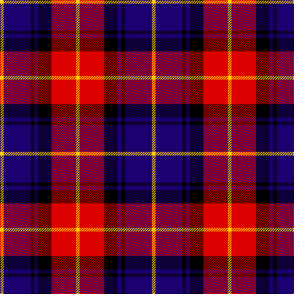

In pattern [YBKBKRY](/patterns/ybkbkry/).

This was sourced from register-of-tartans.  It is a [7 stripes tartan](/stripes/stripes7/).

Original link https://www.tartanregister.gov.uk/tartanDetails.aspx?ref=11100

## Thread count
Y/6 DB44 K6 DB6 K22 R40 Y/6

## Palette
Each colour and its ΔE from the base-6 reference it is a variant of.

| Colour | Shade | Base | ΔE (OKLab) |
|---|---|---|---|
| DB | <code style="background-color:#1C0070;">#1C0070</code> `#1C0070` | B <code style="background-color:#2A418A;">#2A418A</code> | 0.14 |
| K | <code style="background-color:#000000;">#000000</code> `#000000` | K <code style="background-color:#000000;">#000000</code> | 0.00 |
| R | <code style="background-color:#DC0000;">#DC0000</code> `#DC0000` | R <code style="background-color:#CC0000;">#CC0000</code> | 0.03 |
| Y | <code style="background-color:#FFCC00;">#FFCC00</code> `#FFCC00` | Y <code style="background-color:#F2BF00;">#F2BF00</code> | 0.04 |

# Sample pattern

## Nearest tartans

The nearest existing variants by ΔTartan distance.

1. [Biffy Clyro](/setts/s7/y3b22k3b3k11r20y3x2~b202060-k101010-rc80000-yfccc00/) — ΔT 0.80
1. [Graham of Menteith, (Red)](/setts/s6/r26b3r4k16ba16k4x2~b5480b0-ba304080-k000000-rc00000/) — ΔT 1.03
1. [MacTavish](/setts/s6/b2r12ba2b6k6b1x2~b4367ae-ba000052-k000000-raa0000/) — ΔT 1.08
1. [MacTavish](/setts/s6/b2r12ba2b6k6b1~b4367ae-ba000052-k000000-raa0000/) — ΔT 1.08
1. [Aitken](/setts/s8/y5b2k2b12k16r20k2r4x2~b00008c-k000000-r8c0000-yc88c00/) — ΔT 1.08
1. [Dutch (District)](/setts/s6/k4r19k19r2b22w4x2~b440044-k000000-rb84c00-wfcfcfc/) — ΔT 1.14
1. [Baillie](/setts/s7/b3k1b8k6g8k1w2x2~b800080-g008000-k000000-we0e0e0/) — ΔT 1.14
1. [Gipsy](/setts/s9/k1r1b5r1w1r1k5r1k1x2~b304080-k000000-rc00000-we0e0e0/) — ΔT 1.15
1. [Dutch](/setts/s6/k4r19k19r2b22w4x2~b440044-k000000-rc47000-wfcfcfc/) — ΔT 1.18
1. [Gipsy (Fashion)](/setts/s9/k2r2b8r2w1r2k8r2k2x4~b000088-k000000-rc80000-wfcfcfc/) — ΔT 1.20

## Neighbour map

Every grey dot is one of 15726 variants placed by the first two principal components of the ΔTartan feature space (44% of its variance). Red is this tartan; blue dots are its nearest — click one to open its page.

<svg viewBox="0 0 640 380" role="img" style="max-width:100%;height:auto;border:1px solid #e0e0e0;border-radius:4px;display:block" xmlns="http://www.w3.org/2000/svg"><image href="/nn/cloud.v1.png" width="640" height="380"/><a href="/setts/s7/y3b22k3b3k11r20y3x2~b202060-k101010-rc80000-yfccc00/"><circle cx="178.0" cy="200.4" r="4" fill="#3465a4"><title>Biffy Clyro</title></circle></a><a href="/setts/s6/r26b3r4k16ba16k4x2~b5480b0-ba304080-k000000-rc00000/"><circle cx="204.1" cy="211.1" r="4" fill="#3465a4"><title>Graham of Menteith, (Red)</title></circle></a><a href="/setts/s6/b2r12ba2b6k6b1x2~b4367ae-ba000052-k000000-raa0000/"><circle cx="208.4" cy="198.0" r="4" fill="#3465a4"><title>MacTavish</title></circle></a><a href="/setts/s6/b2r12ba2b6k6b1~b4367ae-ba000052-k000000-raa0000/"><circle cx="208.4" cy="198.0" r="4" fill="#3465a4"><title>MacTavish</title></circle></a><a href="/setts/s8/y5b2k2b12k16r20k2r4x2~b00008c-k000000-r8c0000-yc88c00/"><circle cx="185.7" cy="190.6" r="4" fill="#3465a4"><title>Aitken</title></circle></a><a href="/setts/s6/k4r19k19r2b22w4x2~b440044-k000000-rb84c00-wfcfcfc/"><circle cx="157.1" cy="202.6" r="4" fill="#3465a4"><title>Dutch (District)</title></circle></a><a href="/setts/s7/b3k1b8k6g8k1w2x2~b800080-g008000-k000000-we0e0e0/"><circle cx="145.2" cy="209.9" r="4" fill="#3465a4"><title>Baillie</title></circle></a><a href="/setts/s9/k1r1b5r1w1r1k5r1k1x2~b304080-k000000-rc00000-we0e0e0/"><circle cx="161.5" cy="203.8" r="4" fill="#3465a4"><title>Gipsy</title></circle></a><a href="/setts/s6/k4r19k19r2b22w4x2~b440044-k000000-rc47000-wfcfcfc/"><circle cx="150.2" cy="200.7" r="4" fill="#3465a4"><title>Dutch</title></circle></a><a href="/setts/s9/k2r2b8r2w1r2k8r2k2x4~b000088-k000000-rc80000-wfcfcfc/"><circle cx="176.5" cy="196.2" r="4" fill="#3465a4"><title>Gipsy (Fashion)</title></circle></a><circle cx="161.4" cy="194.9" r="5" fill="#c00000"/></svg>

ID: /setts/s7/y3b22k3b3k11r20y3x2~b1c0070-k000000-rdc0000-yffcc00/
