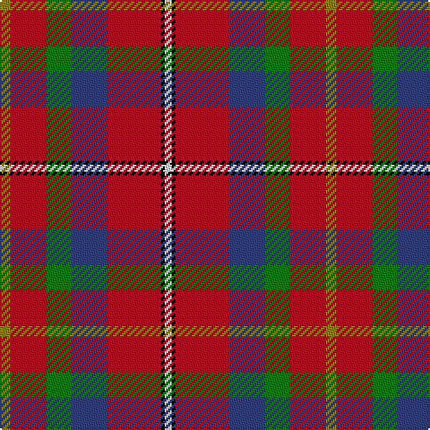

In pattern [GRGBRKW](/stripes/grgbrkw/).

This was sourced from weddslist.  It is a [7 stripe tartan](/stripes/stripes7/).

Original link http://www.weddslist.com/cgi-bin/tartans/pg.pl?source=sts

## Thread count
LG/6 R20 G14 B20 R30 K2 LN/4

## Palette
Each colour and the base-6 reference it is a variant of.

| Colour | Shade | Base |
|---|---|---|
| B | <code style="background-color:#304080;">#304080</code> `oklch(39.4% 0.109 270.2)` <small>#304080</small> | B <code style="background-color:#2A418A;">#2A418A</code> |
| G | <code style="background-color:#008000;">#008000</code> `oklch(52.0% 0.177 142.5)` <small>#008000</small> | G <code style="background-color:#006100;">#006100</code> |
| K | <code style="background-color:#000000;">#000000</code> `oklch(0.0% 0.000 0.0)` <small>#000000</small> | K <code style="background-color:#000000;">#000000</code> |
| LG | <code style="background-color:#908000;">#908000</code> `oklch(59.6% 0.124 100.6)` <small>#908000</small> | G <code style="background-color:#006100;">#006100</code> |
| LN | <code style="background-color:#E0E0E0;">#E0E0E0</code> `oklch(90.7% 0.000 89.9)` <small>#E0E0E0</small> | W <code style="background-color:#F7F7F7;">#F7F7F7</code> |
| R | <code style="background-color:#C00020;">#C00020</code> `oklch(50.9% 0.206 24.5)` <small>#C00020</small> | R <code style="background-color:#CC0000;">#CC0000</code> |

# Sample pattern

## Nearest tartans

The nearest existing variants by ΔTartan distance, with this tartan at the top so the swatches line up against it.

ΔTartan

Tartan

Sett

—

<a href="/ttd/edit/#slug=y3r10g7db10r15k1w2~x2">East Kilbride</a> <a class="nn-out" href="/setts/s7/y3r10g7db10r15k1w2~x2/" title="open its dictionary page">↗</a>

0.34

<a href="/ttd/edit/#slug=lo3r10dg7db10r15k1w2~x2">East Kilbride</a> <a class="nn-out" href="/setts/s7/lo3r10dg7db10r15k1w2~x2/" title="open its dictionary page">↗</a>

0.49

<a href="/ttd/edit/#slug=ly3r10g7db10r15k1w2~x2">East Kilbride (Original) District Tartan Tartan Number: 2061. Earliest known date: 1990 Colours chosen echo the symbolism of the armorial ensigns granted by Lord Lyon: White/Silver and Blue - Stewarts of Torrance White/Silver and Black - Maxwells of Calderwood Red and White - Lindsays White/Silver and Black - Industry Green and Gold - Agriculture. Black guards are added to the blue stripe when woven in reproduction colours. See products available Copyright © Blair Urquhart, Comrie, 2015</a> <a class="nn-out" href="/setts/s7/ly3r10g7db10r15k1w2~x2/" title="open its dictionary page">↗</a>

1.04

<a href="/ttd/edit/#slug=dp2r11t9dp11ly2g13r21w2~x2">Wilson's, No 2</a> <a class="nn-out" href="/setts/s8/dp2r11t9dp11ly2g13r21w2~x2/" title="open its dictionary page">↗</a>

1.08

<a href="/ttd/edit/#slug=r48t16lo5dg17w8k3~x2">Scottish American Society of Michigan (Official)</a> <a class="nn-out" href="/setts/s6/r48t16lo5dg17w8k3~x2/" title="open its dictionary page">↗</a>

1.11

<a href="/ttd/edit/#slug=r48b16lo5g17w8dy3~x2">Scottish American Soc. of Michigan</a> <a class="nn-out" href="/setts/s6/r48b16lo5g17w8dy3~x2/" title="open its dictionary page">↗</a>

1.17

<a href="/ttd/edit/#slug=r6w1r6db2r6dg12ly1db8t4r4~x2">Unidentified No 57</a> <a class="nn-out" href="/setts/s10/r6w1r6db2r6dg12ly1db8t4r4~x2/" title="open its dictionary page">↗</a>

1.17

<a href="/ttd/edit/#slug=r40t11w2k12g36r32~x2">Caithness (1848) (District?)</a> <a class="nn-out" href="/setts/s6/r40t11w2k12g36r32~x2/" title="open its dictionary page">↗</a>

1.22

<a href="/ttd/edit/#slug=db8ly1dg12r10o2r6o2r4~x4">Indiana &quot;Cardinal&quot;</a> <a class="nn-out" href="/setts/s8/db8ly1dg12r10o2r6o2r4~x4/" title="open its dictionary page">↗</a>

1.22

<a href="/ttd/edit/#slug=r40t11w2k12dg36r32~x2">Thompson/Thomson/MacTavish (Mackinlay)</a> <a class="nn-out" href="/setts/s6/r40t11w2k12dg36r32~x2/" title="open its dictionary page">↗</a>

1.28

<a href="/ttd/edit/#slug=r30db12k6dg12ly2dg3w2~x2">Hewitt</a> <a class="nn-out" href="/setts/s7/r30db12k6dg12ly2dg3w2~x2/" title="open its dictionary page">↗</a>

## Neighbour map

Every grey dot is one of 14299 variants placed by the first two principal components of the ΔTartan feature space (44% of its variance). Red is this tartan; blue dots are its nearest — click one to open its page.

<svg viewBox="0 0 640 380" role="img" style="max-width:100%;height:auto;border:1px solid #e0e0e0;border-radius:4px;display:block" xmlns="http://www.w3.org/2000/svg"><image href="/nn/cloud.v1.png" width="640" height="380"/><a href="/setts/s7/lo3r10dg7db10r15k1w2~x2/"><circle cx="241.8" cy="159.1" r="4" fill="#3465a4"><title>East Kilbride</title></circle></a><a href="/setts/s7/ly3r10g7db10r15k1w2~x2/"><circle cx="230.2" cy="152.7" r="4" fill="#3465a4"><title>East Kilbride (Original) District Tartan Tartan Number: 2061. Earliest known date: 1990 Colours chosen echo the symbolism of the armorial ensigns granted by Lord Lyon: White/Silver and Blue - Stewarts of Torrance White/Silver and Black - Maxwells of Calderwood Red and White - Lindsays White/Silver and Black - Industry Green and Gold - Agriculture. Black guards are added to the blue stripe when woven in reproduction colours. See products available Copyright © Blair Urquhart, Comrie, 2015</title></circle></a><a href="/setts/s8/dp2r11t9dp11ly2g13r21w2~x2/"><circle cx="170.8" cy="159.6" r="4" fill="#3465a4"><title>Wilson's, No 2</title></circle></a><a href="/setts/s6/r48t16lo5dg17w8k3~x2/"><circle cx="232.2" cy="134.7" r="4" fill="#3465a4"><title>Scottish American Society of Michigan (Official)</title></circle></a><a href="/setts/s6/r48b16lo5g17w8dy3~x2/"><circle cx="243.6" cy="140.3" r="4" fill="#3465a4"><title>Scottish American Soc. of Michigan</title></circle></a><a href="/setts/s10/r6w1r6db2r6dg12ly1db8t4r4~x2/"><circle cx="173.5" cy="157.8" r="4" fill="#3465a4"><title>Unidentified No 57</title></circle></a><a href="/setts/s6/r40t11w2k12g36r32~x2/"><circle cx="294.5" cy="179.7" r="4" fill="#3465a4"><title>Caithness (1848) (District?)</title></circle></a><a href="/setts/s8/db8ly1dg12r10o2r6o2r4~x4/"><circle cx="212.2" cy="181.7" r="4" fill="#3465a4"><title>Indiana &quot;Cardinal&quot;</title></circle></a><a href="/setts/s6/r40t11w2k12dg36r32~x2/"><circle cx="282.9" cy="173.6" r="4" fill="#3465a4"><title>Thompson/Thomson/MacTavish (Mackinlay)</title></circle></a><a href="/setts/s7/r30db12k6dg12ly2dg3w2~x2/"><circle cx="207.8" cy="131.2" r="4" fill="#3465a4"><title>Hewitt</title></circle></a><circle cx="238.9" cy="159.6" r="5" fill="#c00000"/></svg>

ID: /setts/s7/y3r10g7db10r15k1w2~x2/
