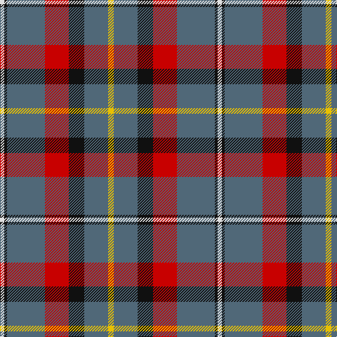

In pattern [WKBRKBY](/patterns/wkbrkby/).

This was sourced from register-of-tartans.  It is a [7 stripes tartan](/stripes/stripes7/).

Original link https://www.tartanregister.gov.uk/tartanDetails.aspx?ref=2673

## Attestations

This cloth appears in 2 source records; the oldest owns this page.

- 01/05/2000 — MacNamara (register-of-tartans, [record](https://www.tartanregister.gov.uk/tartanDetails.aspx?ref=2673))
- May 2000 — MacNamara (tartans-authority, [record](http://www.tartansauthority.com/tartan-ferret/display/6432/))

## Register references

External register numbers recorded for this tartan.

- Scottish Register of Tartans: [2673](https://www.tartanregister.gov.uk/tartanDetails.aspx?ref=2673)
- Scottish Tartans Authority (ITI): 6432

## Thread count
LN/6 K4 N54 R34 K22 N34 Y/8

## Palette
Each colour and its ΔE from the base-6 reference it is a variant of.

| Colour | Shade | Base | ΔE (OKLab) |
|---|---|---|---|
| K | <code style="background-color:#101010;">#101010</code> `#101010` | K <code style="background-color:#000000;">#000000</code> | 0.17 |
| LN | <code style="background-color:#E0E0E0;">#E0E0E0</code> `#E0E0E0` | W <code style="background-color:#F7F7F7;">#F7F7F7</code> | 0.07 |
| N | <code style="background-color:#506878;">#506878</code> `#506878` | B <code style="background-color:#2A418A;">#2A418A</code> | 0.14 |
| R | <code style="background-color:#C80000;">#C80000</code> `#C80000` | R <code style="background-color:#CC0000;">#CC0000</code> | 0.01 |
| Y | <code style="background-color:#E8C000;">#E8C000</code> `#E8C000` | Y <code style="background-color:#F2BF00;">#F2BF00</code> | 0.02 |

# Sample pattern

## Nearest tartans

The nearest existing variants by ΔTartan distance.

1. [Taylor Family Tartan Tartan Number: 809. Earliest known date: 1955 Some similarity to the Cameron recorded in the Vestiarium Scoticum, which may be connected with the name of the designer, Lt Col Iain Cameron Taylor, or to the Clan Cameron warrior Taillear dubh na Tuaighe (Black Taylor of the Axe) who lived in the seventeenth century. The pink stripe is described as 'coral'. The tartan is recognised by the Cameron of Lochiel. See products available Copyright © Blair Urquhart, Comrie, 2015](/setts/s8/g8k2g13r4g12b22g5y3~b780078-g006818-k101010-rd05054-ye8c000~x2/) — ΔT 1.02
1. [Lawrence of Broughty Ferry (Corporat](/setts/s6/g20k2g20b25w2ba3~b780078-ba5c8ca8-g006818-k101010-we0e0e0~x2/) — ΔT 1.21
1. [Bryan Wedding (Personal)](/setts/s6/g30y5b10k10w2k2~b486c9c-g58442c-k101010-we8e8e8-ydcbc1c~x2/) — ΔT 1.21
1. [Wellington (Wilson 122)](/setts/s8/g14b11ba3k2ba3b11g14y1~b440044-ba2888c4-g408060-k101010-ye8c000~x2/) — ΔT 1.22
1. [New York State Troopers (Corporate)](/setts/s7/r6b4r2w2r24k25y4~b780078-k101010-r888888-we0e0e0-ybc8c00~x2/) — ΔT 1.28
1. [Wicks Personal Tartan Tartan Number: 5968. Earliest known date: 2003 A tartan for the occasion of the marriage of Christopher Wicks and Nicola Bundle, in Aberdeen 2003. See products available Copyright © Blair Urquhart, Comrie, 2015](/setts/s8/b30r20g8y3g8r20b30y2~b442450-g003820-r888888-ye8c000~x2/) — ΔT 1.35
1. [Afternoon Tea / Black Tea](/setts/s6/r15b8g25b72ba98w15~b1c1c1c-ba646464-g789484-ra00048-wf8f8f8/) — ΔT 1.36
1. [Bryan Wedding (Personal)](/setts/s6/g30y5b10k10w2k2~b5c8ca8-g604000-k101010-wfcfcfc-yfccc00~x2/) — ΔT 1.39
1. [Finlaggan](/setts/s6/g7w1g18b6r18g2~b2c2c80-g003820-rc80000-we0e0e0~x2/) — ΔT 1.42
1. [New Glasgow (Canada)](/setts/s8/g28r4b25w5r22g27r4b2~b440044-g285800-rc80000-wfcfcfc~x2/) — ΔT 1.43

## Neighbour map

Every grey dot is one of 15726 variants placed by the first two principal components of the ΔTartan feature space (44% of its variance). Red is this tartan; blue dots are its nearest — click one to open its page.

<svg viewBox="0 0 640 380" role="img" style="max-width:100%;height:auto;border:1px solid #e0e0e0;border-radius:4px;display:block" xmlns="http://www.w3.org/2000/svg"><image href="/nn/cloud.v1.png" width="640" height="380"/><a href="/setts/s8/g8k2g13r4g12b22g5y3~b780078-g006818-k101010-rd05054-ye8c000~x2/"><circle cx="272.8" cy="193.3" r="4" fill="#3465a4"><title>Taylor Family Tartan Tartan Number: 809. Earliest known date: 1955 Some similarity to the Cameron recorded in the Vestiarium Scoticum, which may be connected with the name of the designer, Lt Col Iain Cameron Taylor, or to the Clan Cameron warrior Taillear dubh na Tuaighe (Black Taylor of the Axe) who lived in the seventeenth century. The pink stripe is described as 'coral'. The tartan is recognised by the Cameron of Lochiel. See products available Copyright © Blair Urquhart, Comrie, 2015</title></circle></a><a href="/setts/s6/g20k2g20b25w2ba3~b780078-ba5c8ca8-g006818-k101010-we0e0e0~x2/"><circle cx="301.7" cy="196.9" r="4" fill="#3465a4"><title>Lawrence of Broughty Ferry (Corporat</title></circle></a><a href="/setts/s6/g30y5b10k10w2k2~b486c9c-g58442c-k101010-we8e8e8-ydcbc1c~x2/"><circle cx="265.8" cy="170.9" r="4" fill="#3465a4"><title>Bryan Wedding (Personal)</title></circle></a><a href="/setts/s8/g14b11ba3k2ba3b11g14y1~b440044-ba2888c4-g408060-k101010-ye8c000~x2/"><circle cx="243.0" cy="187.2" r="4" fill="#3465a4"><title>Wellington (Wilson 122)</title></circle></a><a href="/setts/s7/r6b4r2w2r24k25y4~b780078-k101010-r888888-we0e0e0-ybc8c00~x2/"><circle cx="240.0" cy="160.1" r="4" fill="#3465a4"><title>New York State Troopers (Corporate)</title></circle></a><a href="/setts/s8/b30r20g8y3g8r20b30y2~b442450-g003820-r888888-ye8c000~x2/"><circle cx="278.6" cy="201.9" r="4" fill="#3465a4"><title>Wicks Personal Tartan Tartan Number: 5968. Earliest known date: 2003 A tartan for the occasion of the marriage of Christopher Wicks and Nicola Bundle, in Aberdeen 2003. See products available Copyright © Blair Urquhart, Comrie, 2015</title></circle></a><a href="/setts/s6/r15b8g25b72ba98w15~b1c1c1c-ba646464-g789484-ra00048-wf8f8f8/"><circle cx="209.3" cy="181.6" r="4" fill="#3465a4"><title>Afternoon Tea / Black Tea</title></circle></a><a href="/setts/s6/g30y5b10k10w2k2~b5c8ca8-g604000-k101010-wfcfcfc-yfccc00~x2/"><circle cx="250.7" cy="162.7" r="4" fill="#3465a4"><title>Bryan Wedding (Personal)</title></circle></a><a href="/setts/s6/g7w1g18b6r18g2~b2c2c80-g003820-rc80000-we0e0e0~x2/"><circle cx="316.2" cy="197.8" r="4" fill="#3465a4"><title>Finlaggan</title></circle></a><a href="/setts/s8/g28r4b25w5r22g27r4b2~b440044-g285800-rc80000-wfcfcfc~x2/"><circle cx="248.3" cy="189.4" r="4" fill="#3465a4"><title>New Glasgow (Canada)</title></circle></a><circle cx="262.3" cy="181.5" r="5" fill="#c00000"/></svg>

ID: /setts/s7/y4b17k11r17b27k2w3~b506878-k101010-rc80000-we0e0e0-ye8c000~x2/
