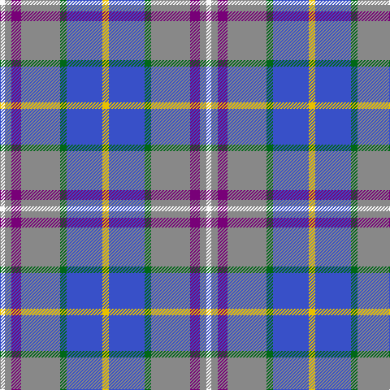

In pattern [WRBRGBY](/patterns/wrbrgby/).

This was sourced from tartans-authority.  It is a [7 stripes tartan](/stripes/stripes7/).

Original link http://www.tartansauthority.com/tartan-ferret/display/1833/

## Thread count
W/6 N8 P12 N48 G8 B44 Y/8

## Palette
Each colour and its ΔE from the base-6 reference it is a variant of.

| Colour | Shade | Base | ΔE (OKLab) |
|---|---|---|---|
| B | <code style="background-color:#3850C8;">#3850C8</code> `#3850C8` | B <code style="background-color:#2A418A;">#2A418A</code> | 0.11 |
| G | <code style="background-color:#006818;">#006818</code> `#006818` | G <code style="background-color:#006100;">#006100</code> | 0.02 |
| N | <code style="background-color:#888888;">#888888</code> `#888888` | R <code style="background-color:#CC0000;">#CC0000</code> | 0.24 |
| P | <code style="background-color:#780078;">#780078</code> `#780078` | B <code style="background-color:#2A418A;">#2A418A</code> | 0.17 |
| W | <code style="background-color:#FCFCFC;">#FCFCFC</code> `#FCFCFC` | W <code style="background-color:#F7F7F7;">#F7F7F7</code> | 0.01 |
| Y | <code style="background-color:#E8C000;">#E8C000</code> `#E8C000` | Y <code style="background-color:#F2BF00;">#F2BF00</code> | 0.02 |

# Sample pattern

## Nearest tartans

The nearest existing variants by ΔTartan distance.

1. [Texas, Bluebonnet](/setts/s11/g4r1b8w1r1w1ba8w1ba8w1y1x4~b304080-ba8080d0-g008000-rc00000-we0e0e0-yf0c000/) — ΔT 1.05
1. [Meh Dundee](/setts/s6/b13y2r4g2ba8w2x6~b2c2c80-ba2888c4-g006818-rc80000-we0e0e0-ye8c000/) — ΔT 1.17
1. [Deeside District Tartan Tartan Number: 1833. Earliest known date: 1963 The name Deas is described as an 'alias' for Davidson in historic records, and is a recognised sept of Clan Dhai (Davidson). See products available Copyright © Blair Urquhart, Comrie, 2015](/setts/s7/w1r1b2r7g1ba5y1x4~b780078-ba1c0070-g006818-r888888-we0e0e0-ye8c000/) — ΔT 1.17
1. [Pride of the Nation (Fashion)](/setts/s8/b12ba6b50bb39bc12bd6bc6w4~b5c8ca8-ba2c2c80-bb1c1c50-bc9050d8-bd780078-we0e0e0/) — ΔT 1.26
1. [Deeside Plaid (Taobh Dhi)](/setts/s12/b22g4r24ba6r4w3r4ba6r24g4b22y4x2~b3850c8-ba780078-g006818-r888888-wfcfcfc-ye8c000/) — ΔT 1.27
1. [Ontex](/setts/s7/b4w1ba12y12r4bb1w2x4~b2c2c80-ba5c5c5c-bb2888c4-rb458ac-we0e0e0-ya0a0a0/) — ΔT 1.31
1. [Texas Bluebonnet District Tartan Tartan Number: 852. Earliest known date: 1983 The colours of the Texas Bluebonnet district tartan owe their selection to the bluebonnet flower, a member of the lupin family, which is widespread in many parts of Texas. The flower changes colour with the passing of time, the 'brim' becoming flecked with wine red. The tartan was adopted as the Sequicentennial Tartan and Accredited by the Scottish Tartans Society. See products available Copyright © Blair Urquhart, Comrie, 2015](/setts/s11/g4r1b8w1r1w1ba8w1ba8w1y1x4~b2c2c80-ba2888c4-g006818-rc80000-we0e0e0-ye8c000/) — ΔT 1.34
1. [Manx National](/setts/s7/b2g6r1ga1ba3bb10w1x2~b800080-ba000050-bb8080d0-g008000-ga908000-rc00000-we0e0e0/) — ΔT 1.35
1. [Seaside (Fashion)](/setts/s7/w3wa2b4wa14ba2bb14y2x4~b9058d8-ba346488-bb2888c4-wfcfcfc-wac8c8c8-yc88c00/) — ΔT 1.36
1. [Texas Blue Bonnet](/setts/s11/g5r1b10w1r1w1ba10w1ba10w1y1x4~b2c2c80-ba5c8ca8-g006818-rc80000-we0e0e0-ye8c000/) — ΔT 1.37

## Neighbour map

Every grey dot is one of 15726 variants placed by the first two principal components of the ΔTartan feature space (44% of its variance). Red is this tartan; blue dots are its nearest — click one to open its page.

<svg viewBox="0 0 640 380" role="img" style="max-width:100%;height:auto;border:1px solid #e0e0e0;border-radius:4px;display:block" xmlns="http://www.w3.org/2000/svg"><image href="/nn/cloud.v1.png" width="640" height="380"/><a href="/setts/s11/g4r1b8w1r1w1ba8w1ba8w1y1x4~b304080-ba8080d0-g008000-rc00000-we0e0e0-yf0c000/"><circle cx="173.3" cy="142.3" r="4" fill="#3465a4"><title>Texas, Bluebonnet</title></circle></a><a href="/setts/s6/b13y2r4g2ba8w2x6~b2c2c80-ba2888c4-g006818-rc80000-we0e0e0-ye8c000/"><circle cx="133.8" cy="187.3" r="4" fill="#3465a4"><title>Meh Dundee</title></circle></a><a href="/setts/s7/w1r1b2r7g1ba5y1x4~b780078-ba1c0070-g006818-r888888-we0e0e0-ye8c000/"><circle cx="155.7" cy="169.2" r="4" fill="#3465a4"><title>Deeside District Tartan Tartan Number: 1833. Earliest known date: 1963 The name Deas is described as an 'alias' for Davidson in historic records, and is a recognised sept of Clan Dhai (Davidson). See products available Copyright © Blair Urquhart, Comrie, 2015</title></circle></a><a href="/setts/s8/b12ba6b50bb39bc12bd6bc6w4~b5c8ca8-ba2c2c80-bb1c1c50-bc9050d8-bd780078-we0e0e0/"><circle cx="214.4" cy="149.2" r="4" fill="#3465a4"><title>Pride of the Nation (Fashion)</title></circle></a><a href="/setts/s12/b22g4r24ba6r4w3r4ba6r24g4b22y4x2~b3850c8-ba780078-g006818-r888888-wfcfcfc-ye8c000/"><circle cx="193.9" cy="161.7" r="4" fill="#3465a4"><title>Deeside Plaid (Taobh Dhi)</title></circle></a><a href="/setts/s7/b4w1ba12y12r4bb1w2x4~b2c2c80-ba5c5c5c-bb2888c4-rb458ac-we0e0e0-ya0a0a0/"><circle cx="162.0" cy="160.6" r="4" fill="#3465a4"><title>Ontex</title></circle></a><a href="/setts/s11/g4r1b8w1r1w1ba8w1ba8w1y1x4~b2c2c80-ba2888c4-g006818-rc80000-we0e0e0-ye8c000/"><circle cx="163.0" cy="145.2" r="4" fill="#3465a4"><title>Texas Bluebonnet District Tartan Tartan Number: 852. Earliest known date: 1983 The colours of the Texas Bluebonnet district tartan owe their selection to the bluebonnet flower, a member of the lupin family, which is widespread in many parts of Texas. The flower changes colour with the passing of time, the 'brim' becoming flecked with wine red. The tartan was adopted as the Sequicentennial Tartan and Accredited by the Scottish Tartans Society. See products available Copyright © Blair Urquhart, Comrie, 2015</title></circle></a><a href="/setts/s7/b2g6r1ga1ba3bb10w1x2~b800080-ba000050-bb8080d0-g008000-ga908000-rc00000-we0e0e0/"><circle cx="135.3" cy="138.9" r="4" fill="#3465a4"><title>Manx National</title></circle></a><a href="/setts/s7/w3wa2b4wa14ba2bb14y2x4~b9058d8-ba346488-bb2888c4-wfcfcfc-wac8c8c8-yc88c00/"><circle cx="164.4" cy="175.7" r="4" fill="#3465a4"><title>Seaside (Fashion)</title></circle></a><a href="/setts/s11/g5r1b10w1r1w1ba10w1ba10w1y1x4~b2c2c80-ba5c8ca8-g006818-rc80000-we0e0e0-ye8c000/"><circle cx="197.5" cy="134.8" r="4" fill="#3465a4"><title>Texas Blue Bonnet</title></circle></a><circle cx="176.8" cy="172.0" r="5" fill="#c00000"/></svg>

ID: /setts/s7/y4b22g4r24ba6r4w3x2~b3850c8-ba780078-g006818-r888888-wfcfcfc-ye8c000/
