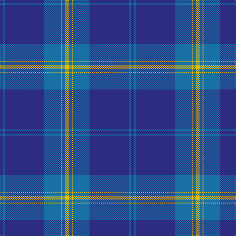

In pattern [BBBBYBY](/patterns/bbbbyby/).

This was sourced from register-of-tartans.  It is a [7 stripes tartan](/stripes/stripes7/).

Original link https://www.tartanregister.gov.uk/tartanDetails.aspx?ref=888

## Attestations

This cloth appears in 2 source records; the oldest owns this page.

- 01/02/2000 — Danzas (register-of-tartans, [record](https://www.tartanregister.gov.uk/tartanDetails.aspx?ref=888))
- Feb. 2000 — Danzas (Corporate) (tartans-authority, [record](http://www.tartansauthority.com/tartan-ferret/display/2666/))

## Thread count
DB/6 B4 DB80 B34 Y2 B6 Y/8

## Palette
Each colour and its ΔE from the base-6 reference it is a variant of.

| Colour | Shade | Base | ΔE (OKLab) |
|---|---|---|---|
| B | <code style="background-color:#1870A4;">#1870A4</code> `#1870A4` | B <code style="background-color:#2A418A;">#2A418A</code> | 0.13 |
| DB | <code style="background-color:#2C2C80;">#2C2C80</code> `#2C2C80` | B <code style="background-color:#2A418A;">#2A418A</code> | 0.06 |
| Y | <code style="background-color:#E8C000;">#E8C000</code> `#E8C000` | Y <code style="background-color:#F2BF00;">#F2BF00</code> | 0.02 |

# Sample pattern

## Nearest tartans

The nearest existing variants by ΔTartan distance.

1. [Danzas](/setts/s7/y4b3y1b17ba40b2ba3x2~b102040-ba304080-yf0c000/) — ΔT 0.82
1. [S.C.O.T.S](/setts/s6/b136ba45w7ba4r4ba16~b1474b4-ba1c0070-rc80000-we0e0e0/) — ΔT 1.31
1. [North Tyneside Pipe Band](/setts/s7/b62ba22w3ba2w2ba3r1x2~b1474b4-ba202060-rc80000-we0e0e0/) — ΔT 1.32
1. [S.C.O.T.S.](/setts/s6/b55ba18w3ba2r2ba6x2~b304080-ba000050-rc00020-we0e0e0/) — ΔT 1.33
1. [St Andrews Earl of Royal family Tartan Tartan Number: 85. Earliest known date: c.1930 Count taken from a 'MacKinlay Strip'. Prince George is reputed to have worn this tartan at a Scottish Society dinner in 1919 and kept everyone guessing the name of the tartan. However, MacKinlay's record shows the design dating to 1930. No further details can be found. The sett has much in common with the Clan Donald. Royal titles of territorial origin provide a precedent for considering tartans of the name, District tartans. See products available Copyright © Blair Urquhart, Comrie, 2015](/setts/s6/b52ba28w3ba2w2ba10x2~b2888c4-ba2c2c80-we0e0e0/) — ΔT 1.35
1. [Salvation Army Hunting Corporate Tartan Tartan Number: 150. Earliest known date: 1983 Designed to be ready for the Perth Citadel Corps Centenary. The hunting version replaces red with green. See products available Copyright © Blair Urquhart, Comrie, 2015](/setts/s7/b40g8k1y2k1g8b5x4~b2c2c80-g006818-k101010-ye8c000/) — ΔT 1.53
1. [Scottish Tourist Board (1990) (Corp)](/setts/s5/b50ba15w3ba4w2x2~b1474b4-ba2c2c80-we0e0e0/) — ΔT 1.54
1. [Federal Bureaux (FBI) Corporate Tartan Tartan Number: 83. Earliest known date: 1989 Discovered (in 1991) to be the same as a previously accredited tartan, "S.C.O.T.S." designed by Kinloch Anderson in 1988. Twenty kilts have been produced for the F.B.I. pipe band. See products available Copyright © Blair Urquhart, Comrie, 2015](/setts/s6/b60ba19w3ba2r2ba7x2~b5c8ca8-ba2c2c80-rc80000-we0e0e0/) — ΔT 1.57
1. [Tyneside Blue, North Tyneside Pipe Band](/setts/s7/b62k22w3k2w2k3r1x2~b304080-k000030-rc00000-we0e0e0/) — ΔT 1.57
1. [Navy-Radar](/setts/s6/b51ba8w4ba30r1ba9x2~b202060-ba1474b4-rc80000-we0e0e0/) — ΔT 1.60

## Neighbour map

Every grey dot is one of 15726 variants placed by the first two principal components of the ΔTartan feature space (44% of its variance). Red is this tartan; blue dots are its nearest — click one to open its page.

<svg viewBox="0 0 640 380" role="img" style="max-width:100%;height:auto;border:1px solid #e0e0e0;border-radius:4px;display:block" xmlns="http://www.w3.org/2000/svg"><image href="/nn/cloud.v1.png" width="640" height="380"/><a href="/setts/s7/y4b3y1b17ba40b2ba3x2~b102040-ba304080-yf0c000/"><circle cx="474.1" cy="167.7" r="4" fill="#3465a4"><title>Danzas</title></circle></a><a href="/setts/s6/b136ba45w7ba4r4ba16~b1474b4-ba1c0070-rc80000-we0e0e0/"><circle cx="449.4" cy="155.5" r="4" fill="#3465a4"><title>S.C.O.T.S</title></circle></a><a href="/setts/s7/b62ba22w3ba2w2ba3r1x2~b1474b4-ba202060-rc80000-we0e0e0/"><circle cx="479.1" cy="126.9" r="4" fill="#3465a4"><title>North Tyneside Pipe Band</title></circle></a><a href="/setts/s6/b55ba18w3ba2r2ba6x2~b304080-ba000050-rc00020-we0e0e0/"><circle cx="466.1" cy="175.3" r="4" fill="#3465a4"><title>S.C.O.T.S.</title></circle></a><a href="/setts/s6/b52ba28w3ba2w2ba10x2~b2888c4-ba2c2c80-we0e0e0/"><circle cx="398.6" cy="189.0" r="4" fill="#3465a4"><title>St Andrews Earl of Royal family Tartan Tartan Number: 85. Earliest known date: c.1930 Count taken from a 'MacKinlay Strip'. Prince George is reputed to have worn this tartan at a Scottish Society dinner in 1919 and kept everyone guessing the name of the tartan. However, MacKinlay's record shows the design dating to 1930. No further details can be found. The sett has much in common with the Clan Donald. Royal titles of territorial origin provide a precedent for considering tartans of the name, District tartans. See products available Copyright © Blair Urquhart, Comrie, 2015</title></circle></a><a href="/setts/s7/b40g8k1y2k1g8b5x4~b2c2c80-g006818-k101010-ye8c000/"><circle cx="501.1" cy="149.7" r="4" fill="#3465a4"><title>Salvation Army Hunting Corporate Tartan Tartan Number: 150. Earliest known date: 1983 Designed to be ready for the Perth Citadel Corps Centenary. The hunting version replaces red with green. See products available Copyright © Blair Urquhart, Comrie, 2015</title></circle></a><a href="/setts/s5/b50ba15w3ba4w2x2~b1474b4-ba2c2c80-we0e0e0/"><circle cx="493.7" cy="204.7" r="4" fill="#3465a4"><title>Scottish Tourist Board (1990) (Corp)</title></circle></a><a href="/setts/s6/b60ba19w3ba2r2ba7x2~b5c8ca8-ba2c2c80-rc80000-we0e0e0/"><circle cx="457.8" cy="157.4" r="4" fill="#3465a4"><title>Federal Bureaux (FBI) Corporate Tartan Tartan Number: 83. Earliest known date: 1989 Discovered (in 1991) to be the same as a previously accredited tartan, &quot;S.C.O.T.S.&quot; designed by Kinloch Anderson in 1988. Twenty kilts have been produced for the F.B.I. pipe band. See products available Copyright © Blair Urquhart, Comrie, 2015</title></circle></a><a href="/setts/s7/b62k22w3k2w2k3r1x2~b304080-k000030-rc00000-we0e0e0/"><circle cx="474.1" cy="126.1" r="4" fill="#3465a4"><title>Tyneside Blue, North Tyneside Pipe Band</title></circle></a><a href="/setts/s6/b51ba8w4ba30r1ba9x2~b202060-ba1474b4-rc80000-we0e0e0/"><circle cx="385.8" cy="159.1" r="4" fill="#3465a4"><title>Navy-Radar</title></circle></a><circle cx="467.4" cy="163.9" r="5" fill="#c00000"/></svg>

ID: /setts/s7/y4b3y1b17ba40b2ba3x2~b1870a4-ba2c2c80-ye8c000/
