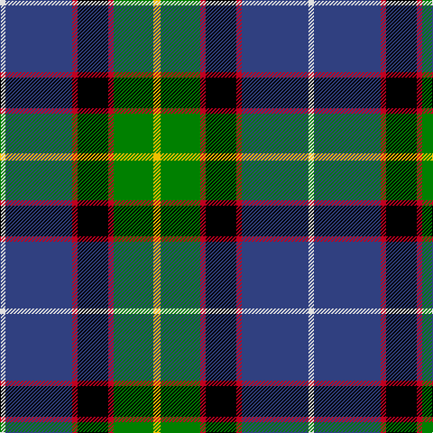

In pattern [WBRKRGY](/patterns/wbrkrgy/).

This was sourced from weddslist.  It is a [7 stripes tartan](/stripes/stripes7/).

Original link http://www.weddslist.com/cgi-bin/tartans/pg.pl?source=sts

## Thread count
LN/6 B74 R6 K34 R6 G44 Y/8

## Palette
Each colour and its ΔE from the base-6 reference it is a variant of.

| Colour | Shade | Base | ΔE (OKLab) |
|---|---|---|---|
| B | <code style="background-color:#304080;">#304080</code> `#304080` | B <code style="background-color:#2A418A;">#2A418A</code> | 0.02 |
| G | <code style="background-color:#008000;">#008000</code> `#008000` | G <code style="background-color:#006100;">#006100</code> | 0.10 |
| K | <code style="background-color:#000000;">#000000</code> `#000000` | K <code style="background-color:#000000;">#000000</code> | 0.00 |
| LN | <code style="background-color:#E0E0E0;">#E0E0E0</code> `#E0E0E0` | W <code style="background-color:#F7F7F7;">#F7F7F7</code> | 0.07 |
| R | <code style="background-color:#C00020;">#C00020</code> `#C00020` | R <code style="background-color:#CC0000;">#CC0000</code> | 0.03 |
| Y | <code style="background-color:#F0C000;">#F0C000</code> `#F0C000` | Y <code style="background-color:#F2BF00;">#F2BF00</code> | 0.00 |

# Sample pattern

## Nearest tartans

The nearest existing variants by ΔTartan distance.

1. [Minnesota (District)](/setts/s8/k6w3k2b30r9k4g20y3x2~b2c2c80-g289c18-k101010-ra00024-we0e0e0-ye8c000/) — ΔT 0.71
1. [Souza Nery (Personal)](/setts/s7/y4g22r3k17r3b37w3x2~b2c2c80-g006818-k101010-rc8002c-we0e0e0-yfccc00/) — ΔT 0.79
1. [Federated Women's Institutes of](/setts/s9/r2k1y2g3y4g3b12k1w2x4~b003478-g007800-k000000-r8c0000-wc8c8c8-yc88c00/) — ΔT 0.84
1. [Loch Awe](/setts/s9/b3k2r3g20k24ba20r3k2y3x2~b778899-ba0000cd-g008b00-k101010-rff0000-yffe600/) — ΔT 0.85
1. [Ayrshire (District)](/setts/s8/b2r1b10w1g4ga8y1ga2x4~b1c0070-g785000-ga30ac38-r880000-we0e0e0-ybc8c00/) — ΔT 0.88
1. [Renfrewshire Tartan](/setts/s7/b4ba2bb8ba25k8g13y4x2~b800080-ba304080-bb5480b0-g008000-k000000-yf0c000/) — ΔT 0.92
1. [St Columba](/setts/s8/b60ba5w4r12g42bb12ba5bb12~b000050-ba5480b0-bb800080-g008000-r906030-we0e0e0/) — ΔT 0.93
1. [Mellor, Phillip (Oldham)](/setts/s7/b8w8k16g32ba3y5w5x2~b351e14-ba433a5a-g23321b-k000000-wf9f5ef-ye0a126/) — ΔT 0.95
1. [Roderick Dhu](/setts/s9/b3k2r2k12g10y1k1g2w2x4~b3850c8-g006818-k101010-rc80000-wa8ace8-ye8c000/) — ΔT 0.98
1. [Shawlands International (Commem.)](/setts/s6/k3g44b27y6r10w3x2~b1c0070-g006818-k101010-rc80000-we0e0e0-yfccc00/) — ΔT 0.99

## Neighbour map

Every grey dot is one of 15726 variants placed by the first two principal components of the ΔTartan feature space (44% of its variance). Red is this tartan; blue dots are its nearest — click one to open its page.

<svg viewBox="0 0 640 380" role="img" style="max-width:100%;height:auto;border:1px solid #e0e0e0;border-radius:4px;display:block" xmlns="http://www.w3.org/2000/svg"><image href="/nn/cloud.v1.png" width="640" height="380"/><a href="/setts/s8/k6w3k2b30r9k4g20y3x2~b2c2c80-g289c18-k101010-ra00024-we0e0e0-ye8c000/"><circle cx="151.3" cy="131.3" r="4" fill="#3465a4"><title>Minnesota (District)</title></circle></a><a href="/setts/s7/y4g22r3k17r3b37w3x2~b2c2c80-g006818-k101010-rc8002c-we0e0e0-yfccc00/"><circle cx="172.9" cy="152.9" r="4" fill="#3465a4"><title>Souza Nery (Personal)</title></circle></a><a href="/setts/s9/r2k1y2g3y4g3b12k1w2x4~b003478-g007800-k000000-r8c0000-wc8c8c8-yc88c00/"><circle cx="138.7" cy="135.2" r="4" fill="#3465a4"><title>Federated Women's Institutes of</title></circle></a><a href="/setts/s9/b3k2r3g20k24ba20r3k2y3x2~b778899-ba0000cd-g008b00-k101010-rff0000-yffe600/"><circle cx="116.4" cy="132.8" r="4" fill="#3465a4"><title>Loch Awe</title></circle></a><a href="/setts/s8/b2r1b10w1g4ga8y1ga2x4~b1c0070-g785000-ga30ac38-r880000-we0e0e0-ybc8c00/"><circle cx="149.3" cy="152.6" r="4" fill="#3465a4"><title>Ayrshire (District)</title></circle></a><a href="/setts/s7/b4ba2bb8ba25k8g13y4x2~b800080-ba304080-bb5480b0-g008000-k000000-yf0c000/"><circle cx="145.7" cy="162.3" r="4" fill="#3465a4"><title>Renfrewshire Tartan</title></circle></a><a href="/setts/s8/b60ba5w4r12g42bb12ba5bb12~b000050-ba5480b0-bb800080-g008000-r906030-we0e0e0/"><circle cx="162.8" cy="135.0" r="4" fill="#3465a4"><title>St Columba</title></circle></a><a href="/setts/s7/b8w8k16g32ba3y5w5x2~b351e14-ba433a5a-g23321b-k000000-wf9f5ef-ye0a126/"><circle cx="124.4" cy="153.0" r="4" fill="#3465a4"><title>Mellor, Phillip (Oldham)</title></circle></a><a href="/setts/s9/b3k2r2k12g10y1k1g2w2x4~b3850c8-g006818-k101010-rc80000-wa8ace8-ye8c000/"><circle cx="184.0" cy="143.7" r="4" fill="#3465a4"><title>Roderick Dhu</title></circle></a><a href="/setts/s6/k3g44b27y6r10w3x2~b1c0070-g006818-k101010-rc80000-we0e0e0-yfccc00/"><circle cx="208.2" cy="150.0" r="4" fill="#3465a4"><title>Shawlands International (Commem.)</title></circle></a><circle cx="153.4" cy="146.4" r="5" fill="#c00000"/></svg>

ID: /setts/s7/y4g22r3k17r3b37w3x2~b304080-g008000-k000000-rc00020-we0e0e0-yf0c000/
