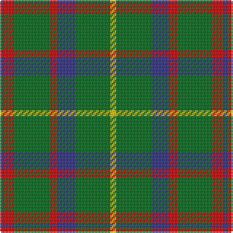

In pattern [BRGRBGY](/patterns/brgrbgy/).

This was sourced from register-of-tartans.  It is a [7 stripes tartan](/stripes/stripes7/).

Original link https://www.tartanregister.gov.uk/tartanDetails.aspx?ref=2574

## Attestations

This cloth appears in 2 source records; the oldest owns this page.

- 01/01/1951 — MacKintosh Hunting (register-of-tartans, [record](https://www.tartanregister.gov.uk/tartanDetails.aspx?ref=2574))
- pre 1951 — MacKintosh Htg (Clan) (tartans-authority, [record](http://www.tartansauthority.com/tartan-ferret/display/544/))

## Thread count
DB/2 R8 G24 R6 DB12 G24 Y/4

## Palette
Each colour and its ΔE from the base-6 reference it is a variant of.

| Colour | Shade | Base | ΔE (OKLab) |
|---|---|---|---|
| DB | <code style="background-color:#2C2C80;">#2C2C80</code> `#2C2C80` | B <code style="background-color:#2C4084;">#2C4084</code> | 0.05 |
| G | <code style="background-color:#006818;">#006818</code> `#006818` | G <code style="background-color:#006400;">#006400</code> | 0.02 |
| R | <code style="background-color:#C80000;">#C80000</code> `#C80000` | R <code style="background-color:#C80000;">#C80000</code> | 0.00 |
| Y | <code style="background-color:#E8C000;">#E8C000</code> `#E8C000` | Y <code style="background-color:#E8C000;">#E8C000</code> | 0.00 |

# Sample pattern

## Nearest tartans

The nearest existing variants by ΔTartan distance.

1. [MacKintosh Hunting Clan Tartan Tartan Number: 544. Earliest known date: 1951 This sett appears in D.C. Stewarts book, The Setts of the Scottish Tartans, with slightly different proportions. The Lyon Court Book No. 1 records the sett in relation to the narrowest stripe. ie Y 1, Vt (Vert meaning green) 10 1/2, Bu 5, etc. The rendering illustrated here multiplies the Lyon count by two. Commercially manufactured cloth may vary from these proportions. D.C. Stewart calls the sett "a modern arrangement". See products available Copyright © Blair Urquhart, Comrie, 2015](/setts/s7/b2r6g22r4b10g22y2-b2c2c80-g006818-rc80000-ye8c000/) — ΔT 0.80
1. [MacKintosh Hunting](/setts/s7/y4g24b12r6g24r8b2-b000064-g004c00-rc80000-yffff00/) — ΔT 0.98
1. [MacKintosh Hunting](/setts/s7/y4g24b12r6g24r8b2-b000052-g11450d-raa0000-yaaaa00/) — ΔT 0.99
1. [Cameron, hunting](/setts/s7/r6g20r6g28b32g6y4-b304080-g008000-rc00000-yf0c000/) — ΔT 1.01
1. [Arkansas](/setts/s7/g12w4g48r24g12k12g8-g006818-k101010-rc8002c-wfcfcfc/) — ΔT 1.04
1. [Bean Hunting](/setts/s7/b6r15g41r15b20g41ba6-b304080-ba5480b0-g008000-rc00000/) — ΔT 1.07
1. [MacKintosh, hunting](/setts/s7/b2r6g22r4b10g22y2-b304080-g008000-rc00000-yf0c000/) — ΔT 1.12
1. [Paton (Personal)](/setts/s7/r6g40k40g40y4g4y4-g006818-k101010-r880000-yd09800/) — ΔT 1.17
1. [Scottish Scouts (1957) (Corporate)](/setts/s7/r6g44b32g28r4g12y4-b1c0070-g006818-r880000-yd09800/) — ΔT 1.17
1. [Cameron Hunting Clan Tartan Tartan Number: 1535. Earliest known date: 1956 A document written in Latin of 1689 descibes the Cameron men from Lochaber as being clad in blue and yellow when they followed their great Chief, Sir Ewan Cameron, to battle and victory at Killiecrankie. This new design was evolved in the 1940s by J G MacKay of Portree and first put on show at the Cameron Gathering at Achnacarry in 1956. The original Cameron first appeared in the Vestiarium Scoticum (1842). See products available Copyright © Blair Urquhart, Comrie, 2015](/setts/s7/r6g20r6g28b32g6y4-b2c2c80-g006818-re87878-ye8c000/) — ΔT 1.21

## Neighbour map

Every grey dot is one of 15726 variants placed by the first two principal components of the ΔTartan feature space (44% of its variance). Red is this tartan; blue dots are its nearest — click one to open its page.

<svg viewBox="0 0 640 380" role="img" style="max-width:100%;height:auto;border:1px solid #e0e0e0;border-radius:4px;display:block" xmlns="http://www.w3.org/2000/svg"><image href="/nn/cloud.v1.png" width="640" height="380"/><a href="/setts/s7/b2r6g22r4b10g22y2-b2c2c80-g006818-rc80000-ye8c000/"><circle cx="368.1" cy="216.3" r="4" fill="#3465a4"><title>MacKintosh Hunting Clan Tartan Tartan Number: 544. Earliest known date: 1951 This sett appears in D.C. Stewarts book, The Setts of the Scottish Tartans, with slightly different proportions. The Lyon Court Book No. 1 records the sett in relation to the narrowest stripe. ie Y 1, Vt (Vert meaning green) 10 1/2, Bu 5, etc. The rendering illustrated here multiplies the Lyon count by two. Commercially manufactured cloth may vary from these proportions. D.C. Stewart calls the sett &quot;a modern arrangement&quot;. See products available Copyright © Blair Urquhart, Comrie, 2015</title></circle></a><a href="/setts/s7/y4g24b12r6g24r8b2-b000064-g004c00-rc80000-yffff00/"><circle cx="300.9" cy="208.7" r="4" fill="#3465a4"><title>MacKintosh Hunting</title></circle></a><a href="/setts/s7/y4g24b12r6g24r8b2-b000052-g11450d-raa0000-yaaaa00/"><circle cx="332.8" cy="223.1" r="4" fill="#3465a4"><title>MacKintosh Hunting</title></circle></a><a href="/setts/s7/r6g20r6g28b32g6y4-b304080-g008000-rc00000-yf0c000/"><circle cx="271.3" cy="228.1" r="4" fill="#3465a4"><title>Cameron, hunting</title></circle></a><a href="/setts/s7/g12w4g48r24g12k12g8-g006818-k101010-rc8002c-wfcfcfc/"><circle cx="366.6" cy="207.6" r="4" fill="#3465a4"><title>Arkansas</title></circle></a><a href="/setts/s7/b6r15g41r15b20g41ba6-b304080-ba5480b0-g008000-rc00000/"><circle cx="283.4" cy="243.9" r="4" fill="#3465a4"><title>Bean Hunting</title></circle></a><a href="/setts/s7/b2r6g22r4b10g22y2-b304080-g008000-rc00000-yf0c000/"><circle cx="364.2" cy="214.8" r="4" fill="#3465a4"><title>MacKintosh, hunting</title></circle></a><a href="/setts/s7/r6g40k40g40y4g4y4-g006818-k101010-r880000-yd09800/"><circle cx="345.8" cy="218.2" r="4" fill="#3465a4"><title>Paton (Personal)</title></circle></a><a href="/setts/s7/r6g44b32g28r4g12y4-b1c0070-g006818-r880000-yd09800/"><circle cx="364.0" cy="223.3" r="4" fill="#3465a4"><title>Scottish Scouts (1957) (Corporate)</title></circle></a><a href="/setts/s7/r6g20r6g28b32g6y4-b2c2c80-g006818-re87878-ye8c000/"><circle cx="265.4" cy="226.0" r="4" fill="#3465a4"><title>Cameron Hunting Clan Tartan Tartan Number: 1535. Earliest known date: 1956 A document written in Latin of 1689 descibes the Cameron men from Lochaber as being clad in blue and yellow when they followed their great Chief, Sir Ewan Cameron, to battle and victory at Killiecrankie. This new design was evolved in the 1940s by J G MacKay of Portree and first put on show at the Cameron Gathering at Achnacarry in 1956. The original Cameron first appeared in the Vestiarium Scoticum (1842). See products available Copyright © Blair Urquhart, Comrie, 2015</title></circle></a><circle cx="321.5" cy="214.8" r="5" fill="#c00000"/></svg>

ID: /setts/s7/y4g24b12r6g24r8b2-b2c2c80-g006818-rc80000-ye8c000/
