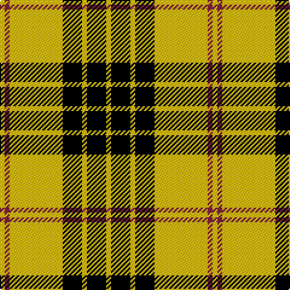

In pattern [YKYKYRY](/patterns/ykykyry/).

This was sourced from weddslist.  It is a [7 stripes tartan](/stripes/stripes7/).

Original link http://www.weddslist.com/cgi-bin/tartans/pg.pl?source=sts

## Thread count
Y/4 DR4 Y44 K16 Y4 K16 Y/4

## Palette
Each colour and its ΔE from the base-6 reference it is a variant of.

| Colour | Shade | Base | ΔE (OKLab) |
|---|---|---|---|
| DR | <code style="background-color:#802040;">#802040</code> `#802040` | R <code style="background-color:#CC0000;">#CC0000</code> | 0.17 |
| K | <code style="background-color:#000000;">#000000</code> `#000000` | K <code style="background-color:#000000;">#000000</code> | 0.00 |
| Y | <code style="background-color:#F0C000;">#F0C000</code> `#F0C000` | Y <code style="background-color:#F2BF00;">#F2BF00</code> | 0.00 |

# Sample pattern

## Nearest tartans

The nearest existing variants by ΔTartan distance.

1. [Baileville (Personal)](/setts/s7/y4k16y4k16y44r4y4-k101010-r901c38-ye8c000/) — ΔT 0.57
1. [MacLeod, Snuffbox](/setts/s9/k4y48r4y8k16r4k16y8k4-k000000-rc00000-yf0c000/) — ΔT 0.71
1. [MacLeod (Snuffbox)](/setts/s9/k4y48r4y8k16r4k16y8k4-k101010-rc80000-ye8c000/) — ΔT 0.84
1. [Porter Drinkers (Commemorative)](/setts/s6/k4y12k4y22k18r2-k101010-rc80000-yfccc00/) — ΔT 1.20
1. [Baillieville Family Tartan Tartan Number: 2326. Earliest known date: Oct. 1882 By David R Gurney of Russell Gurney Weavers, Turiff, Aberdeen for Charles D. Fitzhardinge Bailey of Baileville. See products available Copyright © Blair Urquhart, Comrie, 2015](/setts/s12/k16y4k16y44r4y4r4y44k16y4k16y4-k101010-r901c38-ye8c000/) — ΔT 1.23
1. [Porter Drinkers', The](/setts/s6/k4y12k4y22k18r2-k101010-rff0000-yffcc33/) — ΔT 1.23
1. [Unnamed C21st - Fashion](/setts/s6/k8y64k32r6k32y8-k101010-re87878-yfccc00/) — ΔT 1.33
1. [MacLachlan - 1842 (Chief's Dress)](/setts/s8/k12y4k42y4k12y48k4y12-k101010-ye8c000/) — ΔT 1.35
1. [Big Spruce Brewing](/setts/s6/g88y8g8y48k8y8-g003820-k101010-ye8c000/) — ΔT 1.39
1. [Volkswagen Orange Trim](/setts/s6/g6y6k20y52k6y6-g289c18-k101010-yd87c00/) — ΔT 1.41

## Neighbour map

Every grey dot is one of 15726 variants placed by the first two principal components of the ΔTartan feature space (44% of its variance). Red is this tartan; blue dots are its nearest — click one to open its page.

<svg viewBox="0 0 640 380" role="img" style="max-width:100%;height:auto;border:1px solid #e0e0e0;border-radius:4px;display:block" xmlns="http://www.w3.org/2000/svg"><image href="/nn/cloud.v1.png" width="640" height="380"/><a href="/setts/s7/y4k16y4k16y44r4y4-k101010-r901c38-ye8c000/"><circle cx="336.4" cy="177.9" r="4" fill="#3465a4"><title>Baileville (Personal)</title></circle></a><a href="/setts/s9/k4y48r4y8k16r4k16y8k4-k000000-rc00000-yf0c000/"><circle cx="308.1" cy="159.9" r="4" fill="#3465a4"><title>MacLeod, Snuffbox</title></circle></a><a href="/setts/s9/k4y48r4y8k16r4k16y8k4-k101010-rc80000-ye8c000/"><circle cx="313.1" cy="160.1" r="4" fill="#3465a4"><title>MacLeod (Snuffbox)</title></circle></a><a href="/setts/s6/k4y12k4y22k18r2-k101010-rc80000-yfccc00/"><circle cx="288.7" cy="207.1" r="4" fill="#3465a4"><title>Porter Drinkers (Commemorative)</title></circle></a><a href="/setts/s12/k16y4k16y44r4y4r4y44k16y4k16y4-k101010-r901c38-ye8c000/"><circle cx="310.6" cy="160.4" r="4" fill="#3465a4"><title>Baillieville Family Tartan Tartan Number: 2326. Earliest known date: Oct. 1882 By David R Gurney of Russell Gurney Weavers, Turiff, Aberdeen for Charles D. Fitzhardinge Bailey of Baileville. See products available Copyright © Blair Urquhart, Comrie, 2015</title></circle></a><a href="/setts/s6/k4y12k4y22k18r2-k101010-rff0000-yffcc33/"><circle cx="289.0" cy="206.2" r="4" fill="#3465a4"><title>Porter Drinkers', The</title></circle></a><a href="/setts/s6/k8y64k32r6k32y8-k101010-re87878-yfccc00/"><circle cx="267.9" cy="202.0" r="4" fill="#3465a4"><title>Unnamed C21st - Fashion</title></circle></a><a href="/setts/s8/k12y4k42y4k12y48k4y12-k101010-ye8c000/"><circle cx="318.2" cy="196.1" r="4" fill="#3465a4"><title>MacLachlan - 1842 (Chief's Dress)</title></circle></a><a href="/setts/s6/g88y8g8y48k8y8-g003820-k101010-ye8c000/"><circle cx="329.4" cy="193.8" r="4" fill="#3465a4"><title>Big Spruce Brewing</title></circle></a><a href="/setts/s6/g6y6k20y52k6y6-g289c18-k101010-yd87c00/"><circle cx="388.4" cy="198.8" r="4" fill="#3465a4"><title>Volkswagen Orange Trim</title></circle></a><circle cx="331.5" cy="177.6" r="5" fill="#c00000"/></svg>

ID: /setts/s7/y4k16y4k16y44r4y4-k000000-r802040-yf0c000/
