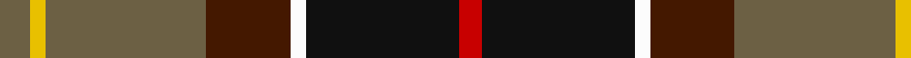

This page is one **sett** — a single exact thread-count. It belongs to the [tartan](/tartans/n4y2n21dr11w2k20r3/)
(the same proportion at any scale), whose colour order is pattern [GYGBWKR](/stripes/gygbwkr/).

Sourced from house-of-tartan.  It is a [7 stripe tartan](/stripes/stripes7/).

Original link http://www.house-of-tartan.scotland.net/house/TartanViewjs.asp?colr=Def&tnam=2489

## Thread count
N/8 Y4 N42 DR22 W4 K40 R/6

## Palette
Each colour and the base-6 reference it is a variant of.

| Colour | Shade | Base |
|---|---|---|
| DR | <code style="background-color:#441800;">#441800</code> `oklch(27.3% 0.076 46.3)` <small>#441800</small> | B <code style="background-color:#2A418A;">#2A418A</code> |
| K | <code style="background-color:#101010;">#101010</code> `oklch(17.3% 0.000 89.9)` <small>#101010</small> | K <code style="background-color:#000000;">#000000</code> |
| N | <code style="background-color:#6C6044;">#6C6044</code> `oklch(49.3% 0.044 87.4)` <small>#6C6044</small> | G <code style="background-color:#006100;">#006100</code> |
| R | <code style="background-color:#C80000;">#C80000</code> `oklch(52.3% 0.215 29.2)` <small>#C80000</small> | R <code style="background-color:#CC0000;">#CC0000</code> |
| W | <code style="background-color:#FCFCFC;">#FCFCFC</code> `oklch(99.1% 0.000 89.9)` <small>#FCFCFC</small> | W <code style="background-color:#F7F7F7;">#F7F7F7</code> |
| Y | <code style="background-color:#E8C000;">#E8C000</code> `oklch(81.9% 0.168 93.7)` <small>#E8C000</small> | Y <code style="background-color:#F2BF00;">#F2BF00</code> |

# Sample pattern

## Nearest tartans

The nearest existing variants by ΔTartan distance, with this tartan at the top so the swatches line up against it.

ΔTartan

Tartan

Sett

—

<a href="/ttd/edit/#slug=y4ly2y21do11w2k20r3~x2">Barbour Corporate Tartan Tartan Number: 2489. Earliest known date: 1998 For the linings of Barbour's famous wax jackets. Tartan designed by Kinloch Anderson of Edinburgh. See products available Copyright © Blair Urquhart, Comrie, 2015</a> <a class="nn-out" href="/setts/s7/y4ly2y21do11w2k20r3~x2/" title="open its dictionary page">↗</a>

0.63

<a href="/ttd/edit/#slug=o4ly2o21dy11w2k20r3~x2">Barbour - Classic</a> <a class="nn-out" href="/setts/s7/o4ly2o21dy11w2k20r3~x2/" title="open its dictionary page">↗</a>

0.66

<a href="/ttd/edit/#slug=r3k20w2dy11o21ly2o2~x2">Barbour</a> <a class="nn-out" href="/setts/s7/r3k20w2dy11o21ly2o2~x2/" title="open its dictionary page">↗</a>

0.75

<a href="/ttd/edit/#slug=r2lb1r8k4db1g10lr1g2~x4">Sawyer</a> <a class="nn-out" href="/setts/s8/r2lb1r8k4db1g10lr1g2~x4/" title="open its dictionary page">↗</a>

0.79

<a href="/ttd/edit/#slug=w2dp20r3k10g20lo2~x2">Morris of Balgonie (Personal)</a> <a class="nn-out" href="/setts/s6/w2dp20r3k10g20lo2~x2/" title="open its dictionary page">↗</a>

1.02

<a href="/ttd/edit/#slug=dr6k1lo1k2db2dr4g8k1r2~x4">Bicentenary (Commemorative)</a> <a class="nn-out" href="/setts/s9/dr6k1lo1k2db2dr4g8k1r2~x4/" title="open its dictionary page">↗</a>

1.06

<a href="/ttd/edit/#slug=ly2dy20k10db3dg20lb2~x2">Morris of Balgonie Htg (Personal)</a> <a class="nn-out" href="/setts/s6/ly2dy20k10db3dg20lb2~x2/" title="open its dictionary page">↗</a>

1.08

<a href="/ttd/edit/#slug=g22w3k2ly3k19r18db4~x2">Scotch House 2000 Dress</a> <a class="nn-out" href="/setts/s7/g22w3k2ly3k19r18db4~x2/" title="open its dictionary page">↗</a>

1.08

<a href="/ttd/edit/#slug=lb4k13g6r16lb2r2g2~x2">Caledonian Brewery Corporate Tartan Tartan Number: 2315. Earliest known date: pre 1997 Designed by Kinloch Anderson Ltd to commemorate the opening of the new Caledonian Brewery Malting Building. See products available Copyright © Blair Urquhart, Comrie, 2015</a> <a class="nn-out" href="/setts/s7/lb4k13g6r16lb2r2g2~x2/" title="open its dictionary page">↗</a>

1.10

<a href="/ttd/edit/#slug=db4r11db1g8r2g4k1lo2~x4">Craik of Assington (Personal)</a> <a class="nn-out" href="/setts/s8/db4r11db1g8r2g4k1lo2~x4/" title="open its dictionary page">↗</a>

1.11

<a href="/ttd/edit/#slug=lb4dg13g6r16lb2r2g2~x2">Caledonian Brewery (Corporate)</a> <a class="nn-out" href="/setts/s7/lb4dg13g6r16lb2r2g2~x2/" title="open its dictionary page">↗</a>

## Neighbour map

Every grey dot is one of 14299 variants placed by the first two principal components of the ΔTartan feature space (44% of its variance). Red is this tartan; blue dots are its nearest — click one to open its page.

<svg viewBox="0 0 640 380" role="img" style="max-width:100%;height:auto;border:1px solid #e0e0e0;border-radius:4px;display:block" xmlns="http://www.w3.org/2000/svg"><image href="/nn/cloud.v1.png" width="640" height="380"/><a href="/setts/s7/o4ly2o21dy11w2k20r3~x2/"><circle cx="172.6" cy="160.6" r="4" fill="#3465a4"><title>Barbour - Classic</title></circle></a><a href="/setts/s7/r3k20w2dy11o21ly2o2~x2/"><circle cx="167.3" cy="156.1" r="4" fill="#3465a4"><title>Barbour</title></circle></a><a href="/setts/s8/r2lb1r8k4db1g10lr1g2~x4/"><circle cx="191.2" cy="163.0" r="4" fill="#3465a4"><title>Sawyer</title></circle></a><a href="/setts/s6/w2dp20r3k10g20lo2~x2/"><circle cx="151.6" cy="178.9" r="4" fill="#3465a4"><title>Morris of Balgonie (Personal)</title></circle></a><a href="/setts/s9/dr6k1lo1k2db2dr4g8k1r2~x4/"><circle cx="139.3" cy="181.3" r="4" fill="#3465a4"><title>Bicentenary (Commemorative)</title></circle></a><a href="/setts/s6/ly2dy20k10db3dg20lb2~x2/"><circle cx="157.9" cy="189.6" r="4" fill="#3465a4"><title>Morris of Balgonie Htg (Personal)</title></circle></a><a href="/setts/s7/g22w3k2ly3k19r18db4~x2/"><circle cx="112.8" cy="158.2" r="4" fill="#3465a4"><title>Scotch House 2000 Dress</title></circle></a><a href="/setts/s7/lb4k13g6r16lb2r2g2~x2/"><circle cx="172.2" cy="188.2" r="4" fill="#3465a4"><title>Caledonian Brewery Corporate Tartan Tartan Number: 2315. Earliest known date: pre 1997 Designed by Kinloch Anderson Ltd to commemorate the opening of the new Caledonian Brewery Malting Building. See products available Copyright © Blair Urquhart, Comrie, 2015</title></circle></a><a href="/setts/s8/db4r11db1g8r2g4k1lo2~x4/"><circle cx="209.3" cy="186.8" r="4" fill="#3465a4"><title>Craik of Assington (Personal)</title></circle></a><a href="/setts/s7/lb4dg13g6r16lb2r2g2~x2/"><circle cx="185.4" cy="197.1" r="4" fill="#3465a4"><title>Caledonian Brewery (Corporate)</title></circle></a><circle cx="176.3" cy="168.6" r="5" fill="#c00000"/></svg>

ID: /setts/s7/y4ly2y21do11w2k20r3~x2/
