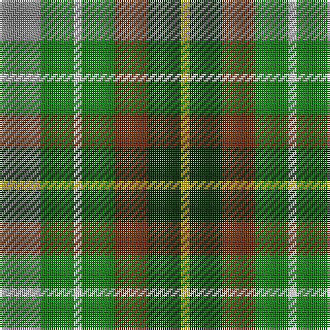

In pattern [GGWGRGY](/stripes/ggwgrgy/).

This was sourced from weddslist.  It is a [7 stripe tartan](/stripes/stripes7/).

Original link http://www.weddslist.com/cgi-bin/tartans/pg.pl?source=sts

## Also known as

This cloth is also recorded under:

- Devon, Original

## Thread count
N/20 G16 LN4 G16 T16 DG16 Y/4

## Palette
Each colour and the base-6 reference it is a variant of.

| Colour | Shade | Base |
|---|---|---|
| DG | <code style="background-color:#003000;">#003000</code> `oklch(26.8% 0.091 142.5)` <small>#003000</small> | G <code style="background-color:#006100;">#006100</code> |
| G | <code style="background-color:#008000;">#008000</code> `oklch(52.0% 0.177 142.5)` <small>#008000</small> | G <code style="background-color:#006100;">#006100</code> |
| LN | <code style="background-color:#E0E0E0;">#E0E0E0</code> `oklch(90.7% 0.000 89.9)` <small>#E0E0E0</small> | W <code style="background-color:#F7F7F7;">#F7F7F7</code> |
| N | <code style="background-color:#808080;">#808080</code> `oklch(60.0% 0.000 89.9)` <small>#808080</small> | G <code style="background-color:#006100;">#006100</code> |
| T | <code style="background-color:#703000;">#703000</code> `oklch(39.1% 0.105 49.1)` <small>#703000</small> | R <code style="background-color:#CC0000;">#CC0000</code> |
| Y | <code style="background-color:#F0C000;">#F0C000</code> `oklch(82.7% 0.169 90.5)` <small>#F0C000</small> | Y <code style="background-color:#F2BF00;">#F2BF00</code> |

# Sample pattern

## Nearest tartans

The nearest existing variants by ΔTartan distance.

1. [Devon Original District Tartan Tartan Number: 1284. Earliest known date: 1984 The Devon Original and Devon Companion owe their origin to the success of the Cornish St Piran sett, which was woven by Coldharbour Mill in the early 1980's. The accreditation certificate was presented to the Mayor of Barnstaple in 1991. In a poem describing the tartan, Miss M. Miles says, "So, in the mind, Devon's beauty is retrieved By contemplating Devon's tartan's weave." See products available Copyright © Blair Urquhart, Comrie, 2015](/setts/s7/lr5g4w1g4o4dg4ly1~x4/) — ΔT 0.95
1. [Loch Fyne](/setts/s6/r1dy3g5lo5dt5t1~x4/) — ΔT 1.10
1. [Pollard (2014)](/setts/s7/g5dg5g5db5db5dg10w2~x8/) — ΔT 1.55
1. [Corcoran of Sherbrooke (Personal)](/setts/s9/k1lr1g5dp1g2dy5lr1y3lr1~x4/) — ΔT 1.55
1. [Parliament Trade Tartan Tartan Number: 2477. Earliest known date: 1998 Created to celebrate the referendum result for the re-establishment of a Scottish Parliament as well as to provide a Parliamentary livery tartan. See products available Copyright © Blair Urquhart, Comrie, 2015](/setts/s7/db8g11k3g11r12dt10ly2~x2/) — ΔT 1.57
1. [Unidentified, Silk Plaid](/setts/s5/db7o8g15ly6y3~x10/) — ΔT 1.66
1. [Devon, Green (District)](/setts/s7/o5y4lr1y4dy4dg4ly1~x4/) — ΔT 1.69
1. [Northern College](/setts/s10/g10db6t6g10w8ly3t2ly3db2r2/) — ΔT 1.71
1. [Devon Rural Skills Trust](/setts/s8/w5y4b1y4r4b1dg4ly1~x2/) — ΔT 1.73
1. [McShane (Personal)](/setts/s8/g9lb2g9k2dy14ly4lb2r2~x4/) — ΔT 1.78

## Neighbour map

Every grey dot is one of 14299 variants placed by the first two principal components of the ΔTartan feature space (44% of its variance). Red is this tartan; blue dots are its nearest — click one to open its page.

<svg viewBox="0 0 640 380" role="img" style="max-width:100%;height:auto;border:1px solid #e0e0e0;border-radius:4px;display:block" xmlns="http://www.w3.org/2000/svg"><image href="/nn/cloud.v1.png" width="640" height="380"/><a href="/setts/s7/lr5g4w1g4o4dg4ly1~x4/"><circle cx="71.2" cy="234.6" r="4" fill="#3465a4"><title>Devon Original District Tartan Tartan Number: 1284. Earliest known date: 1984 The Devon Original and Devon Companion owe their origin to the success of the Cornish St Piran sett, which was woven by Coldharbour Mill in the early 1980's. The accreditation certificate was presented to the Mayor of Barnstaple in 1991. In a poem describing the tartan, Miss M. Miles says, &quot;So, in the mind, Devon's beauty is retrieved By contemplating Devon's tartan's weave.&quot; See products available Copyright © Blair Urquhart, Comrie, 2015</title></circle></a><a href="/setts/s6/r1dy3g5lo5dt5t1~x4/"><circle cx="48.2" cy="236.3" r="4" fill="#3465a4"><title>Loch Fyne</title></circle></a><a href="/setts/s7/g5dg5g5db5db5dg10w2~x8/"><circle cx="67.9" cy="250.1" r="4" fill="#3465a4"><title>Pollard (2014)</title></circle></a><a href="/setts/s9/k1lr1g5dp1g2dy5lr1y3lr1~x4/"><circle cx="109.2" cy="204.9" r="4" fill="#3465a4"><title>Corcoran of Sherbrooke (Personal)</title></circle></a><a href="/setts/s7/db8g11k3g11r12dt10ly2~x2/"><circle cx="115.4" cy="247.2" r="4" fill="#3465a4"><title>Parliament Trade Tartan Tartan Number: 2477. Earliest known date: 1998 Created to celebrate the referendum result for the re-establishment of a Scottish Parliament as well as to provide a Parliamentary livery tartan. See products available Copyright © Blair Urquhart, Comrie, 2015</title></circle></a><a href="/setts/s5/db7o8g15ly6y3~x10/"><circle cx="98.1" cy="245.9" r="4" fill="#3465a4"><title>Unidentified, Silk Plaid</title></circle></a><a href="/setts/s7/o5y4lr1y4dy4dg4ly1~x4/"><circle cx="113.2" cy="262.4" r="4" fill="#3465a4"><title>Devon, Green (District)</title></circle></a><a href="/setts/s10/g10db6t6g10w8ly3t2ly3db2r2/"><circle cx="64.9" cy="194.0" r="4" fill="#3465a4"><title>Northern College</title></circle></a><a href="/setts/s8/w5y4b1y4r4b1dg4ly1~x2/"><circle cx="44.9" cy="202.9" r="4" fill="#3465a4"><title>Devon Rural Skills Trust</title></circle></a><a href="/setts/s8/g9lb2g9k2dy14ly4lb2r2~x4/"><circle cx="156.5" cy="189.2" r="4" fill="#3465a4"><title>McShane (Personal)</title></circle></a><circle cx="69.3" cy="242.8" r="5" fill="#c00000"/></svg>

ID: /setts/s7/y5g4w1g4o4dg4ly1~x4/
