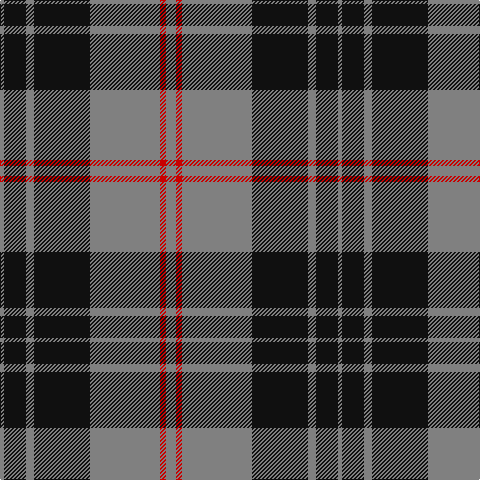

**Bands:** [GKGKGRG](/stripes/gkgkgrg/) · **Stripes:** [Y K Y K Y R Y](/stripes/stripes7/) Y K Y K Y R Y

This was sourced from register-of-tartans.  It is a [7 band tartan](/bands/bands7/).

Original link https://www.tartanregister.gov.uk/tartanDetails.aspx?ref=10074

## Register references

External register numbers recorded for this tartan.

- Scottish Register of Tartans: [10074](https://www.tartanregister.gov.uk/tartanDetails.aspx?ref=10074)

## Thread count
N/4 K22 N8 K56 N70 R6 N/10

## Palette
Each colour and its ΔE from the base-6 reference it is a variant of.

| Colour | Shade | Base | ΔE (OKLab) |
|---|---|---|---|
| K | <code style="background-color:#101010;">#101010</code> `#101010` | K <code style="background-color:#000000;">#000000</code> | 0.17 |
| N | <code style="background-color:#808080;">#808080</code> `#808080` | G <code style="background-color:#006100;">#006100</code> | 0.23 |
| R | <code style="background-color:#C80000;">#C80000</code> `#C80000` | R <code style="background-color:#CC0000;">#CC0000</code> | 0.01 |

# Sample pattern

## Nearest tartans

The nearest existing variants by ΔTartan distance.

1. [West Point](/setts/s8/k13o1k1o1k4o10ly1o1~x6/) — ΔT 0.84
1. [Flynn](/setts/s6/o58k22o8k17r5k14~x2/) — ΔT 0.85
1. [Moffat (1984)](/setts/s7/k39o3k3o3k14o28r3~x2/) — ΔT 0.96
1. [West Point Military Academy (Mil.)](/setts/s8/k10o1k2o1k4o10ly1o2~x4/) — ΔT 0.97
1. [Nowell/Noel 1951 (Name)](/setts/s8/lr3k24lr6k8w4k8lr35k2~x2/) — ΔT 0.97
1. [MacSween, Black (Personal)](/setts/s6/k2o6k2o6k12r1~x4/) — ΔT 1.03
1. [Corrie](/setts/s8/dt14o1dt1o1dt6o14w1o1~x4/) — ΔT 1.08
1. [MacKnight (Name)](/setts/s9/k12lr1k2lr6k4lr3k4lr21r4~x2/) — ΔT 1.10
1. [Machair (warp)](/setts/s6/o72k16w9k4w5k16~x2/) — ΔT 1.11
1. [Bannockbane Grey #3](/setts/s8/k4ly2k13ly1y8y13ly2y4~x2/) — ΔT 1.18

## Neighbour map

Every grey dot is one of 14313 variants placed by the first two principal components of the ΔTartan feature space (44% of its variance). Red is this tartan; blue dots are its nearest — click one to open its page.

<svg viewBox="0 0 640 380" role="img" style="max-width:100%;height:auto;border:1px solid #e0e0e0;border-radius:4px;display:block" xmlns="http://www.w3.org/2000/svg"><image href="/nn/cloud.v1.png" width="640" height="380"/><a href="/setts/s8/k13o1k1o1k4o10ly1o1~x6/"><circle cx="351.7" cy="182.7" r="4" fill="#3465a4"><title>West Point</title></circle></a><a href="/setts/s6/o58k22o8k17r5k14~x2/"><circle cx="321.5" cy="215.0" r="4" fill="#3465a4"><title>Flynn</title></circle></a><a href="/setts/s7/k39o3k3o3k14o28r3~x2/"><circle cx="373.0" cy="198.3" r="4" fill="#3465a4"><title>Moffat (1984)</title></circle></a><a href="/setts/s8/k10o1k2o1k4o10ly1o2~x4/"><circle cx="309.7" cy="202.4" r="4" fill="#3465a4"><title>West Point Military Academy (Mil.)</title></circle></a><a href="/setts/s8/lr3k24lr6k8w4k8lr35k2~x2/"><circle cx="305.2" cy="169.5" r="4" fill="#3465a4"><title>Nowell/Noel 1951 (Name)</title></circle></a><a href="/setts/s6/k2o6k2o6k12r1~x4/"><circle cx="328.1" cy="224.1" r="4" fill="#3465a4"><title>MacSween, Black (Personal)</title></circle></a><a href="/setts/s8/dt14o1dt1o1dt6o14w1o1~x4/"><circle cx="325.9" cy="166.2" r="4" fill="#3465a4"><title>Corrie</title></circle></a><a href="/setts/s9/k12lr1k2lr6k4lr3k4lr21r4~x2/"><circle cx="326.3" cy="159.6" r="4" fill="#3465a4"><title>MacKnight (Name)</title></circle></a><a href="/setts/s6/o72k16w9k4w5k16~x2/"><circle cx="362.4" cy="169.2" r="4" fill="#3465a4"><title>Machair (warp)</title></circle></a><a href="/setts/s8/k4ly2k13ly1y8y13ly2y4~x2/"><circle cx="291.0" cy="200.1" r="4" fill="#3465a4"><title>Bannockbane Grey #3</title></circle></a><circle cx="347.7" cy="188.1" r="5" fill="#c00000"/></svg>

ID: /setts/s7/y5r3y35k28y4k11y2~x2/
