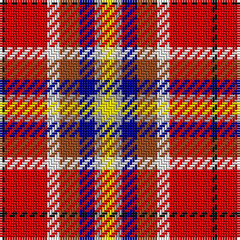

In pattern [KRWRBYY](/patterns/krwrbyy/).

This was sourced from register-of-tartans.  It is a [7 stripes tartan](/stripes/stripes7/).

Original link https://www.tartanregister.gov.uk/tartanDetails.aspx?ref=11384

## Thread count
K/2 R17 W5 T8 DB6 N3 Y/5

## Palette
Each colour and its ΔE from the base-6 reference it is a variant of.

| Colour | Shade | Base | ΔE (OKLab) |
|---|---|---|---|
| DB | <code style="background-color:#00008C;">#00008C</code> `#00008C` | B <code style="background-color:#2C4084;">#2C4084</code> | 0.13 |
| K | <code style="background-color:#101010;">#101010</code> `#101010` | K <code style="background-color:#000000;">#000000</code> | 0.17 |
| N | <code style="background-color:#A0A0A0;">#A0A0A0</code> `#A0A0A0` | Y <code style="background-color:#E8C000;">#E8C000</code> | 0.20 |
| R | <code style="background-color:#DC0000;">#DC0000</code> `#DC0000` | R <code style="background-color:#C80000;">#C80000</code> | 0.04 |
| T | <code style="background-color:#98481C;">#98481C</code> `#98481C` | R <code style="background-color:#C80000;">#C80000</code> | 0.11 |
| W | <code style="background-color:#F8F8F8;">#F8F8F8</code> `#F8F8F8` | W <code style="background-color:#F4F4F0;">#F4F4F0</code> | 0.01 |
| Y | <code style="background-color:#FFE600;">#FFE600</code> `#FFE600` | Y <code style="background-color:#E8C000;">#E8C000</code> | 0.10 |

# Sample pattern

## Nearest tartans

The nearest existing variants by ΔTartan distance.

1. [Young Presidents Organisation Dress](/setts/s8/r12y30b8ba24g24ga8r50w10-b441800-ba2c2c80-g006818-ga604000-rc80000-wfcfcfc-ye8c000/) — ΔT 0.97
1. [Culloden (Old and Rare) District Tartan Tartan Number: 1328. Earliest known date: 1746 Worn by a member of Prince Charles' staff during the battle but it is not known with which family or district it was first connected. It was first illustrated in Old & Rare in 1893 by D W Stewart whose son D C Stewart was a founder member of the Scottish Tartans Society. Now firmly established as a district tartan. See products available Copyright © Blair Urquhart, Comrie, 2015](/setts/s8/r10b4ra28w4k26y26k4y6-b5c8ca8-k101010-rc80000-rab468ac-we0e0e0-ye8c000/) — ΔT 1.27
1. [Walter (Personal)](/setts/s7/r48w6y8g36b36ga6ba8-b780078-ba5c8ca8-g003820-ga5c6428-rc80000-wfcfcfc-ye8c000/) — ΔT 1.38
1. [Oor Wullie (Corporate)](/setts/s7/y6r6ya4r40k32w48wa4-k101010-rc80000-wc0c0c0-wae0e0e0-yfccc00-yae8c000/) — ΔT 1.45
1. [Walter](/setts/s7/r48w6y8g36b36ga6ba8-b800080-ba5480b0-g003000-ga505020-rc00000-we0e0e0-yf0c000/) — ΔT 1.46
1. [Khosla, Sarah and Jatin (Personal)](/setts/s9/r8b20ra36y6ra6y10rb16b18w8-b1c1c1c-rb458ac-raa00048-rbe87878-wf8f4d0-yf8e38c/) — ΔT 1.47
1. [Oor Wullie (DC Thomson)](/setts/s7/y6r6ya4r40k32w48wa4-k101010-rff0000-we0e0e0-waffffff-yffe600-yaffa500/) — ΔT 1.51
1. [Thirkill](/setts/s9/w8k4r30k4r10g14ga14k4y8-g5c6428-ga003820-k101010-rc80000-we0e0e0-ye8c000/) — ΔT 1.54
1. [Oor Wullie Corporate Tartan Tartan Number: 10356. Earliest known date: August 2010 Oor Wullie's tartan is based on the Black Watch which was his Uncle Wattie's regiment and in this new design the red is from the hackle on their famous bonnets. The silver grey is for Wullie's iconic bucket and for his faithful pet, Jeemie the moose. The black is for his mentor PC Murdoch and for Wullie's dungarees, the yellow is for his tousled gold locks that never see a comb. The three lines on the yellow are for his best pals Fat Bob, Soapy Soutar and Wee Eck. The black and white are for the newsprint of The Sunday Post in which Wullie and his pals have lived for 75 years. See products available Copyright © Blair Urquhart, Comrie, 2015](/setts/s7/k6r6y4r40ka32w48wa4-k000000-ka101010-rc80000-wc0c0c0-wae0e0e0-yf09400/) — ΔT 1.54
1. [Culloden](/setts/s8/r10b4ba28w4k26y26k4ya6-b5c8ca8-ba780078-k101010-rc80000-wfcfcfc-ybc8c00-yae8c000/) — ΔT 1.54

## Neighbour map

Every grey dot is one of 15726 variants placed by the first two principal components of the ΔTartan feature space (44% of its variance). Red is this tartan; blue dots are its nearest — click one to open its page.

<svg viewBox="0 0 640 380" role="img" style="max-width:100%;height:auto;border:1px solid #e0e0e0;border-radius:4px;display:block" xmlns="http://www.w3.org/2000/svg"><image href="/nn/cloud.v1.png" width="640" height="380"/><a href="/setts/s8/r12y30b8ba24g24ga8r50w10-b441800-ba2c2c80-g006818-ga604000-rc80000-wfcfcfc-ye8c000/"><circle cx="63.3" cy="157.9" r="4" fill="#3465a4"><title>Young Presidents Organisation Dress</title></circle></a><a href="/setts/s8/r10b4ra28w4k26y26k4y6-b5c8ca8-k101010-rc80000-rab468ac-we0e0e0-ye8c000/"><circle cx="28.1" cy="138.8" r="4" fill="#3465a4"><title>Culloden (Old and Rare) District Tartan Tartan Number: 1328. Earliest known date: 1746 Worn by a member of Prince Charles' staff during the battle but it is not known with which family or district it was first connected. It was first illustrated in Old &amp; Rare in 1893 by D W Stewart whose son D C Stewart was a founder member of the Scottish Tartans Society. Now firmly established as a district tartan. See products available Copyright © Blair Urquhart, Comrie, 2015</title></circle></a><a href="/setts/s7/r48w6y8g36b36ga6ba8-b780078-ba5c8ca8-g003820-ga5c6428-rc80000-wfcfcfc-ye8c000/"><circle cx="91.0" cy="150.0" r="4" fill="#3465a4"><title>Walter (Personal)</title></circle></a><a href="/setts/s7/y6r6ya4r40k32w48wa4-k101010-rc80000-wc0c0c0-wae0e0e0-yfccc00-yae8c000/"><circle cx="127.1" cy="130.2" r="4" fill="#3465a4"><title>Oor Wullie (Corporate)</title></circle></a><a href="/setts/s7/r48w6y8g36b36ga6ba8-b800080-ba5480b0-g003000-ga505020-rc00000-we0e0e0-yf0c000/"><circle cx="92.3" cy="151.0" r="4" fill="#3465a4"><title>Walter</title></circle></a><a href="/setts/s9/r8b20ra36y6ra6y10rb16b18w8-b1c1c1c-rb458ac-raa00048-rbe87878-wf8f4d0-yf8e38c/"><circle cx="60.2" cy="168.0" r="4" fill="#3465a4"><title>Khosla, Sarah and Jatin (Personal)</title></circle></a><a href="/setts/s7/y6r6ya4r40k32w48wa4-k101010-rff0000-we0e0e0-waffffff-yffe600-yaffa500/"><circle cx="118.7" cy="121.1" r="4" fill="#3465a4"><title>Oor Wullie (DC Thomson)</title></circle></a><a href="/setts/s9/w8k4r30k4r10g14ga14k4y8-g5c6428-ga003820-k101010-rc80000-we0e0e0-ye8c000/"><circle cx="119.3" cy="158.7" r="4" fill="#3465a4"><title>Thirkill</title></circle></a><a href="/setts/s7/k6r6y4r40ka32w48wa4-k000000-ka101010-rc80000-wc0c0c0-wae0e0e0-yf09400/"><circle cx="125.6" cy="131.1" r="4" fill="#3465a4"><title>Oor Wullie Corporate Tartan Tartan Number: 10356. Earliest known date: August 2010 Oor Wullie's tartan is based on the Black Watch which was his Uncle Wattie's regiment and in this new design the red is from the hackle on their famous bonnets. The silver grey is for Wullie's iconic bucket and for his faithful pet, Jeemie the moose. The black is for his mentor PC Murdoch and for Wullie's dungarees, the yellow is for his tousled gold locks that never see a comb. The three lines on the yellow are for his best pals Fat Bob, Soapy Soutar and Wee Eck. The black and white are for the newsprint of The Sunday Post in which Wullie and his pals have lived for 75 years. See products available Copyright © Blair Urquhart, Comrie, 2015</title></circle></a><a href="/setts/s8/r10b4ba28w4k26y26k4ya6-b5c8ca8-ba780078-k101010-rc80000-wfcfcfc-ybc8c00-yae8c000/"><circle cx="39.9" cy="145.4" r="4" fill="#3465a4"><title>Culloden</title></circle></a><circle cx="70.0" cy="139.2" r="5" fill="#c00000"/></svg>

ID: /setts/s7/y5ya3b6r8w5ra17k2-b00008c-k101010-r98481c-radc0000-wf8f8f8-yffe600-yaa0a0a0/
