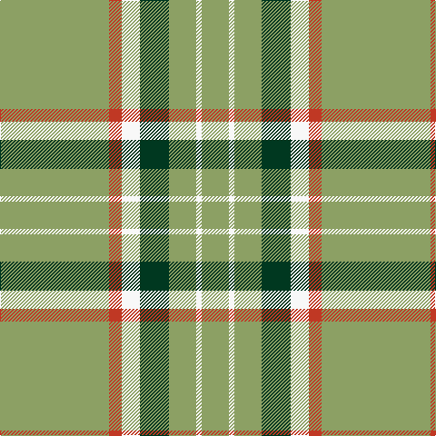

In pattern [YRWGYWY](/patterns/yrwgywy/).

This was sourced from register-of-tartans.  It is a [7 stripes tartan](/stripes/stripes7/).

Original link https://www.tartanregister.gov.uk/tartanDetails.aspx?ref=904

## Attestations

This cloth appears in 2 source records; the oldest owns this page.

- 01/01/1986 — Deer Park (Loton) (Personal) (register-of-tartans, [record](https://www.tartanregister.gov.uk/tartanDetails.aspx?ref=904))
- 1986-1993 — Deer Park (Loton) (Personal) (tartans-authority, [record](http://www.tartansauthority.com/tartan-ferret/display/7074/))

## Thread count
LT/120 R14 W20 DG32 LT30 W6 LT/30

## Palette
Each colour and its ΔE from the base-6 reference it is a variant of.

| Colour | Shade | Base | ΔE (OKLab) |
|---|---|---|---|
| DG | <code style="background-color:#003820;">#003820</code> `#003820` | G <code style="background-color:#006100;">#006100</code> | 0.15 |
| LT | <code style="background-color:#8CA064;">#8CA064</code> `#8CA064` | Y <code style="background-color:#F2BF00;">#F2BF00</code> | 0.19 |
| R | <code style="background-color:#C03824;">#C03824</code> `#C03824` | R <code style="background-color:#CC0000;">#CC0000</code> | 0.04 |
| W | <code style="background-color:#F8F8F8;">#F8F8F8</code> `#F8F8F8` | W <code style="background-color:#F7F7F7;">#F7F7F7</code> | 0.00 |

# Sample pattern

## Nearest tartans

The nearest existing variants by ΔTartan distance.

1. [Carlisle Family Tartan Tartan Number: 674. Earliest known date: 1987 Derived from the Coat of Arms. See products available Copyright © Blair Urquhart, Comrie, 2015](/setts/s7/b11y5k1y2r1y2b11x12~b5c8ca8-k101010-rc80000-ye8c000/) — ΔT 1.47
1. [Wilbers](/setts/s8/y5k9y2k7ya35r4ya35k4x2~k101010-rc80000-ye8c000-yab49440/) — ΔT 1.56
1. [Welsh Assembly (Fashion)](/setts/s8/g5r9g4w5g30ra2g4ra2x2~g006818-r888888-rac80000-we0e0e0/) — ΔT 1.59
1. [McGirr (Letterkenny) David, (Pers.)](/setts/s8/g4r1g15b5r1w5g4r1x4~b68889c-g006818-rc8002c-we0e0e0/) — ΔT 1.60
1. [Logan #4](/setts/s7/g9r4g1r4g15ra4g1x4~g006818-re87878-rac80000/) — ΔT 1.69
1. [St. Christopher (Corporate)](/setts/s8/g5r3g3y2g1ya8g24y2x2~g285800-rc80000-ybc8c00-yac4bc68/) — ΔT 1.71
1. [Ingenico](/setts/s6/y50r4y12ya23r4g4x2~g289c18-rc80000-y48a4c0-yae8c000/) — ΔT 1.76
1. [Loch Tummel Trade Tartan Tartan Number: 1751. Earliest known date: pre 2003 Nothing See products available Copyright © Blair Urquhart, Comrie, 2015](/setts/s5/y38w9y3b9w3x2~b441800-we0e0e0-ya08858/) — ΔT 1.76
1. [Virginia Quadricentennial (District)](/setts/s13/y40ya3y10ya6y20k3y2k3y10r4y2r8y2x2~k101010-r901c38-yc4bc68-yaa08858/) — ΔT 1.81
1. [Tahrir - Liberation (Fashion)](/setts/s6/k5w4r15g70k4w5x2~g289c18-k101010-rc80000-we0e0e0/) — ΔT 1.83

## Neighbour map

Every grey dot is one of 15726 variants placed by the first two principal components of the ΔTartan feature space (44% of its variance). Red is this tartan; blue dots are its nearest — click one to open its page.

<svg viewBox="0 0 640 380" role="img" style="max-width:100%;height:auto;border:1px solid #e0e0e0;border-radius:4px;display:block" xmlns="http://www.w3.org/2000/svg"><image href="/nn/cloud.v1.png" width="640" height="380"/><a href="/setts/s7/b11y5k1y2r1y2b11x12~b5c8ca8-k101010-rc80000-ye8c000/"><circle cx="385.0" cy="202.1" r="4" fill="#3465a4"><title>Carlisle Family Tartan Tartan Number: 674. Earliest known date: 1987 Derived from the Coat of Arms. See products available Copyright © Blair Urquhart, Comrie, 2015</title></circle></a><a href="/setts/s8/y5k9y2k7ya35r4ya35k4x2~k101010-rc80000-ye8c000-yab49440/"><circle cx="399.4" cy="156.2" r="4" fill="#3465a4"><title>Wilbers</title></circle></a><a href="/setts/s8/g5r9g4w5g30ra2g4ra2x2~g006818-r888888-rac80000-we0e0e0/"><circle cx="432.3" cy="181.7" r="4" fill="#3465a4"><title>Welsh Assembly (Fashion)</title></circle></a><a href="/setts/s8/g4r1g15b5r1w5g4r1x4~b68889c-g006818-rc8002c-we0e0e0/"><circle cx="351.4" cy="181.3" r="4" fill="#3465a4"><title>McGirr (Letterkenny) David, (Pers.)</title></circle></a><a href="/setts/s7/g9r4g1r4g15ra4g1x4~g006818-re87878-rac80000/"><circle cx="427.6" cy="218.9" r="4" fill="#3465a4"><title>Logan #4</title></circle></a><a href="/setts/s8/g5r3g3y2g1ya8g24y2x2~g285800-rc80000-ybc8c00-yac4bc68/"><circle cx="441.1" cy="158.9" r="4" fill="#3465a4"><title>St. Christopher (Corporate)</title></circle></a><a href="/setts/s6/y50r4y12ya23r4g4x2~g289c18-rc80000-y48a4c0-yae8c000/"><circle cx="386.8" cy="196.7" r="4" fill="#3465a4"><title>Ingenico</title></circle></a><a href="/setts/s5/y38w9y3b9w3x2~b441800-we0e0e0-ya08858/"><circle cx="408.7" cy="204.9" r="4" fill="#3465a4"><title>Loch Tummel Trade Tartan Tartan Number: 1751. Earliest known date: pre 2003 Nothing See products available Copyright © Blair Urquhart, Comrie, 2015</title></circle></a><a href="/setts/s13/y40ya3y10ya6y20k3y2k3y10r4y2r8y2x2~k101010-r901c38-yc4bc68-yaa08858/"><circle cx="468.1" cy="127.4" r="4" fill="#3465a4"><title>Virginia Quadricentennial (District)</title></circle></a><a href="/setts/s6/k5w4r15g70k4w5x2~g289c18-k101010-rc80000-we0e0e0/"><circle cx="404.5" cy="156.9" r="4" fill="#3465a4"><title>Tahrir - Liberation (Fashion)</title></circle></a><circle cx="428.8" cy="171.5" r="5" fill="#c00000"/></svg>

ID: /setts/s7/y60r7w10g16y15w3y15x2~g003820-rc03824-wf8f8f8-y8ca064/
